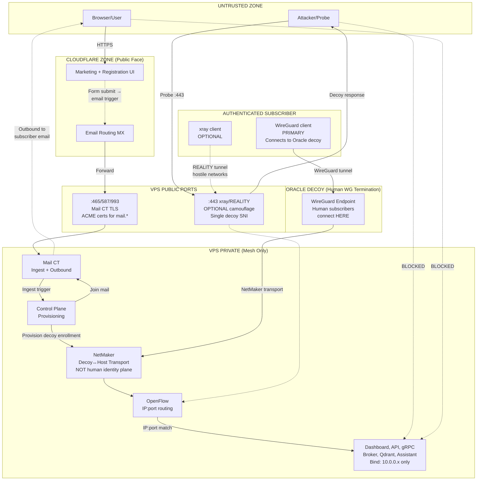

# 3tched Control Plane + ghostbridge Mesh Identity — Design

**Version:** 1.3  
**Status:** Draft  
**Implements:** requirements.md

---

## Revision 1.3

- **THINNED:** subscribe/enrollment treated as a short boundary, not a pipeline design — weight stays on separation architecture
- **FIXED:** join path connects to Oracle decoy (not NetMaker-as-identity endpoint)

## Revision 1.2

- **FIXED:** Trust diagram updated — human WG terminates at Oracle decoy, not VPS host wg-lan
- **ADDED:** Adjacent Specs section with identity topology lock (cross-ref handoff spec)
- **ADDED:** E2E verification note — HumanPrincipal/assertion path verified under handoff mission, not this task list
- **CLARIFIED:** NetMaker = decoy↔host transport layer, not human identity plane

## Revision 1.1

- **FIXED:** REALITY is optional camouflage, not mandatory subscriber path
- **FIXED:** Trust diagram shows WireGuard as primary, REALITY as optional
- **ADDED:** Subscribe sequence mermaid diagram
- **ADDED:** Failure modes for mail delay/loss, enrollment token expiry, ingest parse failure, join-mail delivery
- **CLARIFIED:** mail.* ACME certs on :465/:587/:993 are required; forbidden is web domain certs on :443
- **KEPT:** OVS safety rules (cookied flows, no bulk delete, fail-standalone)

---

## 1. Architecture: The Separation

```
┌─────────────────────────────────────────────────────────────────────────────┐
│                           PUBLIC INTERNET                                   │
│                                                                             │
│   Users see:                                                                │
│   • Cloudflare-served websites (3tched.com, ghostbridge.tech)              │
│   • "Thanks, check your email for join steps"                              │
│   • No knowledge of VPS or email-triggered backend                         │
└─────────────────────────────────────────────────────────────────────────────┘
                │                                    │
                │ HTTPS (orange-proxied)             │ Probe/Attack
                ▼                                    ▼
┌───────────────────────────┐          ┌─────────────────────────────────────┐
│      CLOUDFLARE           │          │         VPS 188.68.58.237           │
│                           │          │                                     │
│  • DNS (orange-proxied)   │          │  :443 ─► xray/REALITY (OPTIONAL)    │
│  • Marketing site         │          │          • Single decoy SNI         │
│  • Registration UI        │          │          • NO owned domain names    │
│  • Email Routing (MX)     │          │          • Camouflage only          │
│  • WAF/DDoS               │          │          • For hostile networks     │
│                           │          │                                     │
│  NO tunnels to VPS ──X    │          │  :465/587/993 ─► Mail CT            │
│  NO live API to VPS ─X    │          │          • ACME certs (mail.*)      │
│                           │          │          • Inbound via CF forward   │
│                           │          │          • Outbound direct          │
└───────────────────────────┘          │          • Join mail to subscriber  │
         │                             │                                     │
         │ Email forward               │  ALL OTHER PORTS ─► CLOSED          │
         │ (ingest trigger)            └─────────────────────────────────────┘
         ▼                                                │
┌─────────────────────────────────────────────────────────┼─────────────────┐
│                              VPS INTERNAL               │                 │
│                                                         │                 │
│  ┌─────────────┐      ┌─────────────────────────────────┼───────────────┐ │
│  │  Mail CT    │      │            MESH (10.0.0.0/8)    │               │ │
│  │             │      │                                 │               │ │
│  │ • Postfix   │      │  WireGuard ─────────────────────┘ (PRIMARY)     │ │
│  │ • Dovecot   │      │  REALITY tunnel ────────────────  (OPTIONAL)    │ │
│  │ • Ingest    │      │                                                 │ │
│  │   pipeline  │──────│► Control Plane (provisioning)                   │ │
│  │             │      │                                                 │ │
│  │ Join mail ◄─│──────│─ sends to subscriber                            │ │
│  │ outbound    │      │                                                 │ │
│  └─────────────┘      │  ┌──────────┐ ┌──────────┐ ┌──────────────────┐ │ │
│                       │  │Dashboard │ │ API      │ │ op-grpc-bridge   │ │ │
│                       │  │10.0.0.x  │ │10.0.0.x  │ │ 10.0.0.2:8090    │ │ │
│                       │  └──────────┘ └──────────┘ └──────────────────┘ │ │
│                       │       │                            ▲            │ │
│                       │       └── gRPC-web UI link ────────┘            │ │
│                       │                                                 │ │
│                       │  ┌──────────┐ ┌──────────┐ ┌──────────────────┐ │ │
│                       │  │ Broker   │ │ Qdrant   │ │ Assistant        │ │ │
│                       │  │10.0.0.x  │ │10.0.0.x  │ │ 10.0.0.x         │ │ │
│                       │  └──────────┘ └──────────┘ └──────────────────┘ │ │
│                       │                                                 │ │
│                       │         ┌─────────────────────────┐             │ │
│                       │         │   Open vSwitch (OVS)    │             │ │
│                       │         │   • Cookied OpenFlow    │             │ │
│                       │         │   • IP:port routing     │             │ │
│                       │         │   • No SNI, no L7       │             │ │
│                       │         └─────────────────────────┘             │ │
│                       │                                                 │ │
│                       │  ┌──────────────────────────────────┐           │ │
│                       │  │         NetMaker                 │           │ │
│                       │  │   • WireGuard identity mgmt      │           │ │
│                       │  │   • Subscriber enrollment        │           │ │
│                       │  │   • PRIMARY access method        │           │ │
│                       │  └──────────────────────────────────┘           │ │
│                       └─────────────────────────────────────────────────┘ │
└─────────────────────────────────────────────────────────────────────────────┘
```

---

## 2. Trust Boundaries



### Trust Boundary Definitions

| Boundary | What Crosses | What's Blocked |
|----------|--------------|----------------|
| Public Internet → CF | HTTPS to marketing/registration | Everything else |
| Public Internet → VPS :443 | TLS probe (gets decoy) | Owned domain access |
| Public Internet → VPS mail | Authenticated SMTP/IMAP, CF forward | Unauthenticated |
| CF → VPS backend | Email only (async, one-way trigger) | Tunnels, APIs, streams, return paths |
| VPS → Subscriber | Outbound join email from mail CT | Live connections |
| WireGuard → Oracle Decoy | Human subscriber traffic (PRIMARY) | Unauthenticated |
| Oracle Decoy → Host | NetMaker transport (mesh addressing) | Direct human WG to host |
| REALITY → Mesh | Authenticated subscriber traffic (OPTIONAL) | Unauthenticated |
| Mesh → Services | OpenFlow-routed by IP:port | Non-mesh source IPs |

---

## Adjacent Specs / Identity Topology

**Cross-reference:** `.kiro/specs/netmaker-xray-identity-handoff/`

### Topology Lock (Authoritative)

```
Human Subscriber
      │
      │ WireGuard (PRIMARY)
      ▼
┌─────────────────┐
│  Oracle Decoy   │  ◄── Human WG terminates HERE
│  (identity      │
│   endpoint)     │
└────────┬────────┘
         │
         │ NetMaker transport
         │ (mesh addressing)
         ▼
┌─────────────────┐
│  VPS Host       │  ◄── NO direct human WG here
│  (services,     │
│   control plane)│
└─────────────────┘
```

### Responsibility Split

| This Spec (Control Plane) | Handoff Spec (Identity) |
|---------------------------|-------------------------|
| Public CF surface + mail half-and-half | Oracle assertion crypto |
| Mesh privacy + OpenFlow IP:port | HumanPrincipal verification |
| REALITY camouflage ops | op-grpc-bridge auth middleware |
| Thin email enroll *channel* | Identity authority / application auth |
| NetMaker as transport only | — |

### Non-Goal for This Spec

Oracle assertion cryptography and HumanPrincipal token verification are **explicitly out of scope** — owned by `.kiro/specs/netmaker-xray-identity-handoff/`. Enrollment *mechanics* (form code, ingest parser, provisioner scripts) are also not the focus — only the channel and topology.

---

## 3. Subscribe Boundary (thin)

```mermaid
sequenceDiagram
    participant U as User
    participant CF as Cloudflare
    participant MCT as Mail CT
    participant Decoy as Oracle Decoy

    U->>CF: Submit subscribe form
    CF-->>U: Thanks, check email for join steps
    CF->>MCT: Email trigger via Email Routing (opaque hop)
    Note over MCT: Provisioning is ops detail; outcome only matters
    MCT->>U: Join mail as branded From
    U->>Decoy: WireGuard connect (PRIMARY)
    Note over Decoy: Assertion path = handoff spec
```

### Key Points
- No CF return path / no live streams into CP
- “Check your email” UX is allowed; CF→CP hop stays opaque
- Human WG terminates at Oracle decoy; host has no human `wg-lan`
- Do not expand this into a full registration product design here

---

## 4. xray/REALITY Configuration (Optional)

### What REALITY Does
- Listens on VPS :443 (optional)
- Presents TLS that mimics a decoy site (e.g., www.microsoft.com)
- Unauthorized probes see decoy response
- Authorized clients (with REALITY credentials) establish tunnel
- Tunnel traffic exits onto mesh interface
- **For hostile network environments where WireGuard is blocked**

### Critical Configuration Rules

```
┌─────────────────────────────────────────────────────────────┐
│                    xray_config.json                         │
├─────────────────────────────────────────────────────────────┤
│  serverNames: ["www.microsoft.com"]     ◄── SINGLE DECOY   │
│                                                             │
│  NOT: ["www.microsoft.com", "3tched.com"]    ◄── WRONG     │
│  NOT: ["dashboard.3tched.com"]               ◄── WRONG     │
│  NOT: ["ghostbridge.tech"]                   ◄── WRONG     │
│                                                             │
│  dest: "www.microsoft.com:443"          ◄── DECOY ONLY     │
└─────────────────────────────────────────────────────────────┘
```

### REALITY is Optional
- Primary access: WireGuard to Oracle decoy (NetMaker = decoy↔host transport only)
- REALITY: For subscribers in censored/hostile networks
- Not all subscribers need xray client
- Decoy-WG subscribers are the common case

---

## 5. SNI Isolation

### The Problem We're Avoiding

```
WRONG APPROACH (SNI demux on public :443):
┌─────────────────────────────────────────────────────────┐
│  Browser sends SNI: dashboard.3tched.com                │
│                         │                               │
│                         ▼                               │
│  nginx/haproxy on :443 sees SNI                         │
│        │                     │                          │
│        ▼                     ▼                          │
│  SNI=dashboard.*        SNI=other                       │
│  → route to dashboard   → route to REALITY              │
│                                                         │
│  PROBLEM: Exposes that VPS serves dashboard.3tched.com │
└─────────────────────────────────────────────────────────┘
```

### The Correct Approach

```
CORRECT APPROACH (no SNI demux on public :443):
┌─────────────────────────────────────────────────────────┐
│  ANY connection to VPS :443                             │
│                         │                               │
│                         ▼                               │
│  xray/REALITY (only thing on :443, if enabled)          │
│        │                     │                          │
│        ▼                     ▼                          │
│  REALITY auth OK        REALITY auth FAIL               │
│  → tunnel to mesh       → decoy response                │
│                                                         │
│  SNI value IGNORED for routing                          │
│  No owned domains exposed                               │
└─────────────────────────────────────────────────────────┘
```

### TLS Certificate Rules
| Port | Certificate | Status |
|------|-------------|--------|
| :443 | Decoy (www.microsoft.com) | REALITY only, no owned certs |
| :465/:587/:993 | ACME for mail.3tched.com, mail.ghostbridge.tech | REQUIRED |
| Mesh services | Internal/self-signed or mesh CA | Mesh-only |

---

## 6. OpenFlow Mesh Routing

### Why IP:Port, Not SNI

| Approach | Layer | Visibility | Works with encrypted? |
|----------|-------|------------|----------------------|
| SNI demux | L7 | Exposes domain names | Only at TLS handshake |
| IP:port demux | L3/L4 | IPs only (mesh-internal) | Yes, post-tunnel |

### Flow Structure

```
┌─────────────────────────────────────────────────────────────┐
│                 OVS Bridge (br-mesh)                        │
│                                                             │
│  WG/REALITY ───►  OpenFlow Table                            │
│  egress           ┌─────────────────────────────────┐       │
│                   │ cookie=0x3tched, priority=100   │       │
│                   │ ip,nw_dst=10.0.0.2,tp_dst=8090  │       │
│                   │ actions=output:grpc_port        │       │
│                   ├─────────────────────────────────┤       │
│                   │ cookie=0x3tched, priority=100   │       │
│                   │ ip,nw_dst=10.0.0.3,tp_dst=443   │       │
│                   │ actions=output:dashboard_port   │       │
│                   ├─────────────────────────────────┤       │
│                   │ priority=0                      │       │
│                   │ actions=NORMAL                  │       │
│                   └─────────────────────────────────┘       │
└─────────────────────────────────────────────────────────────┘
```

### Safety Rules (MUST KEEP)

| Rule | Command Example | Why |
|------|-----------------|-----|
| Always use cookie | `cookie=0x3tched` | Identify managed flows |
| Never bulk delete | ~~`ovs-ofctl del-flows br-mesh`~~ | Destroys all flows |
| Filter deletions | `del-flows cookie=0x3tched/-1,...` | Safe removal |
| Fail-mode standalone | `ovs-vsctl set-fail-mode br-mesh standalone` | Survives controller disconnect |

---

## 7. Mail Architecture (Half-and-Half)

### Inbound Flow
```
External sender → MX (CF Email Routing) → Forward → Mail CT → Mailbox
                                                           └→ Ingest pipeline (if register@/ingest@)
```

### Outbound Flow
```
User/System → Mail CT :587 → DKIM sign → Direct SMTP → Recipient
                                    ↑
                        NOT Gmail, NOT CF
```

### Join Mail Flow
```
Control Plane → Mail CT → Outbound as @3tched.com/@ghostbridge.tech → Subscriber email
```

### DNS Records

| Record | Type | Value | Purpose |
|--------|------|-------|---------|
| 3tched.com | MX | CF Email Routing | Inbound via CF |
| ghostbridge.tech | MX | CF Email Routing | Inbound via CF |
| mail.3tched.com | A | 188.68.58.237 (grey) | Direct mail access |
| mail.ghostbridge.tech | A | 188.68.58.237 (grey) | Direct mail access |
| 3tched.com | TXT | `v=spf1 ip4:188.68.58.237 -all` | Authorize VPS only |
| ghostbridge.tech | TXT | `v=spf1 ip4:188.68.58.237 -all` | Authorize VPS only |
| *._domainkey.* | TXT | DKIM public key | Signature verification |
| _dmarc.* | TXT | `v=DMARC1; p=reject; ...` | Policy |

### What's NOT Allowed
- No `include:_spf.google.com` in SPF
- No Gmail servers in SPF
- No Gmail as CF Email Routing destination
- No Gmail "Send mail as"

---

## 8. What Is Public vs Mesh vs Camouflage

| Category | Components | Access Method | Who Can Reach |
|----------|------------|---------------|---------------|
| **Public (CF)** | Marketing site, registration UI | Browser → CF edge | Anyone |
| **Public (VPS mail)** | IMAP, SMTP submission | Direct to VPS :465/587/993 | Authenticated users |
| **Camouflage (optional)** | REALITY :443 | Probe → decoy; xray client → tunnel | Anyone (decoy) / Subscribers (tunnel) |
| **Mesh-private** | Dashboard, API, gRPC, broker, qdrant, assistant | WG (primary) or REALITY (optional) → mesh → OpenFlow | Enrolled subscribers only |

---

## 9. Failure Modes

### Enrollment Channel Failures (boundary)

| Failure | Impact | Mitigation |
|---------|--------|------------|
| CF Email Routing delay/loss | Join delayed/blocked | Async UX ("check email"); monitor routing |
| Join mail bounce/spam | User never gets instructions | SPF/DKIM/DMARC; branded From from mail CT |
| Wrong WG endpoint in join materials | Breaks topology | Must target Oracle decoy, not host wg-lan |

### REALITY Failures

| Failure | Detection | Impact | Fix |
|---------|-----------|--------|-----|
| Owned name in serverNames | SNI probe reveals | Camouflage defeated | Remove from config, restart xray |
| Multiple serverNames | Config audit | Fingerprint anomaly | Reduce to single decoy |
| Decoy site down | REALITY handshake fails | Optional path broken | Choose reliable decoy; WG still works |

### OpenFlow Failures

| Failure | Detection | Impact | Fix |
|---------|-----------|--------|-----|
| Bulk del-flows | Flows disappear | Network down | Restore from backup, re-add flows |
| Missing cookie | dump-flows shows no cookie | Can't safely manage | Re-add with cookie |
| Controller disconnect | OVS logs | No new flows | fail-standalone preserves existing |

### Mail Failures

| Failure | Detection | Impact | Fix |
|---------|-----------|--------|-----|
| CF forward fails | No mail arrives | Inbound broken | Check CF routing rules |
| SPF mismatch | Bounces, DMARC reports | Outbound rejected | Fix SPF record |
| Gmail in SPF or routing | DMARC reports Gmail sends | Policy violation | Remove Gmail everywhere |

---

## 10. Verification Checklist

### REALITY/SNI Isolation (if REALITY enabled)
- [ ] `grep -i "3tched\|ghostbridge" /etc/xray/xray_config.json` returns nothing
- [ ] SNI probe to VPS:443 with owned domain returns decoy cert
- [ ] Only xray listens on :443 (`ss -tlnp | grep :443`)
- [ ] No nginx/haproxy on :443

### Public Port Surface
- [ ] External nmap shows only :443 (optional) and mail ports
- [ ] HTTP to VPS IP returns nothing useful
- [ ] Owned domains resolve to CF, not VPS (except mail.*)

### Mesh Isolation
- [ ] Services bind to 10.x.x.x (`ss -tlnp` shows mesh IPs)
- [ ] Connection from public IP to mesh services fails
- [ ] Connection via Oracle decoy WG succeeds (PRIMARY)
- [ ] Connection through REALITY succeeds (OPTIONAL, if enabled)

### Mail
- [ ] MX records point to CF
- [ ] SPF contains only VPS IP, no Gmail
- [ ] DKIM test passes
- [ ] Outbound mail delivers with aligned SPF/DKIM/DMARC
- [ ] ACME certs valid on :465/:587/:993
- [ ] CF Email Routing destinations do not include Gmail

### OpenFlow
- [ ] Flows have consistent cookie
- [ ] No scripts with unfiltered del-flows
- [ ] fail-mode is standalone

### Enrollment Boundary (smoke)
- [ ] Subscribe channel is email-only (no VPS callback)
- [ ] Join materials target Oracle decoy; branded join mail from mail CT
- [ ] HumanPrincipal/assertion verified under handoff spec, not here

---

*Center of gravity: separation architecture — CF public surface, mesh-private services, optional REALITY camouflage, mail half-and-half, OpenFlow IP:port. Enrollment is a thin email boundary; identity crypto is the handoff spec.*
