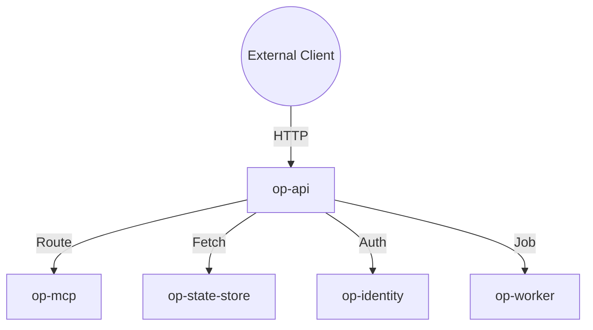

# op-api Design

## Architecture Overview
The `op-api` crate provides a unified REST interface built on `axum` and `tokio`. It serves as the gateway for external clients to interact with the internal services.

## Module Details

### 1. `src/lib.rs`
- Public API and route definitions.
- Main server initialization and entry point.

### 2. `src/handlers/`
- Implements endpoint logic for system, services, and jobs.
- Maps HTTP requests to internal service calls.

### 3. `src/middleware/`
- Handles authentication and authorization using `op-identity`.
- Provides request tracing and metrics using `tower-http`.

### 4. `src/response_handler.py` (Potential Legacy)
- Legacy Python response handler script for compatibility.

## Integration
- **Framework**: `axum` for routing and HTTP handling.
- **Serialization**: `simd-json` for all JSON operations.
- **Monitoring**: `prometheus` for metrics and `tracing` for logs.

## Security
- Token-based authentication required for all sensitive endpoints.
- Role-based access control (RBAC) enforced at the handler level.
- TLS required for all remote client connections.

## Performance
- Non-blocking I/O using `tokio` for high-concurrency handling.
- Efficient JSON parsing using `simd-json` for minimal latency.
