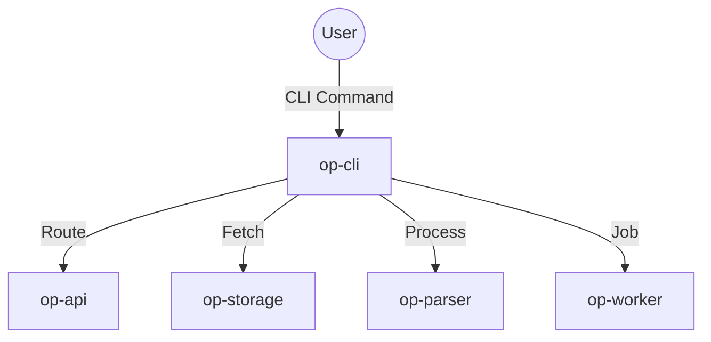

# op-cli Design

## Architecture Overview
The `op-cli` crate provides a comprehensive command-line interface built on `clap` and `tokio`. It serves as the primary tool for system management and developer interaction.

## Module Details

### 1. `src/lib.rs`
- Public CLI API and base command structure.
- Main command loop and entry point.

### 2. `src/commands/`
- Implements individual subcommands for system, services, jobs, and mcp.
- Maps CLI commands to internal API calls.

### 3. `src/output/`
- Handles formatting and presentation of command-line results.
- Provides colorful and interactive output using `colored` and `indicatif`.

## Integration
- **Framework**: `clap` for command-line parsing and `tokio` for async I/O.
- **Serialization**: `simd-json` for all internal JSON data handling.
- **Internal Modules**: Integrates with `op-parser`, `op-storage`, and `op-worker`.

## Performance
- Non-blocking I/O using `tokio` for efficient command-line interaction.
- Fast JSON parsing using `simd-json` for minimal latency.
- Optimized CLI startup time and response for local system queries.

## Usability
- Informative and colorful output using `colored`.
- Progress bars and spinners for long-running operations using `indicatif`.
- Comprehensive help and usage documentation.
