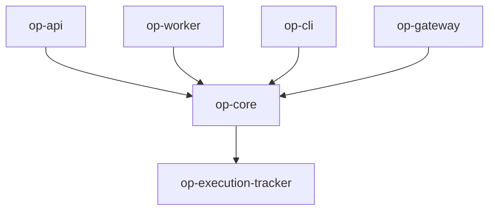

# op-core Design

## Architecture Overview
The `op-core` crate is the foundation of the Operation D-Bus ecosystem. It provides the essential types, traits, and utilities required by all other crates.



## Module Details

### 1. `types.rs`
- Defines core data models used across the system.
- Provides common traits for serialization and message handling.

### 2. `self_identity.rs`
- Manages the identity of the current service/process.
- Handles registration and discovery of the service on D-Bus.

### 3. `security.rs`
- Implements security levels and permission checks.
- Integrates with the system-wide security model.

### 4. `message.rs`
- Defines the internal message format for inter-process communication.
- Supports both JSON and native binary formats.

### 5. `execution.rs`
- Orchestrates the execution of tasks and tools.
- Provides a bridge to `op-execution-tracker` for telemetry.

### 6. `error.rs`
- Unified error type `OpError` using `thiserror`.
- Provides context and conversion methods for other error types.

### 7. `connection.rs`
- Utilities for `zbus` connection management.
- Handles reconnection logic and bus selection.

### 8. `config.rs`
- System-wide configuration management.
- Supports YAML, JSON, and environment variables.

## Key Data Models

### `SelfIdentity`
```rust
pub struct SelfIdentity {
    pub name: String,
    pub id: Uuid,
    pub bus_type: BusType,
    pub security_level: SecurityLevel,
}
```

### `ExecutionStatus`
```rust
pub enum ExecutionStatus {
    Pending,
    Running,
    Completed(ExecutionResult),
    Failed(OpError),
}
```

## Security Considerations
- Centralized security level enforcement.
- Strict validation of incoming messages and configurations.
- No unsafe code in the core layer.

## Performance
- Leverage `simd-json` for high-throughput JSON parsing.
- Asynchronous operations using `tokio` for I/O and task management.
