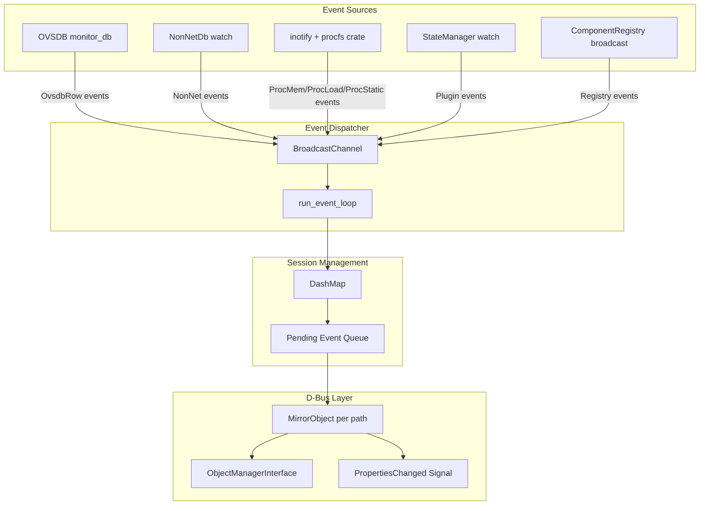

# Design Document: D-Bus Mirror Event-Session Refactoring

## Overview

This design document describes the refactoring of `crates/op-dbus-mirror` from a poll-and-snapshot model to a fully event-driven, session-scoped architecture. The current implementation uses a 30-second polling loop to refresh the entire D-Bus object tree. The new architecture will use event feeds from all data sources (OVSDB, NonNetDb, procfs, StateManager, ComponentRegistry) to publish only deltas, with per-peer session management for efficient resource utilization.

### Key Changes

1. **Session Layer**: Per-peer `MirrorSession` structs with DashMap storage for tracking subscriptions and sequence numbers
2. **Unified Event Enum**: `MirrorEvent` enum representing all data source changes
3. **Event Source Wiring**: Direct connections from OVSDB, NonNetDb, procfs, StateManager, and ComponentRegistry to the event dispatcher
4. **Delta-Only Publication**: Publishing only changed fields with sequence number tracking
5. **Event-Driven Architecture**: Replacing the polling loop with an event loop and heartbeat safety net
6. **zbus 5.12 Upgrade**: Using updated API patterns for signal emissions
7. **serde_json Migration**: Replacing simd-json with serde_json for consistency

### Architecture Diagram



## Architecture

### Session Layer

The session layer manages per-peer connections with the following components:

- **MirrorSession**: Tracks peer state including UniqueName, subscribed paths, and last acknowledged sequence numbers
- **SessionMap**: DashMap<String, MirrorSession> keyed by peer name
- **Pending Event Queue**: Per-session queue with 500-event limit

```rust
pub struct MirrorSession {
    pub peer_name: String,
    pub subscribed_paths: HashSet<String>,
    pub last_acked_sequence: DashMap<String, u64>,
    pub pending_events: VecDeque<MirrorEvent>,
    pub created_at: SystemTime,
}

pub struct DbusMirror {
    // ... existing fields ...
    pub sessions: DashMap<String, MirrorSession>,
}
```

### Event Dispatcher

The event dispatcher receives events from all sources and routes them to the appropriate sessions:

```rust
pub struct EventDispatcher {
    broadcast_tx: broadcast::Sender<MirrorEvent>,
    mirror: Arc<DbusMirror>,
}

impl EventDispatcher {
    pub async fn run_event_loop(&self) {
        let mut rx = self.broadcast_tx.subscribe();
        while let Ok(event) = rx.recv().await {
            self.publish_delta(&event).await;
        }
    }
}
```

## Components and Interfaces

### MirrorSession

Tracks state for each connected peer:

```rust
#[derive(Debug)]
pub struct MirrorSession {
    pub peer_name: String,
    pub subscribed_paths: HashSet<String>,
    pub last_acked_sequence: DashMap<String, u64>,
    pub pending_events: VecDeque<MirrorEvent>,
    pub created_at: SystemTime,
    pub event_count: usize,
}
```

### MirrorEvent

Unified event enum for all data sources:

```rust
#[derive(Debug, Clone)]
pub enum MirrorEvent {
    // OVSDB events
    OvsdbRow {
        table_name: String,
        uuid: String,
        delta: serde_json::Value,
        sequence: u64,
    },
    
    // NonNetDb events
    NonNet {
        key: String,
        delta: serde_json::Value,
        sequence: u64,
    },
    
    // StateManager events
    Plugin {
        plugin_id: String,
        delta: serde_json::Value,
        sequence: u64,
    },
    
    // ComponentRegistry events
    Registry {
        event: RegistryEvent,
        sequence: u64,
    },
    
    // Procfs events
    ProcMem {
        delta: serde_json::Value,
        sequence: u64,
    },
    ProcLoad {
        delta: serde_json::Value,
        sequence: u64,
    },
    ProcStatic {
        section: String,
        data: serde_json::Value,
        sequence: u64,
    },
}
```

### EventDispatcher

Wires all event sources to the broadcast channel:

```rust
pub struct EventDispatcher {
    broadcast_tx: broadcast::Sender<MirrorEvent>,
    mirror: Arc<DbusMirror>,
    ovsdb_client: Arc<OvsdbClient>,
    nonnet_db: Arc<NonNetDb>,
    state_manager: Option<Arc<StateManager>>,
    grpc_server: Option<Arc<OperationGrpcServer>>,
}

impl EventDispatcher {
    pub async fn spawn_event_sources(&self) -> Result<()> {
        // Spawn OVSDB monitor
        self.spawn_ovsdb_monitor().await?;
        
        // Spawn NonNetDb watcher
        self.spawn_nonnet_watcher().await?;
        
        // Spawn procfs watchers
        self.spawn_procfs_watchers().await?;
        
        // Spawn StateManager watcher
        if let Some(sm) = &self.state_manager {
            self.spawn_state_manager_watcher(sm).await?;
        }
        
        // Spawn ComponentRegistry watcher
        if let Some(grpc) = &self.grpc_server {
            self.spawn_component_registry_watcher(grpc).await?;
        }
        
        Ok(())
    }
}
```

## Data Models

### Current Data Store

```rust
pub struct DbusMirror {
    // ... existing fields ...
    
    /// Current data and sequence numbers per object path
    pub current_data: DashMap<String, (serde_json::Value, u64)>,
    
    /// Per-session state
    pub sessions: DashMap<String, MirrorSession>,
}
```

### Sequence Number Tracking

Each published object has a monotonically increasing sequence number:

```rust
pub struct MirrorSession {
    /// Last acknowledged sequence number per path
    pub last_acked_sequence: DashMap<String, u64>,
}

impl DbusMirror {
    /// Increment and store sequence number for a path
    pub async fn increment_sequence(&self, path: &str) -> u64 {
        let mut current = self.current_data.get_mut(path).unwrap();
        current.1 += 1;
        current.1
    }
}
```

## Correctness Properties

*A property is a characteristic or behavior that should hold true across all valid executions of a system-essentially, a formal statement about what the system should do. Properties serve as the bridge between human-readable specifications and machine-verifiable correctness guarantees.*

### Property 1: Session Creation on Peer Activity

*For any* peer name and D-Bus method call or signal subscription, if no MirrorSession exists for that peer, the DbusMirror SHALL create a new MirrorSession with the peer's UniqueName, an empty subscribed paths set, and zero last acknowledged sequence numbers.

**Validates: Requirements 1.1, 1.2**

### Property 2: Session Isolation

*For any* two distinct peer names, the DbusMirror SHALL maintain completely independent MirrorSession instances, with no shared state between them.

**Validates: Requirements 1.6**

### Property 3: Event Queue Limit Enforcement

*For any* MirrorSession, if the pending event queue exceeds 500 events, the DbusMirror SHALL emit InterfacesRemoved for all subscribed paths and destroy the session.

**Validates: Requirements 1.4**

### Property 4: Session Cleanup on Peer Disconnection

*For any* peer name, when the org.freedesktop.DBus.NameOwnerChanged signal indicates the peer is gone, the DbusMirror SHALL destroy the corresponding MirrorSession.

**Validates: Requirements 1.5**

### Property 5: Event Enum Completeness

*For any* data source change (OVSDB row, NonNetDb key, StateManager plugin, ComponentRegistry event, procfs memory/load/static), the EventDispatcher SHALL emit a MirrorEvent variant corresponding to that data source.

**Validates: Requirements 2.1, 2.2, 2.3, 2.4, 2.5, 2.6, 2.7, 2.8**

### Property 6: Event Sequence Number Inclusion

*For any* MirrorEvent emitted by the EventDispatcher, the event SHALL include the current sequence number for the target object path.

**Validates: Requirements 7.6**

### Property 7: Delta-Only Publication

*For any* published object where fields have changed, the DbusMirror SHALL emit PropertiesChanged signals containing only the changed fields, not the full object snapshot.

**Validates: Requirements 7.3, NFR 1.3**

### Property 8: Sequence Number Monotonicity

*For any* object path, each call to publish_object SHALL increment and store a sequence number that is strictly greater than the previous sequence number for that path.

**Validates: Requirements 7.4**

### Property 9: Event Loop Continuity

*For any* MirrorEvent received by the run_event_loop method, the method SHALL process the event and continue running indefinitely until explicitly stopped.

**Validates: Requirements 8.6, 8.7**

### Property 10: Heartbeat Resync

*For any* object whose sequence number has not advanced in 300 seconds, the heartbeat task SHALL trigger a full resync of that object.

**Validates: Requirements 8.8**

### Property 11: Event Source Broadcast Firing

*For any* write operation in NonNetDb or StateManager (insert/update/delete for NonNetDb, register/deregister for StateManager), the broadcast sender SHALL fire exactly once.

**Validates: Requirements 4.5, 6.5**

### Property 12: Procfs Typed Reading

*For any* procfs file (/proc/meminfo, /proc/loadavg, /proc/cpuinfo, /proc/version, /proc/mounts), the EventDispatcher SHALL use the procfs crate to read typed data rather than manual string parsing.

**Validates: Requirements 5.3, 5.4, 5.5, 5.6, 5.7, 5.8, 13.1, 13.2, 13.3, 13.4, 13.5**

### Property 13: NonNetDb Watch Feed

*For any* NonNetDb instance, the watch() method SHALL return a broadcast::Receiver<NonNetChanged> and all write operations SHALL fire the broadcast sender.

**Validates: Requirements 4.1, 4.2, 4.3, 4.4, 4.5, 11.1, 11.2, 11.3, 11.4**

### Property 14: StateManager Watch Feed

*For any* StateManager instance, the watch() method SHALL return a broadcast::Receiver<PluginEvent> and all register/deregister operations SHALL fire the broadcast sender.

**Validates: Requirements 6.1, 6.2, 6.3, 6.4, 6.5, 12.1, 12.2, 12.3, 12.4**

### Property 15: OVSDB Monitor Feed

*For any* OVSDB table row change, the EventDispatcher SHALL receive the change via monitor_db() and emit a MirrorEvent::OvsdbRow event.

**Validates: Requirements 3.1, 3.2, 3.5**

### Property 16: ComponentRegistry Event Propagation

*For any* ComponentRegistry event (registered/updated/deregistered), the EventDispatcher SHALL receive the event and emit a MirrorEvent::Registry event.

**Validates: Requirements 2.5, 3.4**

## Error Handling

### Event Feed Disconnection

When an event feed connection is lost:

1. Log the disconnection with context (source, peer name if applicable)
2. Attempt reconnection with exponential backoff (start at 100ms, max 30s)
3. On reconnection, emit a resync event to ensure consistency
4. If reconnection fails after 10 attempts, emit a critical error and continue attempting

### Session Queue Overflow

When a session's pending event queue exceeds 500 events:

1. Log a warning with session details
2. Emit InterfacesRemoved for all subscribed paths
3. Remove the session from the session map
4. Log the session destruction

### Broadcast Channel Lag

When the broadcast channel receiver lags behind:

1. Log a warning with lag count
2. Emit a resync event to all sessions
3. Continue processing new events

## Testing Strategy

### Dual Testing Approach

This feature uses a dual testing approach:

1. **Unit Tests**: Verify specific examples, edge cases, and error conditions
2. **Property Tests**: Verify universal properties across all inputs (where applicable)

### Property-Based Testing

The following properties will be tested using property-based testing (100+ iterations each):

- **Property 1**: Session creation on peer activity
- **Property 2**: Session isolation
- **Property 3**: Event queue limit enforcement
- **Property 4**: Session cleanup on peer disconnection
- **Property 5**: Event enum completeness
- **Property 6**: Event sequence number inclusion
- **Property 7**: Delta-only publication
- **Property 8**: Sequence number monotonicity
- **Property 9**: Event loop continuity
- **Property 10**: Heartbeat resync
- **Property 11**: Event source broadcast firing
- **Property 12**: Procfs typed reading
- **Property 13**: NonNetDb watch feed
- **Property 14**: StateManager watch feed
- **Property 15**: OVSDB monitor feed
- **Property 16**: ComponentRegistry event propagation

### Unit Tests

Unit tests will cover:

- **Specific Examples**: Valid session creation, event processing, delta publication
- **Edge Cases**: Empty event queues, single-event sessions, boundary conditions
- **Error Conditions**: Connection failures, broadcast lag, queue overflow

### Integration Tests

Integration tests will verify:

- **End-to-End Flow**: Full event flow from source to D-Bus publication
- **Multi-Peer Scenarios**: Multiple peers with independent sessions
- **Reconnection Scenarios**: Event feed disconnection and recovery

### Test Configuration

- Property tests: 100 iterations minimum
- Tag format: `Feature: op-dbus-mirror-event-session-refactor, Property {number}: {property_text}`
- Use `fast-check` for Rust property-based testing

## Implementation Guidance

### File Structure

```
crates/op-dbus-mirror/src/
├── lib.rs                    # Main entry point, DbusMirror struct
├── session.rs                # MirrorSession and session management
├── event.rs                  # MirrorEvent enum and event dispatcher
├── event_sources/
│   ├── mod.rs                # Event source module exports
│   ├── ovsdb.rs              # OVSDB monitor_db integration
│   ├── nonnet.rs             # NonNetDb watch integration
│   ├── procfs.rs             # Procfs inotify integration
│   ├── state_manager.rs      # StateManager watch integration
│   └── component_registry.rs # ComponentRegistry broadcast integration
├── delta.rs                  # Delta publication logic
├── heartbeat.rs              # Heartbeat safety net
└── object.rs                 # MirrorObject D-Bus interface
```

### Module Organization

1. **session.rs**: MirrorSession struct, session lifecycle management
2. **event.rs**: MirrorEvent enum, EventDispatcher struct
3. **event_sources/**: Per-source event wiring
4. **delta.rs**: Delta computation and publication
5. **heartbeat.rs**: Heartbeat task implementation

### Key Implementation Steps

1. **Add Dependencies**: procfs 0.17, inotify 0.10, upgrade zbus to 5.12
2. **Create MirrorEvent Enum**: Define all event variants
3. **Create MirrorSession Struct**: Track peer state
4. **Implement EventDispatcher**: Wire all event sources
5. **Add Session Management**: DashMap for sessions, queue management
6. **Implement Delta Publication**: Compare and publish only changes
7. **Add Heartbeat Task**: 300-second resync interval
8. **Replace Poll Loop**: Remove 30-second interval, use event loop
9. **Migrate to serde_json**: Replace simd-json usage
10. **Upgrade zbus**: Use interface proxy methods for signals

### Migration Checklist

- [ ] Add procfs 0.17 and inotify 0.10 to Cargo.toml
- [ ] Upgrade zbus from 4.0 to 5.12
- [ ] Remove simd-json dependency
- [ ] Create MirrorEvent enum with all variants
- [ ] Create MirrorSession struct
- [ ] Implement EventDispatcher with all event sources
- [ ] Add session management with DashMap
- [ ] Implement delta publication logic
- [ ] Add heartbeat task
- [ ] Replace poll loop with event loop
- [ ] Replace simd_json with serde_json
- [ ] Upgrade zbus signal emissions to use interface proxy methods
- [ ] Add NonNetDb::watch() method
- [ ] Add StateManager::watch() method
- [ ] Replace gather_meminfo, gather_cpuinfo, gather_loadavg with procfs crate
- [ ] Update documentation

### Testing Checklist

- [ ] Property tests for all 16 correctness properties
- [ ] Unit tests for edge cases and error conditions
- [ ] Integration tests for end-to-end flow
- [ ] Multi-peer scenario tests
- [ ] Reconnection scenario tests
- [ ] Performance tests (latency < 100ms)
