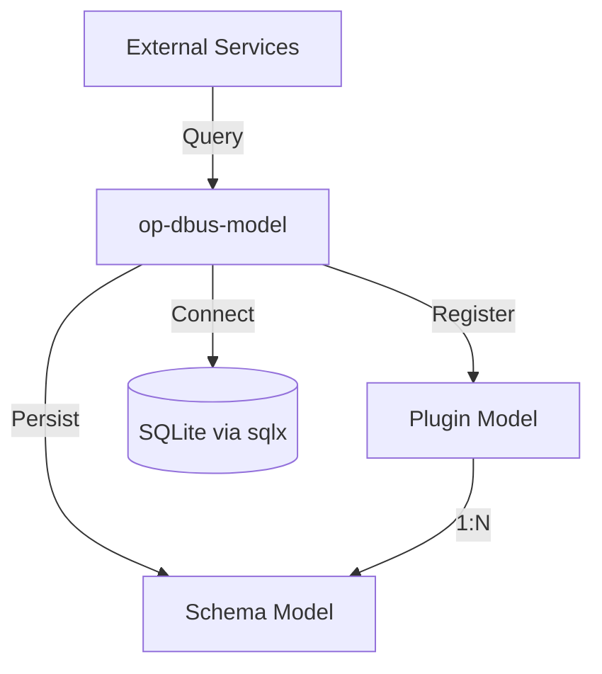

# op-dbus-model - Design

## Architecture Overview

The `op-dbus-model` crate provides the persistent data layer for the Operation D-Bus ecosystem. It defines the SQLite database schema and the Rust models used to represent plugins and their associated D-Bus interface definitions.

## Component Details

### 1. Database Schema (`create_schema`)
- **Engine**: SQLite (via `sqlx`).
- **Initial Schema**:
    - `plugins`:
        - `name`: Primary Key (TEXT).
        - `service_name`: D-Bus Service Name (TEXT).
        - `base_object`: JSON string (TEXT).
        - `created_at`: Registration timestamp (TIMESTAMP).
    - `schemas`:
        - `id`: Primary Key (TEXT/UUID).
        - `plugin_name`: Foreign Key to `plugins(name)` (TEXT).
        - `definition`: JSON interface definition (TEXT).
        - `discovered_from`: Discovery source (TEXT).
        - `discovered_at`: Discovery timestamp (TIMESTAMP).
        - `created_at`: Record creation time (TIMESTAMP).

### 2. Data Models (`models/`)
- **`Plugin`**: Represents a registered D-Bus service.
- **`Schema`**: Represents an introspected D-Bus interface.
- Uses `serde` for serialization/deserialization and `chrono` for time management.
- Utilizes `simd-json` for efficient JSON handling within `base_object` and `definition` fields.

### 3. API Methods (`mod.rs`)
- **`create_schema(pool: &SqlitePool) -> Result<()>`**: Asynchronously initializes the database schema.
- **`register_plugin(pool: &SqlitePool, plugin: Plugin) -> Result<()>`**: Stores or updates a plugin record.
- **`store_schema(pool: &SqlitePool, schema: Schema) -> Result<()>`**: Persists a discovered interface schema.
- **`get_schemas_for_plugin(pool: &SqlitePool, name: &str) -> Result<Vec<Schema>>`**: Retrieves all schemas associated with a plugin.

## Module Structure

- `models/`: Rust structures representing database records (`Plugin`, `Schema`).
- `db/`: Database connection and query logic (integrated into the main module or a sub-module).
- `migrations/`: (Future) Directory for `sqlx` migrations.

## Security Considerations

- **Input Validation**: `sqlx` uses prepared statements to prevent SQL injection.
- **Data Integrity**: Foreign key constraints ensure referential integrity between plugins and schemas.
- **Asynchronous Safety**: Thread-safe access via the `SqlitePool`.

## Performance

- **Connection Pooling**: Managed by `sqlx` to support concurrent access.
- **JSON Handling**: `simd-json` provides high-performance parsing and serialization.
- **Indexing**: Primary and foreign key fields are indexed for efficient record retrieval.
