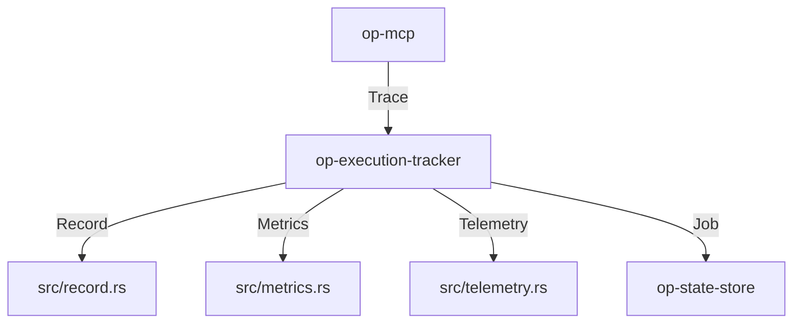

# op-execution-tracker Design

## Architecture Overview
The `op-execution-tracker` crate provides a lightweight execution tracking layer built on `tokio` and `simd-json`. It monitors MCP executions and manages telemetry records.

## Module Details

### 1. `src/lib.rs`
- Public Tracker API and base service initialization.
- Main execution tracking and lifecycle management.

### 2. `src/execution_tracker.rs`
- Implements MCP execution tracking and state transitions.
- Maps tracking requests to internal telemetry records.

### 3. `src/record.rs`
- Handles telemetry record serialization and persistence using `simd-json`.
- Provides data integrity and validation logic.

### 4. `src/metrics.rs`
- Integrated Prometheus metrics for job throughput and tracking latency.

## Integration
- **Framework**: `tokio` for asynchronous execution monitoring.
- **Serialization**: `simd-json` for all internal JSON data handling.
- **Async Runtime**: `tokio` for non-blocking execution tracking.

## Performance
- High-throughput, low-latency execution tracking operations using `tokio`.
- Optimized tracking operations for minimal overhead using asynchronous operations.
- Fast JSON parsing using `simd-json` for minimal latency.

## Security
- Input validation and sanitization for all tracking inputs.
- Telemetry data handling and encryption if applicable.
- No memory leaks or resource exhaustion under high load.
