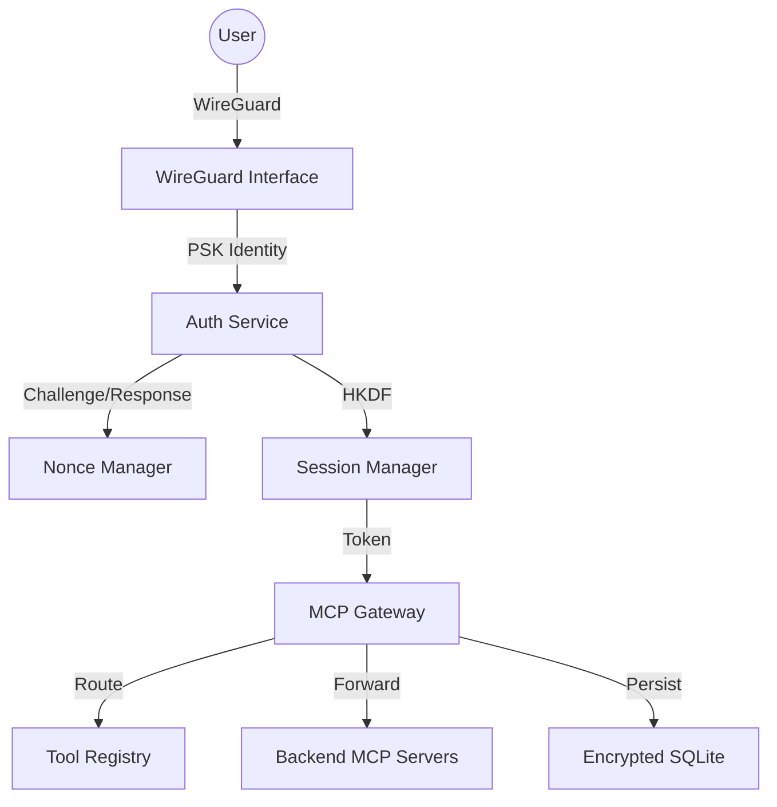

# op-gateway - Design

## Architecture Overview

The `op-gateway` is the secure entry point for the Operation D-Bus ecosystem. It integrates WireGuard-based identity verification, an MCP routing layer, and an encrypted persistence engine.



## Component Details

### 1. Authentication Service (`auth/`)
- **Identity**: Derived from the WireGuard Peer PSK.
- **Protocol**: 
    1. Client initiates login.
    2. Server provides a high-entropy nonce (from `/dev/urandom`).
    3. Client signs the nonce and identity metadata.
    4. Server verifies the signature using the PSK.
- **Key Derivation**: Uses HKDF-SHA256 to derive transient session keys from the PSK and session nonces.

### 2. MCP Gateway (`mcp/`)
- **Dispatcher**: Inspects the `method` and `params` of incoming JSON-RPC 2.0 requests.
- **Routing Table**: Map of namespaces (e.g., `system.*`, `network.*`) to specific internal service handles or remote gRPC endpoints.
- **Transport**: Supports both Unix Domain Sockets (UDS) and stdio for local service communication.

### 3. Encrypted Storage (`storage/`)
- **Engine**: SQLite (via `rusqlite` or `sqlx`).
- **Encryption**: AES-256-GCM provided by `SQLCipher` or a custom VFS layer.
- **Key Management**: The master key is derived from a system secret and salt using Argon2id.
- **Schema**:
    - `sessions`: `session_id`, `identity_hash`, `created_at`, `expires_at`, `metadata`.
    - `registry`: `tool_name`, `provider_id`, `schema_json`.

## Security Considerations

- **Memory Safety**: All sensitive buffers (keys, nonces) use `Zeroize` on drop.
- **JSON Security**: Uses `simd-json` with recursive depth limits to prevent Dos attacks.
- **Replay Protection**: Nonces are strictly single-use and expire within 60 seconds.
- **Privilege Separation**: The gateway runs as a dedicated `op-gateway` user with restricted filesystem access.

## Data Models

### Authentication Request
```json
{
  "jsonrpc": "2.0",
  "method": "auth/login",
  "params": {
    "identity": "base64_psk_hash",
    "signature": "base64_sig"
  }
}
```

### Gateway Routing Metadata
```rust
pub struct RouteInfo {
    pub namespace: String,
    pub target_service: String,
    pub permissions_required: Vec<String>,
}
```