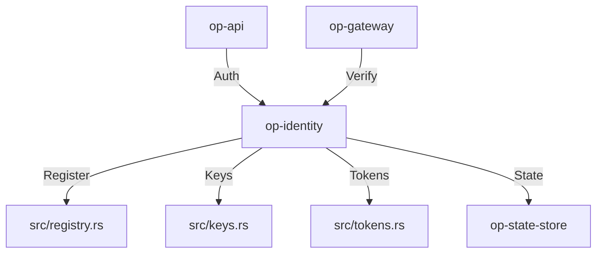

# op-identity Design

## Architecture Overview
The `op-identity` crate provides a robust, secure identity management layer built on `op-core` and `op-state`. It manages service and user identities, tokens, and cryptographic keys.

## Module Details

### 1. `src/lib.rs`
- Public Identity API and base service initialization.
- Main identity registration and lifecycle management.

### 2. `src/keys.rs`
- Implements cryptographic key management for services and users.
- Support secure key derivation (X25519) and signing (Ed25519) operations.

### 3. `src/tokens.rs`
- Handles secure token generation, validation, and revocation.
- Provides token-based authentication for external API clients.

### 4. `src/registry.rs`
- Handles identity registration, discovery, and metadata management.
- Provides a centralized store for all available and registered identities.

## Integration
- **Core Layer**: Built on `op-core` and `op-state`.
- **Async Runtime**: `tokio` for non-blocking identity operations.
- **Serialization**: `simd-json` for all internal JSON data handling.
- **Persistence**: Integrates with `op-state-store` for identity data.

## Performance
- High-throughput, low-latency identity verification using `tokio`.
- Optimized identity operations for minimal overhead using asynchronous operations.
- Minimal memory footprint for long-running identity processes.

## Security
- Input validation and sanitization for all identity-specific data.
- Identity-specific resource isolation and sandboxing if applicable.
- Secure identity data handling and encryption at rest if applicable.
- No memory leaks or resource exhaustion under high load.
