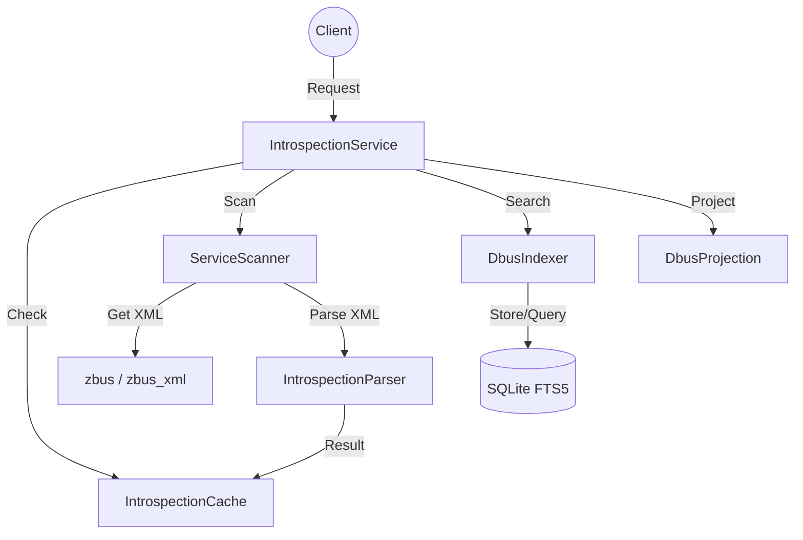

# op-introspection - Design

## Architecture Overview

The `op-introspection` crate provides a unified service for discovering, parsing, caching, and indexing D-Bus introspection data. It acts as a bridge between the raw D-Bus XML and structured, JSON-serializable representations used by other system components.



## Component Details

### 1. `IntrospectionService` (`lib.rs`)
- **Main Interface**: Provides a high-level API for listing services, introspecting objects, and searching the index.
- **Orchestration**: Manages the interaction between the `ServiceScanner`, `IntrospectionCache`, and `DbusIndexer`.

### 2. `ServiceScanner` (`scanner.rs`)
- **D-Bus Client**: Uses `zbus` to communicate with the system and session buses.
- **XML Fetching**: Retrieves introspection XML from object paths.
- **Discovery**: Enumerates active services and their object trees.

### 3. `IntrospectionParser` (`parser.rs`)
- **XML Parsing**: Uses `quick-xml` and `zbus_xml` to process D-Bus introspection data.
- **Mapping**: Converts D-Bus types and structures into JSON-serializable Rust objects (`ObjectInfo`, `InterfaceInfo`, `MethodInfo`, etc.).

### 4. `IntrospectionCache` (`cache.rs`)
- **Async Caching**: Provides a thread-safe, asynchronous cache for introspection results.
- **In-Memory/Persistence**: Currently an in-memory `parking_lot` based cache, with potential for SQLite-backed persistence.

### 5. `DbusIndexer` and `IndexerManager` (`indexer.rs`, `indexer_manager.rs`)
- **Full-Text Search**: Uses SQLite's FTS5 engine to index D-Bus services, interfaces, and methods.
- **Query API**: Provides methods for searching D-Bus components by keyword or semantic prefix.
- **Manager**: Orchestrates background indexing tasks to keep the FTS5 index up-to-date.

### 6. `DbusProjection` and `Hierarchical` (`projection.rs`, `hierarchical.rs`)
- **Simplification**: Projects complex D-Bus interfaces into flattened structures for high-level consumption.
- **Tree View**: Manages the hierarchical relationship of D-Bus object paths.

## Module Structure

- `src/lib.rs`: Public API and the `IntrospectionService`.
- `src/scanner.rs`: D-Bus communication and service discovery.
- `src/parser.rs`: XML parsing and data mapping.
- `src/cache.rs`: Result caching.
- `src/indexer.rs`: SQLite FTS5 indexing.
- `src/indexer_manager.rs`: Management of background indexing tasks.
- `src/projection.rs`: Schema simplification and projection.
- `src/hierarchical.rs`: Object tree management.
- `src/cache.rs`: Caching logic.
- `src/cpu_features.rs`: Hardware-specific optimizations for parsing/indexing.

## Data Models

### `ObjectInfo`
```rust
pub struct ObjectInfo {
    pub path: String,
    pub interfaces: Vec<InterfaceInfo>,
    pub children: Vec<String>,
}
```

### `InterfaceInfo`
```rust
pub struct InterfaceInfo {
    pub name: String,
    pub methods: Vec<MethodInfo>,
    pub signals: Vec<SignalInfo>,
    pub properties: Vec<PropertyInfo>,
}
```

## Security Considerations

- **Isolation**: Introspection is a read-only operation and does not grant mutation capabilities.
- **Input Validation**: `simd-json` and `quick-xml` are used with strict parsing rules to prevent injection or DoS attacks via malformed bus data.
- **Privilege Separation**: The service respects D-Bus bus-level access controls.

## Performance

- **Asynchronous I/O**: Fully built on `tokio` for non-blocking D-Bus and database operations.
- **Efficient JSON/XML**: Leveraging `simd-json` and `quick-xml` for low-latency data transformation.
- **Caching**: Drastically reduces repeated D-Bus calls for stable system services.
- **FTS5**: High-speed indexing and searching within a local SQLite database.
