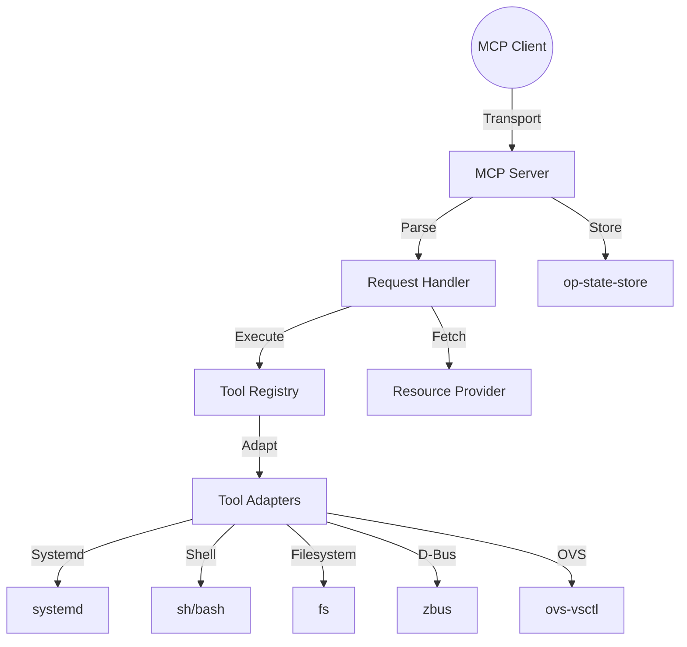

# op-mcp - Design

## Architecture Overview

The `op-mcp` crate provides a unified server implementation of the Model Context Protocol (MCP). It is designed to be highly modular, with pluggable transports, tool adapters, and resource providers.

## Component Details

### 1. Transports (`transport/`)
- **`StdioTransport`**: Implements MCP over standard input/output for local CLI integration.
- **`HttpTransport` (SSE)**: Uses `axum` to serve MCP via Server-Sent Events.
- **`WebSocketTransport`**: Leverages `axum-ws` for bidirectional MCP streams.
- **`GrpcTransport`**: Provides a high-performance gRPC interface for internal service communication (using `tonic` and `prost`).

### 2. Tool Registry and Adapters (`tool_registry.rs`, `tools/`)
- **`ToolRegistry`**: Centralized store for tool definitions (schemas) and their associated execution logic.
- **`ToolAdapter`**: A trait for bridging different system-level operations to the MCP tool format.
    - **`SystemdAdapter`**: Manages systemd units (start, stop, restart, status).
    - **`ShellAdapter`**: Safely executes pre-approved shell commands.
    - **`DbusAdapter`**: Dynamically generates MCP tools from D-Bus introspection data (integrated with `op-introspection`).
    - **`OvsAdapter`**: Provides tools for Open vSwitch bridge and port configuration.

### 3. Resource Management (`resources.rs`, `request_handler.rs`)
- **`ResourceProvider`**: Defines how system state (files, logs, D-Bus properties) is mapped to MCP resources.
- **`ResourceTemplate`**: Supports dynamic resource URI expansion.

### 4. Agent Execution (`trait_agent_executor.rs`, `tool_adapter_orchestrated.rs`)
- **`AgentExecutor`**: A higher-level trait for orchestrating complex tasks that may involve multiple tool calls and state transitions.
- **`OrchestratedToolAdapter`**: Combines multiple tool sources into a single, unified interface for the executor.

## Module Structure

- `grpc/`: gRPC service definitions, server, and client implementations.
- `tools/`: Individual tool implementations (systemd, system, shell, ovs, etc.).
- `transport/`: MCP transport implementations (WebSocket, Stdio, HTTP).
- `tool_registry.rs`: The main tool management logic.
- `request_handler.rs`: Central logic for processing incoming JSON-RPC 2.0 requests.
- `router.rs`: Maps incoming requests to the appropriate handlers.

## Security Considerations

- **Transport Security**: TLS encryption for all network-based transports (HTTP, WebSocket, gRPC).
- **Input Validation**: All tool parameters are validated against their registered JSON schemas using `simd-json`.
- **Sandboxing**: Shell and filesystem tools are restricted to pre-defined paths and command sets.
- **Resource Isolation**: Access control lists (ACLs) can be applied to resources based on client identity.

## Performance

- **Asynchronous I/O**: Fully built on `tokio` for high-concurrency handling.
- **Fast JSON**: `simd-json` is used throughout for high-performance serialization and deserialization.
- **Streaming**: Supports large resource transfers and long-lived notification streams using `tokio-stream` and `futures`.