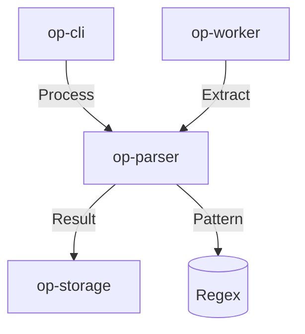

# op-parser Design

## Architecture Overview
The `op-parser` crate provides a high-performance parsing layer built on `regex` and `simd-json`. It manages system-wide configuration, logs, and data processing.

## Module Details

### 1. `src/lib.rs`
- Public Parser API and base regex initialization.
- Main parsing and data extraction logic.

### 2. `src/patterns/`
- Implements common parsing patterns for system logs and configurations.
- Maps parsing requests to internal `regex` calls.

### 3. `src/processing/`
- Handles structured data extraction and mapping using `simd-json`.
- Provides data integrity and validation logic.

## Integration
- **Framework**: `regex` for high-performance regular expression parsing.
- **Serialization**: `simd-json` for all internal JSON data handling.
- **Lazy Init**: `once_cell` for efficient, lazy-initialized parsing logic.

## Performance
- High-throughput, low-latency parsing operations using `regex`.
- Optimized parsing operations for minimal overhead using asynchronous operations.
- Fast JSON parsing using `simd-json` for minimal latency.

## Security
- Input validation and sanitization for all parsing inputs.
- No shell injection or malformed data vectors in parsing logic.
- No memory leaks or resource exhaustion under high load.
