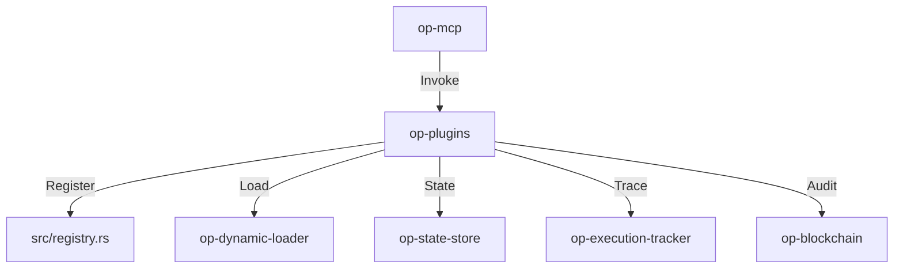

# op-plugins Design

## Architecture Overview
The `op-plugins` crate provides a modular plugin system built on `op-core` and `op-state`. It manages domain-specific plugins and integrates with the system-wide state management and audit trail.

## Module Details

### 1. `src/lib.rs`
- Public Plugin API and base service initialization.
- Main plugin registration and lifecycle management.

### 2. `src/state_plugins/`
- Implements individual domain-specific plugins (systemd, dinit, network, etc.).
- Maps plugin requests to internal system-level operations.

### 3. `src/registry.rs`
- Handles plugin registration, discovery, and metadata management.
- Provides a centralized store for all available and registered plugins.

### 4. `src/plugin.rs`
- Core `Plugin` trait for all domain-specific plugins.
- Defines common methods for initialization, state management, and execution.

## Integration
- **Core Layer**: Built on `op-core` and `op-state`.
- **Async Runtime**: `tokio` for non-blocking plugin operations.
- **Serialization**: `simd-json` for all internal JSON data handling.
- **Audit Ledger**: Integrates with `op-blockchain` for tamper-evident footprints.

## Performance
- High-throughput, low-latency plugin execution using `tokio`.
- Optimized plugin operations for minimal overhead using asynchronous operations.
- Minimal memory footprint for long-running plugin processes.

## Security
- Input validation and sanitization for all plugin-specific data.
- Plugin-specific resource isolation and sandboxing if applicable.
- Secure transport and encryption for remote plugin connections if applicable.
