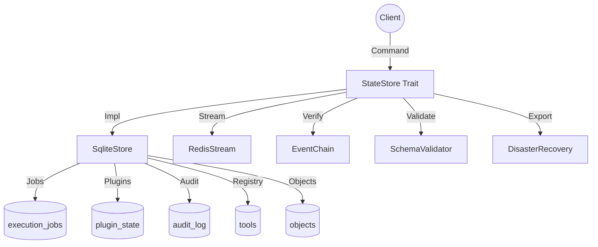

# op-state-store - Design

## Architecture Overview

The `op-state-store` crate provides the persistent storage layer for execution jobs, plugin state, and the system audit trail. It integrates SQLite for durable state persistence and Redis for real-time event streaming.



## Component Details

### 1. `StateStore` Trait (`state_store.rs`)
- **Common Interface**: Defines the essential methods for saving/loading jobs, objects, and tools.
- **Abstraction**: Allows for different storage backends (SQLite, In-memory for testing).

### 2. `SqliteStore` (`sqlite_store.rs`)
- **Durable Storage**: Uses `sqlx` and SQLite to persist execution jobs, plugin states, checkpoints, and audit logs.
- **Schema Management**: Initializes and manages the SQLite schema, including support for extended enterprise tables (AD, CMS).
- **Transactions**: Ensures atomic updates for complex state transitions.

### 3. `ExecutionJob` (`execution_job.rs`)
- **Job Model**: Defines the structure and state transitions for execution jobs.
- **Statuses**: `Pending`, `Running`, `Completed`, `Failed`.

### 4. `EventChain` (`event_chain.rs`)
- **Audit Integrity**: Implements a blockchain-style event chain for the audit trail.
- **Hashing**: Uses Merkle batches and canonical hashing to ensure audit log immutability and reproducibility.
- **Verification**: Provides methods for verifying the integrity of the stored event chain.

### 5. `SchemaValidator` and `PluginSchema` (`schema_validator.rs`, `plugin_schema.rs`)
- **JSON Schema**: Integrates with `jsonschema` to validate job arguments and plugin state.
- **Registry**: Maintains a registry of plugin-specific schemas and constraints.
- **Canonicalization**: Ensures JSON data is in a canonical format before hashing or storage.

### 6. `RedisStream` (`redis_stream.rs`)
- **Real-time Notifications**: Publishes state changes and job updates to a Redis stream for real-time consumption by other services.

### 7. `DisasterRecovery` (`disaster_recovery.rs`)
- **Export/Import**: Provides logic for creating and restoring canonical database exports.
- **Context**: Tracks host-specific info and system dependencies.

## Module Structure

- `src/lib.rs`: Public API and core traits.
- `src/sqlite_store.rs`: SQLite persistence implementation.
- `src/redis_stream.rs`: Redis real-time streaming.
- `src/execution_job.rs`: Job state and model.
- `src/event_chain.rs`: Verifiable audit trail logic.
- `src/schema_validator.rs`: JSON schema enforcement.
- `src/plugin_schema.rs`: Plugin-specific schema registry.
- `src/state_store.rs`: The base `StateStore` trait.
- `src/disaster_recovery.rs`: Backup and restore functionality.
- `src/metrics.rs`: Prometheus metrics integration.

## Data Models

### `ExecutionJob`
```rust
pub struct ExecutionJob {
    pub id: Uuid,
    pub tool_name: String,
    pub arguments: simd_json::OwnedValue,
    pub status: ExecutionStatus,
    pub created_at: DateTime<Utc>,
    pub updated_at: DateTime<Utc>,
    pub result: Option<ExecutionResult>,
}
```

### `StoredObject`
```rust
pub struct StoredObject {
    pub id: String,
    pub object_type: String,
    pub namespace: String,
    pub data: simd_json::OwnedValue,
}
```

## Security Considerations

- **Integrity**: The `EventChain` prevents undetected tampering with the audit log.
- **Prepared Statements**: `sqlx` prevents SQL injection.
- **Schema Enforcement**: Prevents malformed or malicious data from being processed via job arguments or plugin states.
- **Audit Footprints**: Every mutation includes a hash for verification.

## Performance

- **Async I/O**: Non-blocking database and Redis operations using `tokio`.
- **Fast JSON**: `simd-json` for high-performance data transformation.
- **Pooling**: `sqlx` connection pooling for concurrent access.
- **Indexing**: Extensive SQLite indices for fast job and audit log queries.
