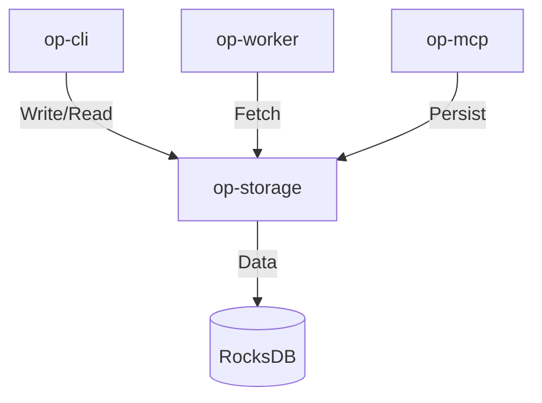

# op-storage Design

## Architecture Overview
The `op-storage` crate provides a high-performance, persistent storage layer built on `rocksdb` and `tokio`. It manages system-wide configuration, state, and audit data.

## Module Details

### 1. `src/lib.rs`
- Public Storage API and base database initialization.
- Main database access and lifecycle management.

### 2. `src/ops/`
- Implements individual database operations for system, services, and tools.
- Maps storage requests to internal `rocksdb` calls.

### 3. `src/persistence/`
- Handles data serialization and persistence using `simd-json`.
- Provides data integrity and recovery logic.

## Integration
- **Framework**: `rocksdb` for high-performance key-value storage.
- **Async Runtime**: `tokio` for non-blocking database operations.
- **Serialization**: `simd-json` for all internal JSON data handling.

## Performance
- High-throughput, low-latency database operations using `rocksdb`.
- Non-blocking I/O using `tokio` for concurrent database access.
- Minimal database write/read overhead using asynchronous operations.

## Security
- Input validation and sanitization for all database keys and values.
- Database access control and encryption at rest if applicable.
- No memory leaks or resource exhaustion under high load.
