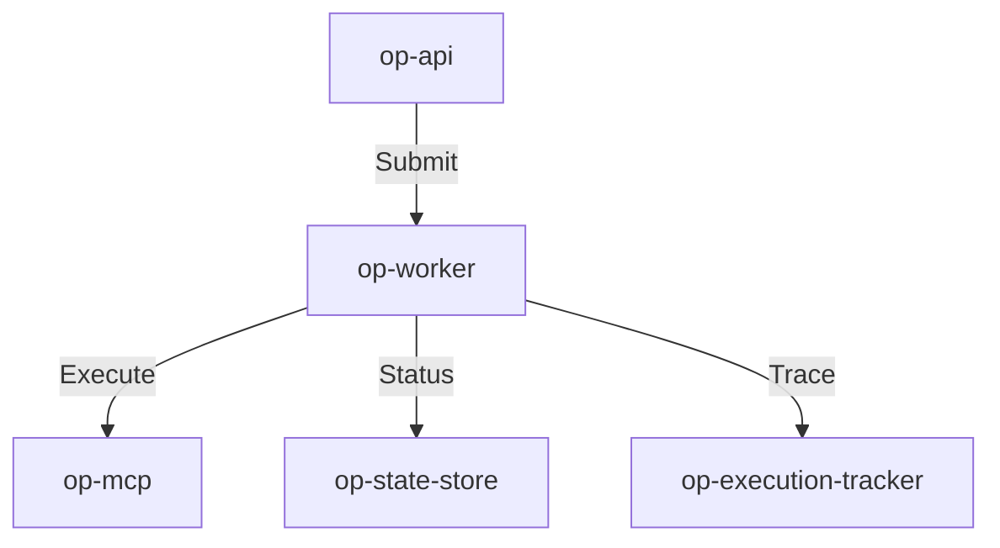

# op-worker Design

## Architecture Overview
The `op-worker` crate provides an asynchronous, background worker system built on `tokio`. It manages the lifecycle of long-running tasks and coordinates their execution with other system components.

## Module Details

### 1. `src/lib.rs`
- Public API and worker service initialization.
- Main task execution and lifecycle management.

### 2. `src/jobs/`
- Implements job-specific logic for system, services, and tools.
- Maps job requests to internal tool executions.

### 3. `src/lifecycle/`
- Handles job status transitions and persistence using `op-state-store`.
- Provides job cancellation and timeout logic.

## Integration
- **Framework**: `tokio` for asynchronous task execution and scheduling.
- **Serialization**: `simd-json` for all internal JSON data handling.
- **Monitoring**: `tracing` for logs and `prometheus` for job-specific metrics.

## Performance
- Non-blocking I/O using `tokio` for efficient background processing.
- Minimal job dispatch overhead using asynchronous task management.
- Scalable job-based load balancing and prioritization.

## Security
- Input validation and sanitization for all job arguments.
- Job-specific resource isolation and sandboxing if applicable.
- No shell injection vectors in task execution.
