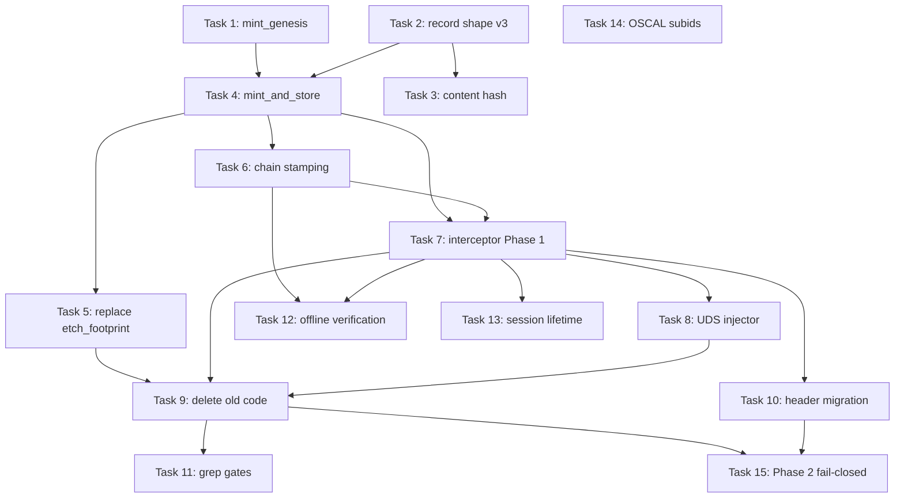

# Tasks — Session Genesis Identity

**Implements:** `design.md` (amended 2026-08-16)

Each task is independently testable. Tasks are sequenced so that the
fail-closed change (Phase 2) comes AFTER the stamping change (Phase 1), and
deletions come AFTER their replacements are in place.

---

## Task 1: `mint_genesis` pure function + unit tests

**File:** `crates/op-identity/src/session_genesis.rs` (NEW)

**Work:**
1. Create `session_genesis.rs` with `pub fn mint_genesis(wg_pubkey: &[u8; 32], chain_head_hash: &[u8; 32], head_timestamp: i64, catalog_hash: &[u8; 32], arrival_timestamp: i64) -> [u8; 32]`.
2. All inputs as raw `[u8; 32]` or `i64` — no encoding ambiguity.
3. Blake3 hash of the concatenation in the specified order.
4. Add `pub mod session_genesis;` to `crates/op-identity/src/lib.rs`.
5. Unit tests in the module: deterministic, uniqueness (different arrival_ts → different output), all-zeros input handled, different pubkey → different output.

**Test:**
```bash
cargo test -p op-identity session_genesis
```

**Acceptance:** Tests pass. Function exists in exactly one place.

---

## Task 2: Extend `ContainerIdentitySled` with v3 fields

**File:** `crates/op-plugins/src/state_plugins/identity_sled.rs`

**Work:**
1. Add fields: `genesis: Option<String>`, `arrival_timestamp: i64`, `chain_head_at_arrival: String`, `catalog_hash_at_arrival: String`, `head_timestamp_at_arrival: i64`.
2. Add `#[serde(alias = "hashed_footprint")]` on `genesis` field for backward compat with v2 records.
3. Remove `hashed_footprint` field (replaced by `genesis`).
4. Ensure `#[serde(default)]` on all new fields so old records deserialize.

**Test:**
```bash
cargo test -p op-plugins
cargo check -p op-grpc-bridge  # confirm downstream compiles
```

**Acceptance:** Existing tests pass (old records deserialize via alias). New fields present in schemars output.

---

## Task 3: Schema content hash + drift detection (`build.rs`)

**File:** `crates/op-plugins/build.rs` (NEW or extend), `crates/op-plugins/src/state_plugins/identity_sled.rs`

**Work:**
1. In `build.rs`: serialize `ContainerIdentitySled`'s schemars JSON schema, sha256 hash it, write to `OUT_DIR/identity_sled_schema_hash.txt`.
2. Export `pub const SCHEMA_CONTENT_HASH: &str = include_str!(...)` from identity_sled module.
3. **No monotonic counter, and the design no longer allows either option** (see design.md §8, amended). Two distinct facts, one author each:
   - `pub const RECORD_FORMAT: u32 = 3;` declared **in the record definition itself**, next to the fields. This is the format discriminator §6.5 needs for its `version <= 2` legacy comparison. Human-set, changes only on a deliberate format generation. `schema_version` on every record is assigned from this const — never a literal at a call site.
   - `SCHEMA_CONTENT_HASH` generated from the canonical schemars serialization (step 1/2 above). This is the drift check.
   A build-script counter has no memory across clean builds, so two machines would emit different versions for identical source — a hand-maintained fact wearing a generated costume. Do not implement one.
4. Test: mutate a field name → hash changes → restore.

**Test:**
```bash
cargo test -p op-plugins schema_content_hash
```

**Acceptance:** `SCHEMA_CONTENT_HASH` is a stable 64-char hex string that changes when the struct changes.

---

## Task 4: `mint_and_store_genesis` in MutationEngine

**File:** `crates/op-grpc-bridge/src/mutation_engine.rs`

**Work:**
1. Add `SessionContext` struct: `genesis_hex: String`, `session_id: String`, `wireguard_pubkey: String`.
2. Add `mint_and_store_genesis(&self, session_id: &str, pubkey: &str) -> anyhow::Result<String>`:
   - Reads chain head (`self.event_chain.lock().last_hash()` + head timestamp).
   - Reads catalog hash (`schema_catalog_hash()`).
   - Gets arrival_timestamp (`Utc::now().timestamp()`).
   - Decodes pubkey from base64 to `[u8; 32]`.
   - Decodes chain_head_hash from hex to `[u8; 32]`.
   - Calls `op_identity::session_genesis::mint_genesis(...)`.
   - Writes genesis + inputs to the session's cache entry.
   - **Inline Cozo persist** (awaited — §5.2 durability).
   - Publishes SHM projection.
   - Returns genesis hex.
3. Wire into the mutation path: on first mutation for a session where `genesis` is `None`, call `mint_and_store_genesis` before proceeding.

**Test:**
```bash
cargo test -p op-grpc-bridge mint_and_store_genesis
```

**Acceptance:** Integration test: create a session, first mutation mints genesis, second mutation reads stored genesis without re-minting.

---

## Task 5: Replace `etch_footprint` calls in `identity_sled_dispatch.rs`

**File:** `crates/op-grpc-bridge/src/identity_sled_dispatch.rs`

**Work:**
1. At line ~388 (backfill empty footprint on re-registration): replace `etch_footprint(&pubkey_bytes, 0, 0)` with a call to `mint_and_store_genesis` (or the inline equivalent using `mint_genesis`).
2. At line ~428 (initial provisioning): same replacement.
3. Both sites now mint genesis with real chain head + arrival timestamp, making provisioning equivalent to arrival.
4. Remove `write_sled_from_wg` call at :465.

**Test:**
```bash
cargo test -p op-grpc-bridge identity_sled
```

**Acceptance:** `write_identity_mints_genesis` test: provisioning a new session produces a non-empty `genesis` field. No call to `etch_footprint` remains in this file.

---

## Task 6: `event_to_footprint` carries session identity (FR-3)

**File:** `crates/op-grpc-bridge/src/mutation_engine.rs`

**Work:**
1. Change `event_to_footprint` signature to accept `session: &SessionContext`.
2. Add `session_genesis`, `session_id`, `wireguard_pubkey` to the metadata map.
3. Update all call sites to pass the session context (derived from request extensions or engine state).
4. `advance_identity_sled` → rename to `advance_session_record`, remove `write_sled_full` call, replace with in-process cache mutation_index update.

**Test:**
```bash
cargo test -p op-grpc-bridge event_to_footprint
cargo test -p op-grpc-bridge chain_carries_session_identity
```

**Acceptance:** Footprint metadata includes all three session fields. `chain_sliceable_by_session` test passes.

---

## Task 7: Interceptor genesis verification path (Phase 1)

**File:** `crates/op-grpc-bridge/src/interceptor.rs`

**Work:**
1. Read `x-ghostbridge-genesis` header (new, preferred) alongside existing `x-ghostbridge-footprint` (legacy).
2. After assertion validation: look up session's stored genesis from state cache via `get_identity`.
3. Compare presented genesis against stored. Reject on mismatch.
4. For assertion-carrying traffic: genesis looked up server-side after assertion validation (no header required from client). Populate genesis in `HumanPrincipalIdentity`.
5. If session exists but `genesis` is `None`: treat as arrival, call `mint_and_store_genesis` inline (re-mint on cold-start recovery — §5.2).
6. Remove `verify_ghostbridge_footprint` call from the fallback path.
7. Both headers accepted during Phase 1 (compared to stored genesis).

**Test:**
```bash
cargo test -p op-grpc-bridge interceptor
```

**Acceptance:**
- Valid genesis header → accepted.
- Mismatched genesis → UNAUTHENTICATED.
- Absent genesis (no assertion either) → UNAUTHENTICATED.
- Assertion without header → genesis looked up server-side → accepted.
- Old `x-ghostbridge-footprint` value matching stored genesis → accepted (transition).

---

## Task 8: UDS injector rework (`shared_socket.rs`)

**File:** `crates/op-grpc-bridge/src/shared_socket.rs`

**Work:**
1. Build uid-to-container-name static map at startup (from Incus subuid config or environment).
2. `CanonicalPeerIdentity::from_sled()` → `from_session(session_id)`: resolves session_id from `SO_PEERCRED` uid via the static map, then reads genesis from state cache.
3. `uds_identity_interceptor`: uses `block_in_place` + `Handle::current().block_on(...)` for the async lookup (same pattern as `verify_per_identity`).
4. Injects `x-ghostbridge-genesis` header (instead of `x-ghostbridge-footprint`).
5. Host identity (uid 0 / bridge's own uid) uses host session_id.

**Test:**
```bash
cargo test -p op-grpc-bridge shared_socket
```

**Acceptance:** `uid_to_session_mapping` test: known uid → correct session_id. UDS interceptor injects genesis header.

---

## Task 9: Delete global-sled writers + `etch_footprint` + `anna_scribe`

**Files:** Multiple (see FR-6 enumeration)

**Work:**
1. `op-cognitive-mcp/src/main.rs:66` — remove `write_sled_from_wg` call.
2. `op-mcp/src/main.rs:113` — remove `write_sled_from_wg` call.
3. `op-mcp/src/compact.rs:585` — remove `write_sled_from_wg` call.
4. `op-identity/src/bin/op-identity-sled.rs:52` — remove write, make CLI read-only.
5. `op-identity/src/schema_bridge.rs` — delete `write_sled_from_wg`, `write_sled_full`, `watch_wireguard_handshakes`, `etch_footprint`.
6. `op-identity/src/lib.rs` — remove re-exports of deleted functions; remove `pub mod anna_scribe;` and `pub use anna_scribe::*`.
7. Delete `crates/op-identity/src/anna_scribe.rs`.
8. Remove unused imports in all touched files.

**Test:**
```bash
cargo build --workspace
cargo test --workspace
# Grep gates:
grep -rn 'write_sled_from_wg\|write_sled_full' crates/ --include='*.rs' | grep -v '#\[cfg'
# Should be zero
grep -rn 'etch_footprint' crates/ --include='*.rs'
# Should be zero
grep -rn 'anna_scribe' crates/ --include='*.rs'
# Should be zero (or only in CHANGELOG/docs)
```

**Acceptance:** Workspace builds and tests pass. Grep gates exit clean.

---

## Task 10: Header migration support (`grpc_web.rs`, `grpc_client.rs`, `tracing.rs`)

**Files:** `grpc_web.rs`, `grpc_client.rs`, `tracing.rs`, `server.rs`

**Work:**
1. `grpc_web.rs`: Add `HeaderName::from_static("x-ghostbridge-genesis")` to `ALLOW_HEADERS`.
2. `grpc_client.rs`: Add `x-ghostbridge-genesis` to outbound header injection.
3. `server.rs`: Stamp `x-ghostbridge-genesis` on outbound responses where applicable.
4. `tracing.rs`: Remove `SENTINEL_FOOTPRINT`. `TraceContext::from_headers` no longer zero-fills — returns empty/None when absent. Genesis value NEVER in trace output.

**Test:**
```bash
cargo test -p op-grpc-bridge grpc_web
cargo test -p op-grpc-bridge tracing
# Grep gate:
grep -rn 'SENTINEL_FOOTPRINT' crates/ --include='*.rs'
# Should be zero
```

**Acceptance:** CORS preflight allows the new header. Sentinel removed. Genesis not logged.

---

## Task 11: Genesis redaction lint + grep gates

**File:** `crates/op-grpc-bridge/tests/` or `scripts/`

**Work:**
1. Grep gate test: no `tracing::` macro in op-grpc-bridge references a variable containing "genesis" (excluding test helpers).
2. Grep gate test: `mint_genesis` blake3 invocation only in `session_genesis.rs`.
3. Grep gate test: no `write_sled_from_wg` / `write_sled_full` / `etch_footprint` / `SENTINEL_FOOTPRINT` / `anna_scribe` outside comments/docs.
4. Grep gate test: `hashed_footprint` only appears in `#[serde(alias)]` context.

**Test:**
```bash
cargo test -p op-grpc-bridge grep_gates
# or:
scripts/check-session-genesis-gates.sh
```

**Acceptance:** All gates pass. Introducing a forbidden pattern makes them fail (self-test).

---

## Task 12: Offline re-verification test

**File:** `crates/op-grpc-bridge/tests/` (integration test)

**Work:**
1. Create two sessions with interleaved mutations.
2. Extract chain segments filtered by `session_genesis`.
3. For each segment: recompute genesis from stored inputs, verify equality.
4. Verify ancestor relationship: `chain_head_at_arrival` is an ancestor (not necessarily parent) of the segment's first event.
5. Verify internal prev_hash linkage within each segment.
6. Test with deliberate gap (other session mutates between head read and arrival event) to confirm ancestor check passes.

**Test:**
```bash
cargo test -p op-grpc-bridge offline_reverification
```

**Acceptance:** Both segments verify. Ancestor check handles gaps correctly.

---

## Task 13: Session lifetime tests (FR-12)

**File:** `crates/op-grpc-bridge/tests/`

**Work:**
1. `reauth_new_genesis`: same pubkey, expire session, re-authenticate → different genesis.
2. `expired_session_rejected`: valid genesis for expired session → PERMISSION_DENIED.
3. `session_bounded_span`: chain segment has defined start (arrival event) and end (last before expiry).
4. `genesis_none_triggers_remint`: session in cache with `genesis: None` (simulating crash recovery) → next request mints fresh genesis.

**Test:**
```bash
cargo test -p op-grpc-bridge session_lifetime
```

**Acceptance:** All four tests pass.

---

## Task 14: OSCAL subid registration

**File:** `crates/op-plugins/src/state_plugins/oscal_subid_registry.rs`

**Work:**
1. Register: `mut.service.session-genesis.mint@v1`
2. Register: `evt.service.event-chain.session-stamp@v1`
3. Register: `obs.service.identity-sled.genesis-verify@v1`
4. Register: `evt.service.session-genesis.arrival@v1`

**Test:**
```bash
cargo test -p op-plugins all_plugin_subids_are_valid_and_unique
```

**Acceptance:** Uniqueness test passes with the new subids.

---

## Task 15 (Phase 2, separate deployment): Fail-closed + assertion-required

**NOT deployed with Phase 1.** Gated on confirming all active sessions are
stamping genesis successfully.

**Work:**
1. Remove legacy `x-ghostbridge-footprint` acceptance from interceptor.
2. For non-UDS traffic: require assertion alongside genesis (FR-11 option 1).
3. Remove `#[serde(alias = "hashed_footprint")]` (all records now v3).
4. Remove any remaining version ≤ 2 compat code.

**Test:**
```bash
cargo test -p op-grpc-bridge interceptor
cargo test -p op-grpc-bridge assertion_bound_genesis
```

**Acceptance:** Genesis without assertion → rejected. Old footprint header → ignored.

---

## Sequencing Summary

```
Task 1  (mint_genesis)           ← foundation, no dependencies
Task 2  (record shape v3)        ← foundation, no dependencies
Task 3  (content hash)           ← depends on Task 2
Task 4  (mint_and_store)         ← depends on Tasks 1, 2
Task 5  (replace etch_footprint) ← depends on Task 4
Task 6  (chain stamping)         ← depends on Task 4
Task 7  (interceptor Phase 1)    ← depends on Tasks 4, 6
Task 8  (UDS injector)           ← depends on Task 7
Task 9  (delete old code)        ← depends on Tasks 5, 7, 8
Task 10 (header migration)       ← depends on Task 7
Task 11 (grep gates)             ← depends on Task 9
Task 12 (offline verification)   ← depends on Tasks 6, 7
Task 13 (session lifetime)       ← depends on Task 7
Task 14 (OSCAL subids)           ← independent, any time
Task 15 (Phase 2 fail-closed)    ← AFTER Phase 1 deployed and confirmed
```


