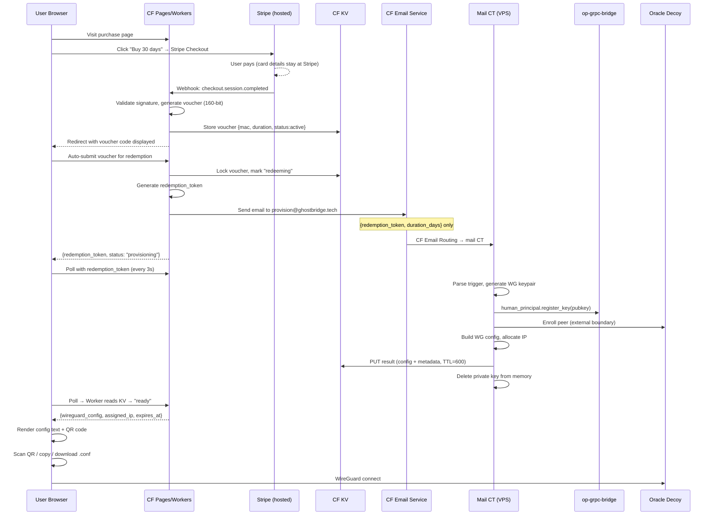
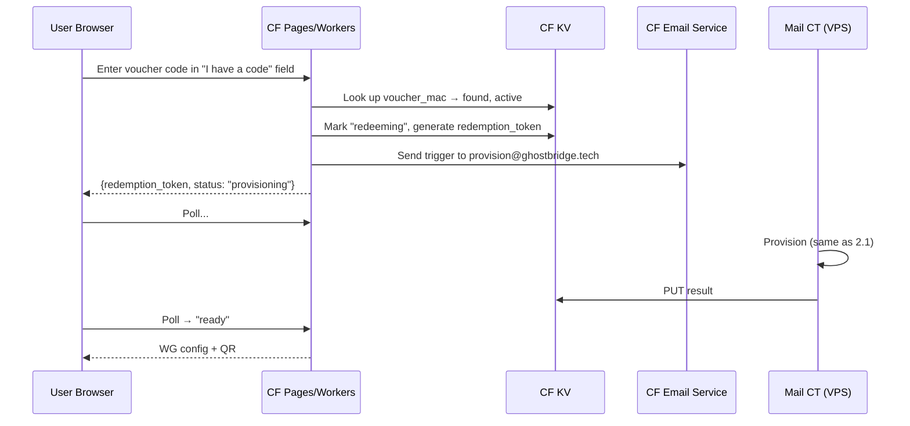
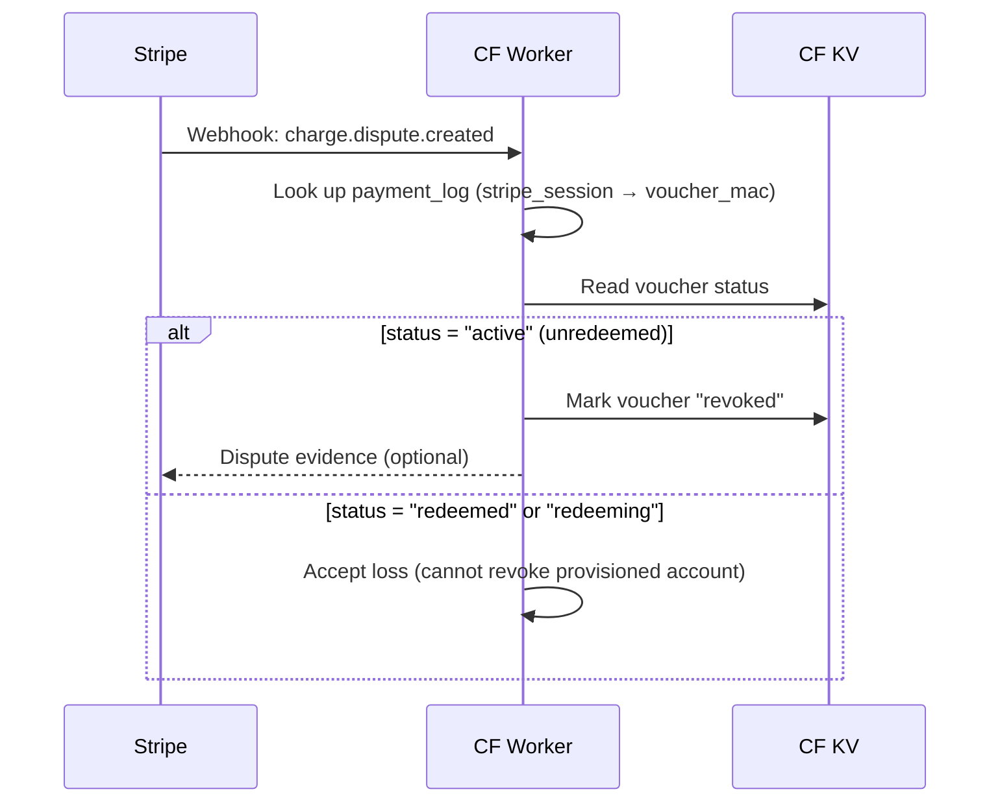

# Design — Subscriber Registration Flow

**Version:** 1.0
**Status:** Draft
**Implements:** requirements.md

---

## 1 · Design Decisions

### D-1: End user never receives email

The purchase page is a normal product page. User pays, receives a voucher
(or enters a pre-purchased one), and gets their WG config — all on the same
page. No email verification, no magic link, no "check your inbox." Email is
exclusively the internal machine-to-machine trigger from CF to ghostbridge.

### D-2: Voucher as the unlinkable bridge

Inspired by Mullvad's architecture but with stronger separation:


- Payment settles → voucher issued (CF Worker, same process).
- Voucher code is the ONLY artifact the user carries between payment and
  provisioning. It is a 160-bit random bearer token.
- After redemption, no persistent record joins voucher → account.
- The payment-log cross-reference (stripe_session → voucher_mac) auto-deletes
  after the 14-day refund window.
- VPS never learns the voucher code at all — only a `redemption_token`.

This is stronger than Mullvad's documented model (which retains
`voucher_id → account_number` in its activation-code table). Our redemption
domain NEVER sends the voucher code to VPS; it sends only an opaque
one-time `redemption_token`. The provisioning domain cannot correlate back
to the payment even if compromised.

### D-3: CF Email Service as internal trigger

CF Email Service (public beta, Workers Paid) enables:
- **Outbound from Workers**: `env.EMAIL.send({to, from, subject, text})`.
  Domain must be onboarded. Sends via CF infrastructure with CF DKIM.
- **Inbound routing**: MX → CF, routes to Workers or destination addresses.
- **SMTP relay for ghostbridge**: `smtp.mx.cloudflare.net:465`, API token
  auth. Ghostbridge outbound mail appears from CF infra.

The trigger email from CF Worker to `provision@ghostbridge.tech` uses
`env.EMAIL.send()`. CF Email Routing forwards it to the mail CT destination
address (VPS mail port). This is an async fire-and-forget RPC encoded as
email.

### D-4: CF KV REST API for result delivery

VPS writes provisioning results to CF KV via:
```
PUT https://api.cloudflare.com/client/v4/accounts/{id}/storage/kv/namespaces/{ns}/values/{redemption_token}
Authorization: Bearer <CF_KV_WRITE_TOKEN>
```
With `expiration_ttl=600` (10 min). Requires only "Workers KV Storage: Write"
permission — cannot read KV, cannot access other CF resources. This is the
narrowest possible outbound channel from VPS to CF.

### D-5: Server-side key generation (phase 1)

In phase 1, the VPS generates the WireGuard keypair. The private key is:
1. Generated in memory.
2. Written to CF KV (encrypted at rest by CF).
3. Deleted from VPS memory after successful KV write.
4. Available to the user's browser for 10 min via CF Worker.
5. Gone forever after KV TTL expires.

Phase 2 improvement: client-side key generation where the user generates
their keypair in-browser (WebCrypto/libsodium-wasm) and submits only the
public key. This eliminates server-side private key handling entirely.

### D-6: Fixed denominations, no identity

Products: 30 days, 90 days, 365 days. No custom amounts. No identity.
No recurring billing for anonymous purchasers (recurring requires knowing
who to bill, which requires identity). Users buy prepaid time.

---

## 2 · Sequence Diagrams


### 2.1 Card Purchase → Config Delivery (happy path)



### 2.2 Pre-Purchased Voucher Redemption



### 2.3 Chargeback on Unredeemed Voucher



---

## 3 · Component Architecture


### 3.1 CF Pages (Static Site)

```
/
├── index.html          (product selection + pricing)
├── checkout.html       (post-payment voucher display + redemption)
├── assets/
│   ├── qrcode.min.js   (client-side QR generation)
│   ├── app.js          (polling logic, QR render, copy/download)
│   └── style.css
└── _worker/            (CF Pages Functions — the API layer)
    └── functions/
        ├── webhook.ts          POST /webhook (Stripe webhook)
        ├── redeem.ts           POST /redeem  (voucher redemption)
        └── poll/[token].ts     GET  /poll/:token (config polling)
```

### 3.2 CF Worker Data Stores

**CF KV Namespace: `VOUCHERS`**
```
Key: voucher_mac (hex)
Value: JSON {
  product_class: "30d" | "90d" | "365d",
  duration_days: number,
  status: "active" | "redeeming" | "redeemed" | "revoked" | "expired",
  issued_day: "2026-08-08",
  redemption_token: string | null
}
Metadata: { expiry: issued_day + 365 days }
```

**CF KV Namespace: `RESULTS`**
```
Key: redemption_token
Value: JSON {
  status: "provisioning" | "ready" | "failed",
  wireguard_config?: string,    (full [Interface]+[Peer] text)
  assigned_ip?: string,
  endpoint?: string,
  expires_at?: string,          (ISO 8601, entitlement expiry)
  error?: string
}
expiration_ttl: 600 (10 min from VPS write)
```

**CF KV Namespace: `PAYMENT_LOG`** (separate, TTL-scoped)
```
Key: stripe_session_id
Value: JSON {
  voucher_mac: string,
  amount_minor: number,
  currency: "usd" | "eur",
  issued_day: "2026-08-08"
}
expiration_ttl: 1209600 (14 days — refund period)
```

After 14 days the payment→voucher cross-reference auto-deletes. No manual
cleanup needed. This is the ONLY record that could theoretically link payment
to voucher, and it's gone after the refund window.

### 3.3 Voucher Generation

```typescript
// In CF Worker (webhook.ts)
import { webcrypto } from 'node:crypto'; // CF Workers runtime

const VOUCHER_PEPPER = env.VOUCHER_PEPPER; // 32-byte secret

function generateVoucher(): string {
  const bytes = new Uint8Array(20); // 160 bits
  crypto.getRandomValues(bytes);
  return crockfordBase32Encode(bytes); // grouped: XXXXX-XXXXX-XXXXX-XXXXX
}

function voucherMac(code: string): string {
  const normalized = code.replace(/[-\s]/g, '').toUpperCase();
  // HMAC-SHA-256(pepper, normalized_code) → hex
  return hmacSha256Hex(VOUCHER_PEPPER, normalized);
}
```

The MAC is the database key. The plaintext code is never stored server-side
after issuance. The user receives the plaintext; the system stores only the
keyed hash.

### 3.4 VPS Ingest Pipeline

```
/usr/local/bin/op-provision-ingest
  ├── Reads email from stdin (piped by mail CT delivery)
  ├── Parses JSON payload: {redemption_token, duration_days}
  ├── Generates WG keypair (wg genkey + wg pubkey)
  ├── Calls op-grpc-bridge:
  │   ├── human_principal.register_key(pubkey)
  │   └── (future) entitlement.set_expiry(principal_id, duration)
  ├── Calls Oracle decoy peer enrollment (external, ops-defined)
  ├── Allocates IP from pool (/var/lib/opdbus/subscriber-pool.json)
  ├── Assembles WG config text
  ├── PUTs to CF KV: /accounts/{id}/storage/kv/namespaces/{ns}/values/{token}
  │   Body: {status:"ready", wireguard_config:..., ...}
  │   expiration_ttl: 600
  ├── Zeroes private key in memory
  └── Exits 0
```

Language: Rust binary (`crates/op-provision-ingest/`) or shell script calling
`grpcurl` + `curl` + `wg`. Design choice made during implementation.

### 3.5 Stripe Integration

- **Stripe Checkout** (hosted): user redirected to Stripe's page. Card data
  never touches CF Worker or VPS.
- **Products**: 3 fixed-price products in Stripe (30d, 90d, 365d).
- **Webhook**: `checkout.session.completed` → CF Worker at `/webhook`.
- **No Stripe Customer object**: one-time payments, no profiles.
- **3-D Secure**: enabled by default on Stripe Checkout.
- **Statement descriptor**: "GHOSTBRIDGE VPN" or similar (clear, no confusion).
- **Metadata**: random `purchase_handle` only — no account ID, no WG key.
- **Success URL**: `https://purchase.ghostbridge.tech/checkout?code={VOUCHER}`
  (Worker generates voucher and encodes in redirect URL query param).

---

## 4 · Security Analysis


### 4.1 Private Key Lifecycle

| Step | Location | Duration |
|------|----------|----------|
| Generated | VPS memory | Seconds |
| Written to CF KV | CF infrastructure (encrypted at rest) | ≤ 10 min |
| Read by user's browser | Browser memory / clipboard | Until user closes tab |
| Deleted from CF KV | Auto (TTL expiry) | At 10 min mark |

The private key is NEVER:
- Stored on VPS disk.
- Written to any log (VPS or CF).
- Sent via email (neither to user nor internally).
- Available to the payment domain.
- Retrievable after the 10-min KV TTL expires.

### 4.2 Voucher Security

- 160 bits of entropy → 2^160 possible codes. Brute-force infeasible.
- Rate limiting on redemption endpoint: ≤ 10 failed attempts/IP/hour.
- Voucher pepper is a CF Worker secret; compromise of KV alone cannot
  forge new voucher MACs.
- Voucher auto-expires after 365 days from issuance (KV metadata expiry).
- Single-use: atomic state transition `active → redeeming` prevents
  double-spend. Race condition handled by KV's conditional-write or D1
  transaction semantics.

### 4.3 Abuse Mitigation

| Attack | Mitigation |
|--------|-----------|
| Card fraud (stolen cards) | 3-D Secure on Stripe Checkout; fixed low values; chargeback budget |
| Voucher enumeration | 160-bit codes; rate limiting; no enumeration endpoint |
| Double-spend | Atomic status transition in KV/D1 |
| Provisioning spam via email trigger | Email trigger only fires on valid voucher redemption; rate-limited |
| Config theft (steal QR before user) | 10-min TTL; page session-bound (optional: delete-on-first-read) |
| VPS compromise → forge vouchers | VPS never has voucher pepper; cannot issue vouchers |
| CF Worker compromise → mass issuance | Worker secret rotation; audit logs; Stripe webhook sig still required |

### 4.4 Chargeback Strategy

Accept bounded losses rather than destroying privacy:
- Fixed low-value products (max ~$100 for 365 days).
- 3-D Secure shifts liability for most stolen-card fraud to issuer.
- Clear statement descriptor reduces "I don't recognize this" disputes.
- Unredeemed vouchers revocable during 14-day refund window.
- Redeemed vouchers: loss accepted. Budget ~1-2% of card volume.
- No identity verification, no device fingerprinting, no fraud scores
  that would compromise the privacy model.

---

## 5 · What Does NOT Change

| Item | Reason |
|------|--------|
| HumanPrincipal plugin + register_key | Reused as-is from handoff spec |
| Oracle assertion crypto | Untouched; subscriber is assertion-ready after provisioning |
| op-grpc-bridge capability gate | Subscriber's footprint keys the grants file |
| Mail CT postfix/dovecot | Unchanged; gains one new delivery target (ingest script) |
| CF Email Routing MX | Already configured for ghostbridge.tech |
| xray passthrough | Unchanged; `/etc/xray/xray_config.json` in container |
| OpenFlow mesh routing | Subscriber traffic routes via existing IP:port rules |
| No host wg-lan | Topology lock preserved; subscriber connects to Oracle decoy |

---

## 6 · Phase 2 Roadmap (deferred)

| Enhancement | Benefit |
|-------------|---------|
| Client-side WG key generation | Eliminates server-side private key handling entirely |
| Blind-signature voucher issuance | Cryptographic unlinkability (issuer cannot recognize redeemed token) |
| Self-hosted Bitcoin (BTCPay) | Stronger payment privacy via self-hosted node |
| Self-hosted Monero | Strongest on-chain privacy |
| Physical scratch-card reseller channel | Cash purchase → voucher code; VPN knows nothing about payer |
| Recovery key (optional) | User stores a seed; can re-derive config if lost |
| Multi-device / key rotation | Additional peers for same entitlement |
| Entitlement ledger on VPS | Proper duration tracking, renewal, expiry enforcement |

---

## 7 · Verified CF Platform Capabilities

Research conducted 2026-08-08 against CF developer documentation:

| Capability | Verified | Source |
|------------|----------|--------|
| Email Sending from Workers (`env.EMAIL.send()`) | Yes, public beta | developers.cloudflare.com/email-service/ |
| SMTP relay at `smtp.mx.cloudflare.net:465` | Yes, API token auth | developers.cloudflare.com/email-service/api/send-emails/smtp/ |
| Email Routing inbound → Worker or destination | Yes, free | developers.cloudflare.com/email-service/get-started/route-emails/ |
| KV REST API write from external server | Yes, API token + expiration_ttl | developers.cloudflare.com/api/operations/workers-kv-namespace-write-key-value-pair-with-metadata |
| KV expiration_ttl minimum 60s | Yes | CF docs |
| Workers Paid plan required for Email Sending | Yes, $5/mo + 3000 emails included | developers.cloudflare.com/email-service/platform/pricing/ |
| Stripe Checkout hosted (no card data touches merchant) | Yes | Standard Stripe product |
| Domain onboarding for Email Sending adds SPF/DKIM/DMARC | Yes, to cf-bounce subdomain | CF docs |

---

## 8 · Implementation Order

1. CF Pages static site (product page, checkout page, QR + copy UI).
2. CF Worker: Stripe webhook handler → voucher generation → KV store.
3. CF Worker: redemption endpoint → email trigger via CF Email Service.
4. CF Worker: polling endpoint → read RESULTS KV.
5. VPS: ingest script (parse email → generate WG → register key → write KV).
6. Integration test: end-to-end payment → config delivery.
7. Stripe product setup (3 fixed prices, webhook endpoint, success URL).
8. CF Email Service domain onboarding + routing rule for provision@.
9. Rate limiting (CF WAF rules + Worker-level checks).
10. Security hardening (delete-on-read, audit logging, secret rotation plan).
