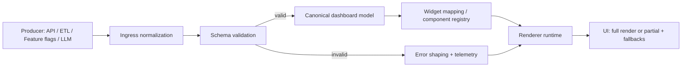
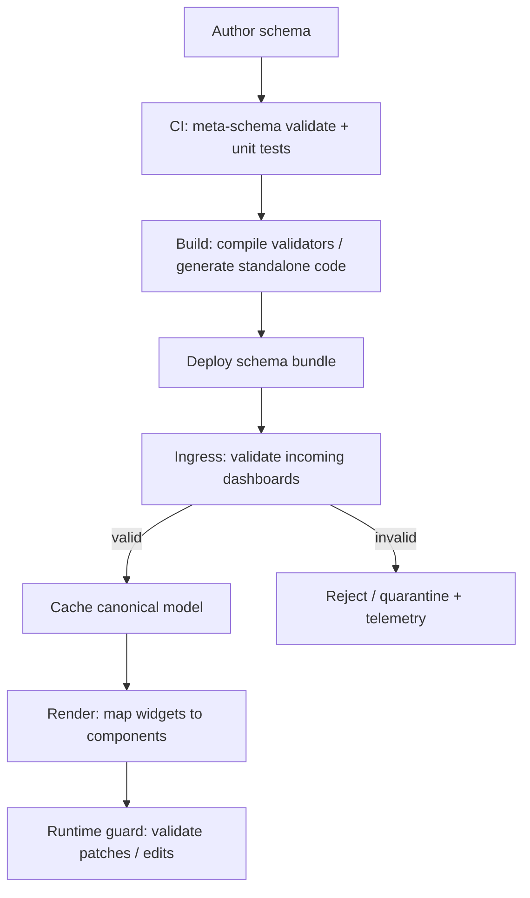

# Schema-Validated JSON for UI Dashboard Rendering

## Executive summary

Schema-validated JSON is a strong foundation for dashboard UIs because it turns a “bag of JSON” into an explicit contract that can be validated, documented, and safely consumed by a renderer. JSON Schema is explicitly intended for validation and annotation of JSON data, and the Validation vocabulary notes it can also provide UI-oriented hints for tools working with JSON. citeturn9search7turn0search4

For dashboard systems specifically, the most robust architecture treats *validation* and *rendering* as two layers with a narrow, typed interface between them:

- **Validate early, validate often**: validate on ingestion (server/worker) and again at use (client/renderer) when data is untrusted or can drift. This aligns with JSON Schema’s long-standing use both for interactive UI construction and for validating data retrieved from external sources. citeturn4search4turn9search7  
- **Model dashboards as discriminated unions of widgets**: a top-level dashboard document that contains an array of widgets/panels, where each widget has a `type` field (`kpi`, `table`, `timeseries`, `chart`, `container`, etc.) and uses `oneOf` with per-type schemas. This mirrors real-world dashboard JSON models where a dashboard is built from an array of panels whose fields depend on panel type. citeturn6search3turn14view0  
- **Separate “data contract” from “UI preferences”**: use JSON Schema for structural validity + a small, versioned UI metadata surface (either standard JSON Schema annotations like `title`/`description`/`examples`, or a dedicated `ui` object in the payload, or an external “UI schema”). Multiple mature schema-driven rendering systems (notably form renderers) take this separation approach because JSON Schema alone is intentionally limited for describing rendering details. citeturn3search3turn3search2turn1search3

Operationally, **JSON Schema 2020-12** is a sensible default today because it is the current version of the specification, but you should commit to one draft per validation runtime and be explicit via `$schema` because validators use that to pick the correct rules. citeturn5search16turn0search11turn15view0

The rest of this report provides concrete schema patterns for dashboard data, design principles for renderer-friendly schemas (reusability, versioning, extensibility, typing, constraints, rendering metadata), a library comparison across ecosystems, integration patterns between validators and renderers (including incremental validation), error-handling and UX strategies, performance and security guidance, and reference schemas/snippets (framework-agnostic plus a React/TypeScript example). citeturn9search7turn1search4turn2search3turn3search0

## Dashboard data patterns and canonical JSON Schema modeling

A renderer-friendly dashboard contract typically has a **document → layout → widgets** structure:

- **Document-level metadata**: `dashboardId`, `title`, `generatedAt`, `schemaVersion`, optional `timeRange`, `refreshInterval`, etc. This makes payloads self-describing and supports caching, audit, and debugging. JSON Schema supports such “annotation + validation” use cases explicitly. citeturn9search7turn0search4  
- **Widgets as a discriminated union**: each widget has `id`, `type`, optional `title/subtitle`, and then type-specific required fields. Ajv explicitly documents `oneOf`-based tagged unions and even supports an OpenAPI-style `discriminator` keyword to optimize validation of such unions. citeturn14view0turn1search5  
- **Nested widgets**: dashboards often need containers (rows, tabs, grids). Recursion is handled with `$defs` and `$ref`, which is a standard JSON Schema technique for reuse and complex schemas. The 2020-12 Core spec explicitly positions JSON Schema for interaction control and structuring JSON data. citeturn0search8turn9search7

Below are common widget data patterns and how they map to JSON Schema constraints.

### Time series widgets

Canonical pattern: an array of points with a timestamp and typed values.

- **Point schema**: `{ t: string(date-time), v: number }` (and optionally `series`, `min/max`, `quality`, etc.).  
- **Constraints**: `minItems`, `uniqueItems` (rarely appropriate for time series), bounded `maximum/minimum` for values when known, and `format: "date-time"` for timestamps. JSON Schema’s Validation vocabulary defines `format`, and Ajv commonly relies on the `ajv-formats` package to implement many standard formats (including `date-time` per RFC 3339). citeturn0search4turn10search10

Design caveat: JSON Schema can validate the *shape* but not guarantee sorting by time or enforce “no gaps” without custom keywords or post-validation logic.

### KPI widgets

Canonical pattern: a single “current value” with context.

- `value`: number or string (depending on KPI),  
- `unit`: string (e.g., `"ms"`, `"%"`),  
- `trend`: optional `{ direction: "up"|"down"|"flat", delta: number }`,  
- `thresholds`: optional array for coloring rules.

Constraints: enforce numeric ranges, required fields, and forbid unexpected properties (`additionalProperties: false` or `unevaluatedProperties: false` in composed schemas). The 2020-12 release notes and related guidance highlight `unevaluatedProperties` as a key tool for strict validation in composed schemas (especially with `allOf`). citeturn9search6turn9search17

### Tables

Two practical patterns exist, each with trade-offs:

- **Row-as-object**: `columns: [{id, label, type}]` and `rows: [{colA: ..., colB: ...}, ...]`.  
  - Pros: direct access by key, easier mapping to renderer columns, good for sparse columns.  
  - Constraint gap: JSON Schema cannot easily enforce that each row’s keys exactly match the runtime `columns[].id` values because that’s a cross-instance dependency.

- **Row-as-array (columnar)**: `columns: [...]` and `rows: [[...], [...]]` with fixed ordering.  
  - Pros: schema can strongly validate tuple structure (especially with 2020-12 `prefixItems`).  
  - Cons: more brittle when columns evolve; harder to debug.

This is a prime example where you may validate structure via JSON Schema and enforce relational constraints (like “column ids must match row keys”) in a second pass.

### Charts

You have three mainstream approaches:

- **Lightweight “chart intent” model** (recommended when you own the renderer): your schema defines a constrained set of chart types (line/bar/area/pie), defines allowed encodings, and the renderer maps it to a charting library.  
- **Embed an external declarative spec** (recommended when you want portability): e.g., Vega-Lite specs are JSON, have a published JSON Schema URL, and explicitly note that setting `$schema` enables automatic validation and editor tooling. citeturn6search2turn6search14  
- **Hybrid**: keep your widget schema stable but allow a `spec` field for “escape hatches” (e.g., Vega-Lite for advanced charts), which can also be independently validated against the external schema.

### Nested widgets (containers)

Typical container widgets:

- `grid`: children with layout coordinates  
- `tabs`: children grouped by label  
- `row/section`: collapsible groups

JSON Schema handles this by defining a `$defs.widget` and letting `container.children.items` `$ref` the same widget schema (recursion).

### Why this matches real dashboard practice

Grafana’s documentation describes dashboards as JSON objects with **panels as the building blocks**, where panel JSON is an array of objects and **some fields depend on panel type**—a direct real-world fit for the `widgets: oneOf[...]` pattern. citeturn6search3turn6search7

## Schema design principles for renderer-friendly contracts

A schema that feeds a renderer is not just about validation; it is an **API contract** between producers (backend/ETL/LLM/feature flags) and consumers (renderer + component registry). JSON Schema is intended for contracts, validation, documentation, and interaction control. citeturn9search7turn9search20

### Reusability and composition

Use:

- **`$defs` + `$ref`** for reusable structures (point, column, thresholds, common widget base). The Core spec notes that `definitions` moved to `$defs` in newer drafts, and `$defs` is the modern pattern. citeturn0search8turn9search7  
- **`allOf` for layering** (base widget + type-specific fields).  
- **Dynamic references when you truly need generics**: `$dynamicRef`/`$dynamicAnchor` exist to enable reusable schema patterns where a referenced schema is resolved from “dynamic scope.” JSON Schema’s own guidance explains how these features enable generic types and reduce duplication. citeturn9search2turn14view0

Practical note: dynamic references are powerful but increase cognitive load; most dashboard schemas do fine with `$defs` + `$ref`.

### Versioning strategy

You generally need *both*:

- **Schema identity**: `$id` (for resolvable references) and `$schema` (to lock the draft rules). Validators recommend `$schema` so the proper validator/dialect is used. citeturn12search9turn5search16  
- **Payload version**: `schemaVersion` in the instance payload (semantic version or integer epoch), used by your application logic for migration decisions.

Be strict about draft mixing: Ajv documents that draft 2020-12 is not backwards compatible and cannot be mixed with previous drafts in the same Ajv instance, which pushes you toward deliberate version boundaries. citeturn15view0turn18search0

### Extensibility without breaking consumers

A renderer contract must evolve. Common patterns:

- **Union extension**: add new widget types in `oneOf` with a new `type` constant. Old renderers can ignore unknown widget types if you design for it (e.g., allow `unknownWidget` fallback). Ajv can also optimize tagged unions using `discriminator` (OpenAPI keyword) when `oneOf` is used. citeturn1search5turn14view0  
- **Optional fields**: add optional properties with defaults. If you rely on defaults, note Ajv provides `useDefaults` to assign defaults during validation, but that *modifies data during validation* and should be an intentional choice. citeturn8search1  
- **Extension slots**: provide a controlled `extensions` object with namespaced keys, rather than allowing arbitrary properties everywhere.

Avoid embedding many custom keywords directly into the JSON Schema unless you’ve defined a dialect/vocabulary and your validator supports it. In practice, validators (and strict modes) may warn or fail on mistakes or unexpected constructs; for example Ajv’s strict mode is designed to prevent silently ignored mistakes in schemas. citeturn8search0

### Typing, constraints, and “strictness”

For renderer inputs, you usually want **high strictness**:

- Prefer `additionalProperties: false` on most objects (widget configs, column definitions, KPI definitions).  
- Use `required` aggressively; JSON Schema does not imply requiredness from `properties`. Ajv’s FAQ highlights that `properties` does not require fields; you must use `required`. citeturn8search9turn14view0  
- For composed schemas (especially with `allOf`), consider `unevaluatedProperties: false` at the leaves; JSON Schema guidance shows this is especially useful in inheritance/composition patterns. citeturn9search17turn9search6  
- Use `enum` / `const` for discriminators (`type`) and controlled vocabularies.

### Metadata for rendering

There are three layers of “rendering metadata”:

- **Standard JSON Schema annotations**: `title`, `description`, `default`, `examples`, `deprecated`, `readOnly`, `writeOnly`. These are recognized as annotations and are commonly used by tooling. citeturn1search3turn1search7  
- **Renderer-specific UI schema** (separate JSON object): many schema-driven systems do this because JSON Schema is limited in describing rendering choices. React JSON Schema Form and JSON Forms both document this “schema tells what, UI schema tells how” separation and a renderer registry model. citeturn3search3turn3search2turn3search6  
- **Payload-side UI hints** (`ui` block in the instance): works well when you want per-dashboard overrides without changing the schema (e.g., column widths, formatting presets, preferred visualization).

A practical dashboard architecture often uses **standard annotations + a small payload-side `ui` section**, and reserves a full UI schema for complex, user-editable layout rules.

## Validation libraries and runtimes

### Comparative table of validation options

The table below focuses on commonly used, actively maintained validators and schema/type libraries relevant to dashboard payload validation across environments. Draft support and major capabilities are taken from the official docs/readmes cited.

| Library / Runtime | Primary role | JSON Schema draft support | TypeScript support | Performance posture | Incremental / “streaming” validation | Notable ecosystem notes |
|---|---|---:|---|---|---|---|
| **Ajv (JS/TS)** | JSON Schema validator | draft-04/06/07/2019-09/2020-12 citeturn0search1turn18search13 | Strong TS guidance incl. `JSONSchemaType` utility types citeturn11search0 | Compiles schemas to efficient JS validation code; widely benchmarked as very fast citeturn11search6turn2search1turn2search5 | Not a streaming JSON parser; validates JS values. Supports standalone precompiled validators for build-time integration citeturn1search0turn1search4 | Common in frameworks (e.g., Fastify uses Ajv v8 for route schema validation) citeturn1search21 |
| **Zod (JS/TS)** | TS-first runtime schema + parsing | Not a JSON Schema validator; can export to JSON Schema via `z.toJSONSchema()` with documented limitations citeturn7search3turn13search7 | Excellent (TS-first, inference) citeturn13search7turn13search1 | Focuses on developer experience; v4 release notes emphasize faster/slimmer than prior versions citeturn13search2 | Validates in-memory values; `safeParse` returns a result union for graceful handling citeturn13search0 | Useful when TS inference is the “source of truth”; exporting to JSON Schema is best-effort, not perfect citeturn7search3 |
| **python-jsonschema (Python)** | JSON Schema validator | Full support for Draft 2020-12/2019-09/7/6/4/3 citeturn0search3turn10search0 | N/A | Correctness-focused; provides lazy validation yielding multiple errors iteratively citeturn10search0 | “Lazy validation” in the sense of iterating errors, not streaming parse citeturn10search0 | Recommends `$schema` so the proper validator is chosen citeturn0search11 |
| **networknt/json-schema-validator (Java)** | JSON Schema validator | Draft v4/v6/v7/2019-09/2020-12 citeturn5search0 | N/A | Emphasizes speed; supports dialects/vocabularies/keywords citeturn5search0 | In-memory validation | Common Java option; integrates with OpenAPI validation patterns citeturn5search0 |
| **santhosh-tekuri/jsonschema (Go)** | JSON Schema validator | draft-2020-12/2019-09/7/6/4 citeturn5search9turn5search19 | N/A | Notes compliance goals; supports remote refs and recursion citeturn5search19 | In-memory validation | Go-centric choice with vocabulary awareness (draft-2020-12 vocab assertions) citeturn5search6 |
| **jsonschema (Rust crate)** | JSON Schema validator | Draft 2020-12/2019-09/7/6/4 listed as supported citeturn5search7 | N/A | Performance-oriented rust ecosystem; supports meta-schema validation citeturn5search3turn5search10 | In-memory validation | Useful for Rust backends/edge/WASM; includes draft202012 meta validator citeturn5search10 |
| **JsonSchema.Net (.NET)** | JSON Schema validator | Supports Draft 6/7/2019-09/2020-12 citeturn5search8 | N/A | “Fully implements” the JSON Schema specifications per package summary citeturn5search8 | In-memory validation | Widely used .NET option with explicit draft URIs citeturn5search8 |

Key takeaways for dashboard systems:

- If your canonical contract is **JSON Schema**, **Ajv** is the most common choice in JS/TS frontends and Node services due to draft coverage, compilation to fast code, and rich ecosystem. citeturn18search13turn2search1turn11search6  
- If your canonical contract is **TypeScript-first**, **Zod** is attractive, and it can export a JSON Schema representation, but you must accept that some Zod types/checks are not representable in JSON Schema and require strategy (e.g., remove transforms from shared schemas, or keep separate “transport schema” vs “internal schema”). citeturn7search3turn13search7  
- For polyglot environments (Node + Python + Java), JSON Schema remains a pragmatic interchange contract because multiple validators support draft 2020-12 and earlier drafts. citeturn0search1turn0search3turn5search0

## Integration architecture between validation and rendering

This section focuses on how to connect “validated JSON” to “renderer components” in a way that is resilient, debuggable, and performant.

### Data flow architecture diagram



The “compile schema to validator function” approach is especially common in Ajv: Ajv converts schemas into efficient JavaScript code for validation, and can also generate standalone validation code at build time. citeturn11search6turn1search0

### Validation placement patterns

**Pre-validate at the boundary (server-side or ingestion pipeline)**  
Best when: multiple clients consume dashboards; failures should be caught before reaching the UI; you want consistent data quality.

- Validate right after data assembly (DB + metrics + transforms).  
- Optionally normalize by applying defaults or removing extra props (with care). Ajv supports `useDefaults`, `removeAdditional`, and `coerceTypes` which can modify data during validation. citeturn8search1  
- Persist only validated payloads (or persist both raw + validated with audit metadata).

**Runtime validate where you render (client-side)**  
Best when: payload may be untrusted (multi-tenant), can drift (rapid backend releases), or is user-editable.

- For Ajv, you can compile in the browser or bundle standalone validators; Ajv’s docs recommend bundling schemas with your application code either way. citeturn1search8turn1search0  
- Runtime validation is also valuable for “dashboard as code” editing experiences (live JSON editing with validation feedback), a pattern supported by many JSON Schema-based tools. citeturn4search4turn6search2

**Hybrid** (common in production): validate on the server to keep “garbage out of storage,” and validate again on the client to protect the renderer from unexpected data.

### Incremental and “streaming” validation patterns

True streaming JSON Schema validation (validating as bytes arrive) is uncommon in mainstream validators because they typically operate on parsed JSON values. However, you can approximate incremental validation in a dashboard system in two very practical ways:

- **Widget-level incremental validation**: validate the dashboard header first, then validate widgets one-by-one (or in chunks) so you can partially render valid widgets and show targeted fallbacks for invalid ones. This can be combined with `oneOf` union validation for widget types. citeturn14view0turn10search1  
- **Error iteration (lazy reporting)**: in Python, `jsonschema` explicitly supports lazy validation that can iteratively report validation errors, which is useful for batch processing and tooling. citeturn10search0turn12search2

If the transport is a stream (SSE/websocket), validate each message/event against an event schema (e.g., `WidgetPatchEvent`) rather than trying to validate a never-ending JSON document.

### Validation lifecycle flowchart



This lifecycle is aligned with: (a) JSON Schema’s role in validation and tooling, (b) Ajv’s explicit build-time standalone validator generation, and (c) the existence of an official JSON Schema Test Suite used by validator implementations to verify correctness. citeturn9search7turn1search0turn2search0

## Mapping from validated JSON to renderer components

Once you have a validated payload, your central design question is: **how does a `Widget` object become a UI component?** There are multiple viable strategies.

### Mapping strategy comparison table

The table below summarizes common strategies, including how they relate to established schema-driven rendering systems (even though those systems often focus on forms, the architectural patterns transfer well to dashboards).

| Strategy | Core idea | Pros | Cons / risks | Best fit |
|---|---|---|---|---|
| Declarative mapping (switch on `type`) | Renderer has a typed union; map `widget.type` → component function | Simple, explicit, fast; easy to audit; strong type safety | Requires code changes to add widget types; less dynamic | Product dashboards with controlled widget catalog |
| Component registry (plugin model) | Registry `{ type → renderer }`, optionally discovered dynamically | Extensible; supports plugins/tenants; mirrors JSON Forms’ renderer registry concept citeturn3search6 | Requires governance (versioning, compatibility); error handling for missing plugins | Multi-team dashboards, internal platform |
| Schema-driven UI (derive UI from schema) | Use schema annotations and/or an explicit UI schema to drive layout | Highly dynamic; supports “dashboard as code/editor” patterns; parallels JSON Forms / RJSF separation of schema vs UI schema citeturn3search2turn3search3 | JSON Schema alone is insufficient for rich layout; can become complex and opaque | User-configurable dashboards, low-code environments |
| Template-driven rendering | Widget JSON selects template + parameters | Great for consistent, branded dashboards; can constrain flexibility | Template sprawl; harder to compose complex widgets | Executive dashboards, standardized reporting |

A practical middle-ground frequently used in production is: **component registry + declarative mapping** (registry lookup by `type` plus explicit fallback rules), with a small payload-side `ui` block for customization.

### Error handling and UX principles

A renderer consuming untrusted or evolving contracts must treat validation failures as normal operational states.

Recommended UX behavior:

- **Per-widget fallbacks**: if widget validation fails, render an “Unavailable” widget with a stable layout footprint, rather than failing the whole dashboard.  
- **Partial rendering**: validate widgets individually so valid ones still render (especially important for wide dashboards).  
- **User-facing messages**: show simple messages (“This widget failed to load”) and hide raw validator output; send full error details to telemetry.  
- **Error shaping**: map raw error objects into a stable internal format (`code`, `path`, `severity`, `widgetId`).

Validator error APIs support these patterns:

- Ajv exposes an `errors` array on the validation function (or Ajv instance), including structured error details. citeturn10search1  
- Zod’s `safeParse()` returns a discriminated union (`success` true/false) containing either parsed data or a `ZodError`, enabling graceful UI flows without exceptions. citeturn13search0turn13search7  
- Python `jsonschema` documents rich error handling (paths, schema paths, nested contexts). citeturn12search2turn12search16

For internationalization and user-friendly error messages, Ajv has ecosystem packages (e.g., `ajv-i18n`) and structured error formats that can be translated by tooling; JSON Forms documents error translation hooks that consume Ajv error objects. citeturn12search3turn12search10

## Reliability, security, performance, testing, and migration

### Performance considerations

For dashboards, performance risks come from:

- **Large payloads** (thousands of points, big tables)  
- **Many widgets** (each with separate `oneOf` validation)  
- **Repeated validation** (revalidating identical payloads during rerenders)

Best practices:

- **Compile validators once and reuse**: Ajv is designed around compiling schemas into efficient JS validation code. citeturn11search6turn2search1  
- **Precompile / standalone validators**: Ajv supports generating standalone validation code at build time, reducing startup cost and improving compatibility with strict CSP environments. citeturn1search0turn1search4  
- **Prefer widget-level validation**: validate only changed widgets for incremental updates.  
- **Memoize by content hash**: if a widget’s JSON is unchanged, skip validation and mapping.  
- **Be careful with “collect all errors”**: Ajv’s `allErrors` is useful for debugging and rich UI feedback, but on untrusted large inputs it increases work by design because it does not fail fast. Ajv documents `allErrors`, and security tooling has flagged unconstrained “collect everything” configurations as potential resource risks in adversarial settings. citeturn8search2turn8search11

### Security concerns for untrusted dashboard JSON

Validation is necessary but not sufficient for security. The highest-risk surface is **rendering untrusted strings into HTML/DOM**.

Key controls:

- **Output encoding and framework protections**: OWASP recommends combining framework protections with output encoding and HTML sanitization for XSS prevention. citeturn2search3turn2search7  
- **Avoid raw HTML rendering**: React explicitly warns that `dangerouslySetInnerHTML` should be used with extreme caution because untrusted HTML introduces XSS risk. citeturn3search0  
- **Sanitize if you must render HTML**: DOMPurify is explicitly designed to sanitize HTML and prevent XSS attacks by stripping dangerous content. OWASP’s cheat sheet also recommends DOMPurify for HTML sanitization scenarios. citeturn3search1turn3search21  
- **CSP compatibility**: if your validator compiles schemas in the browser, it may conflict with strict CSP settings around dynamic code execution; Ajv’s standalone precompiled validators are motivated partly by strict CSP compatibility, and RJSF explicitly references precompiled Ajv validators to overcome `unsafe-eval` warnings under strict CSP. citeturn1search4turn18search9

Also consider schema supply-chain risk: treat schemas as code, review changes, and pin versions. Ajv’s strict mode exists to prevent silently ignored schema mistakes. citeturn8search0

### Testing and CI

A strong CI strategy for schema-validated dashboards usually includes:

- **Meta-schema validation**: validate your schemas against the appropriate JSON Schema meta-schema. Many validators support this (e.g., Rust `jsonschema` explicitly documents meta-schema validation). citeturn5search3turn5search10  
- **Schema unit tests**: “golden” valid/invalid payload fixtures for each widget type.  
- **Contract tests between producer and renderer**: consumer-driven contract testing formalizes “consumer expectations,” and Pact documents this model for ensuring providers remain compatible with consumer usage. citeturn6search5turn6search1  
- **Fuzzing / property-based tests**: fast-check is a property-based testing framework for JavaScript/TypeScript designed to generate many edge cases automatically. This is well-suited for validating that “validator → mapper → renderer” never crashes for valid inputs and degrades gracefully for invalid ones. citeturn6search0turn6search4  
- **Cross-validator correctness checks**: the official JSON Schema Test Suite exists for implementations to verify specification behavior (it is not a style guide). If you run multiple validators (e.g., Ajv in frontend, python-jsonschema in backend), this suite is part of how ecosystems converge on consistent behavior. citeturn2search0turn2search5

### Migration and versioning strategies

Pragmatic strategies that scale:

- **Dual-read, single-write**: accept multiple schema versions in the renderer, but emit only the latest version from producers.  
- **Explicit migrations**: store a migration map `v1 → v2`, run it before validation, then validate against the target schema.  
- **Versioned `$id` and schema bundles**: publish immutable schema artifacts.  
- **Draft discipline**: keep the JSON Schema draft constant per major version of your dashboard schema. Ajv emphasizes that draft 2020-12 cannot be mixed with prior drafts in the same instance, which reinforces this practice. citeturn15view0turn18search0  
- **Type generation strategy**: either (a) generate TS types from JSON Schema (e.g., `json-schema-to-ts` exists specifically to avoid “typing twice”), or (b) define TS-first schemas (Zod/TypeBox) and generate JSON Schema with known limitations. citeturn7search0turn7search3turn7search1

## Reference schema and implementation snippets

This section provides: a sample JSON Schema (dashboard + KPIs + table + time series chart + nested container), a sample payload, validation code (Ajv), a framework-agnostic renderer mapping, and a React/TypeScript example.

### Sample dashboard JSON Schema (Draft 2020-12)

```json
{
  "$schema": "https://json-schema.org/draft/2020-12/schema",
  "$id": "https://example.com/schemas/dashboard/v1/dashboard.schema.json",
  "title": "DashboardDocument v1",
  "type": "object",
  "additionalProperties": false,
  "required": ["schemaVersion", "dashboardId", "title", "generatedAt", "widgets"],
  "properties": {
    "schemaVersion": {
      "type": "string",
      "description": "Semantic version of the dashboard contract.",
      "pattern": "^1\\.(0|[1-9]\\d*)\\.(0|[1-9]\\d*)$",
      "examples": ["1.0.0"]
    },
    "dashboardId": { "type": "string", "minLength": 1 },
    "title": { "type": "string", "minLength": 1 },
    "generatedAt": { "type": "string", "format": "date-time" },
    "timeRange": {
      "type": "object",
      "additionalProperties": false,
      "required": ["from", "to"],
      "properties": {
        "from": { "type": "string", "format": "date-time" },
        "to": { "type": "string", "format": "date-time" }
      }
    },
    "ui": {
      "type": "object",
      "description": "Renderer hints (does not affect semantic meaning).",
      "additionalProperties": false,
      "properties": {
        "theme": { "type": "string", "enum": ["light", "dark", "system"] },
        "density": { "type": "string", "enum": ["compact", "comfortable"] }
      }
    },
    "widgets": {
      "type": "array",
      "minItems": 1,
      "items": { "$ref": "#/$defs/widget" }
    }
  },
  "$defs": {
    "widgetBase": {
      "type": "object",
      "additionalProperties": false,
      "required": ["id", "type"],
      "properties": {
        "id": { "type": "string", "minLength": 1 },
        "type": { "type": "string" },
        "title": { "type": "string" },
        "description": { "type": "string" },
        "layout": {
          "type": "object",
          "additionalProperties": false,
          "properties": {
            "x": { "type": "integer", "minimum": 0 },
            "y": { "type": "integer", "minimum": 0 },
            "w": { "type": "integer", "minimum": 1 },
            "h": { "type": "integer", "minimum": 1 }
          }
        }
      }
    },

    "kpiWidget": {
      "allOf": [
        { "$ref": "#/$defs/widgetBase" },
        {
          "type": "object",
          "additionalProperties": false,
          "required": ["type", "value"],
          "properties": {
            "type": { "const": "kpi" },
            "value": { "type": ["number", "string"] },
            "unit": { "type": "string" },
            "trend": {
              "type": "object",
              "additionalProperties": false,
              "required": ["direction"],
              "properties": {
                "direction": { "type": "string", "enum": ["up", "down", "flat"] },
                "delta": { "type": "number" }
              }
            }
          }
        }
      ]
    },

    "timeSeriesPoint": {
      "type": "object",
      "additionalProperties": false,
      "required": ["t", "v"],
      "properties": {
        "t": { "type": "string", "format": "date-time" },
        "v": { "type": "number" }
      }
    },

    "timeSeriesWidget": {
      "allOf": [
        { "$ref": "#/$defs/widgetBase" },
        {
          "type": "object",
          "additionalProperties": false,
          "required": ["type", "series"],
          "properties": {
            "type": { "const": "timeseries" },
            "series": {
              "type": "array",
              "minItems": 1,
              "items": {
                "type": "object",
                "additionalProperties": false,
                "required": ["name", "points"],
                "properties": {
                  "name": { "type": "string", "minLength": 1 },
                  "points": {
                    "type": "array",
                    "minItems": 1,
                    "items": { "$ref": "#/$defs/timeSeriesPoint" }
                  }
                }
              }
            },
            "yUnit": { "type": "string" }
          }
        }
      ]
    },

    "tableWidget": {
      "allOf": [
        { "$ref": "#/$defs/widgetBase" },
        {
          "type": "object",
          "additionalProperties": false,
          "required": ["type", "columns", "rows"],
          "properties": {
            "type": { "const": "table" },
            "columns": {
              "type": "array",
              "minItems": 1,
              "items": {
                "type": "object",
                "additionalProperties": false,
                "required": ["id", "label", "valueType"],
                "properties": {
                  "id": { "type": "string", "pattern": "^[a-zA-Z][a-zA-Z0-9_]*$" },
                  "label": { "type": "string", "minLength": 1 },
                  "valueType": { "type": "string", "enum": ["string", "number", "dateTime"] },
                  "align": { "type": "string", "enum": ["left", "right", "center"] }
                }
              }
            },
            "rows": {
              "type": "array",
              "items": {
                "type": "object",
                "description": "Row-as-object pattern; enforce row shape in application logic if it must match columns exactly.",
                "additionalProperties": { "type": ["string", "number", "boolean", "null"] }
              }
            }
          }
        }
      ]
    },

    "containerWidget": {
      "allOf": [
        { "$ref": "#/$defs/widgetBase" },
        {
          "type": "object",
          "additionalProperties": false,
          "required": ["type", "children"],
          "properties": {
            "type": { "const": "container" },
            "layoutMode": { "type": "string", "enum": ["grid", "row", "tabs"] },
            "children": {
              "type": "array",
              "items": { "$ref": "#/$defs/widget" }
            }
          }
        }
      ]
    },

    "widget": {
      "oneOf": [
        { "$ref": "#/$defs/kpiWidget" },
        { "$ref": "#/$defs/timeSeriesWidget" },
        { "$ref": "#/$defs/tableWidget" },
        { "$ref": "#/$defs/containerWidget" }
      ]
    }
  }
}
```

This schema uses: discriminated unions (`type` + `oneOf`), reuse via `$defs`, strict object boundaries (`additionalProperties: false`), and standard annotations (`title`, `description`, `examples`). These are core JSON Schema practices, and metadata annotations are explicitly part of JSON Schema’s annotation vocabulary. citeturn9search7turn1search7turn0search8

### Sample validated payload

```json
{
  "schemaVersion": "1.0.0",
  "dashboardId": "ops-overview",
  "title": "Ops Overview",
  "generatedAt": "2026-04-04T13:20:00Z",
  "timeRange": {
    "from": "2026-04-04T12:20:00Z",
    "to": "2026-04-04T13:20:00Z"
  },
  "ui": { "theme": "system", "density": "comfortable" },
  "widgets": [
    {
      "id": "kpi-latency",
      "type": "kpi",
      "title": "p95 latency",
      "value": 182.4,
      "unit": "ms",
      "trend": { "direction": "down", "delta": -12.2 },
      "layout": { "x": 0, "y": 0, "w": 3, "h": 2 }
    },
    {
      "id": "kpi-error-rate",
      "type": "kpi",
      "title": "Error rate",
      "value": 0.73,
      "unit": "%",
      "trend": { "direction": "flat", "delta": 0.02 },
      "layout": { "x": 3, "y": 0, "w": 3, "h": 2 }
    },
    {
      "id": "ts-requests",
      "type": "timeseries",
      "title": "Requests / min",
      "yUnit": "rpm",
      "series": [
        {
          "name": "total",
          "points": [
            { "t": "2026-04-04T12:55:00Z", "v": 1200 },
            { "t": "2026-04-04T13:00:00Z", "v": 1320 },
            { "t": "2026-04-04T13:05:00Z", "v": 1285 }
          ]
        }
      ],
      "layout": { "x": 0, "y": 2, "w": 6, "h": 4 }
    },
    {
      "id": "tbl-top-errors",
      "type": "table",
      "title": "Top errors",
      "columns": [
        { "id": "code", "label": "Code", "valueType": "string", "align": "left" },
        { "id": "count", "label": "Count", "valueType": "number", "align": "right" }
      ],
      "rows": [
        { "code": "E_CONN_RESET", "count": 17 },
        { "code": "E_TIMEOUT", "count": 9 }
      ],
      "layout": { "x": 6, "y": 0, "w": 6, "h": 6 }
    },
    {
      "id": "group-secondary",
      "type": "container",
      "title": "Secondary",
      "layoutMode": "row",
      "children": [
        {
          "id": "kpi-build",
          "type": "kpi",
          "title": "Build time",
          "value": 8.7,
          "unit": "min"
        }
      ]
    }
  ]
}
```

### JS/TS validation with Ajv (Draft 2020-12) and format support

Ajv supports draft 2020-12 via the `ajv/dist/2020` entrypoint, and its documentation shows the import pattern for that draft. citeturn18search0turn18search1  
For `date-time` and other formats, Ajv commonly uses `ajv-formats`, which documents the supported formats (including `date-time`). citeturn10search10

```ts
import Ajv from "ajv/dist/2020";
import addFormats from "ajv-formats";
// import type { ErrorObject } from "ajv"; // optional, for typing

import dashboardSchema from "./dashboard.schema.json"; // the JSON Schema above
import payload from "./dashboard.payload.json";        // the sample payload above

const ajv = new Ajv({
  strict: true,        // strict-mode helps catch schema mistakes
  allErrors: true      // helpful for tooling; consider false for untrusted huge inputs
});

addFormats(ajv);

const validate = ajv.compile(dashboardSchema);

const ok = validate(payload);

if (!ok) {
  // Ajv attaches structured error objects to validate.errors
  console.error("Dashboard payload invalid:", validate.errors);
  // You can turn this into UI-safe messages and telemetry here.
} else {
  // payload is valid; safe to map to renderer components
  console.log("Dashboard payload valid.");
}
```

Ajv documents strict mode as a guardrail against silently ignored schema mistakes, and documents that validation errors are exposed via an `errors` array. citeturn8search0turn10search1

### Framework-agnostic renderer mapping with a component registry

This pattern is conceptually similar to JSON Forms’ renderer registry approach: select a renderer based on a schema/UI-schema element and registry entries. citeturn3search6

```ts
type KpiWidget = { id: string; type: "kpi"; title?: string; value: number | string; unit?: string; trend?: { direction: "up"|"down"|"flat"; delta?: number } };
type TimeSeriesWidget = { id: string; type: "timeseries"; title?: string; yUnit?: string; series: Array<{ name: string; points: Array<{ t: string; v: number }> }> };
type TableWidget = { id: string; type: "table"; title?: string; columns: Array<{ id: string; label: string; valueType: "string"|"number"|"dateTime" }>; rows: Array<Record<string, unknown>> };
type ContainerWidget = { id: string; type: "container"; title?: string; layoutMode?: "grid"|"row"|"tabs"; children: Widget[] };

type Widget = KpiWidget | TimeSeriesWidget | TableWidget | ContainerWidget;

type RenderContext = {
  // hooks to theme, formatting utilities, navigation, etc.
  formatNumber: (n: number) => string;
  formatDateTime: (iso: string) => string;
};

type RenderNode = unknown; // replace with your UI runtime’s node type

type WidgetRenderer<T extends Widget> = (widget: T, ctx: RenderContext) => RenderNode;

const registry: Record<Widget["type"], WidgetRenderer<any>> = {
  kpi: (w: KpiWidget, ctx) => ({ kind: "KpiCard", title: w.title, value: w.value, unit: w.unit }),
  timeseries: (w: TimeSeriesWidget) => ({ kind: "LineChart", title: w.title, series: w.series }),
  table: (w: TableWidget) => ({ kind: "DataTable", title: w.title, columns: w.columns, rows: w.rows }),
  container: (w: ContainerWidget, ctx) => ({
    kind: "Container",
    title: w.title,
    children: w.children.map(child => renderWidget(child, ctx))
  })
};

function renderWidget(widget: Widget, ctx: RenderContext): RenderNode {
  const renderer = registry[widget.type];
  if (!renderer) {
    return { kind: "UnknownWidget", id: widget.id, message: `Unsupported widget type: ${widget.type}` };
  }
  return renderer(widget as any, ctx);
}
```

This registry model naturally supports:
- **fallback rendering** for unknown types,
- **partial rendering** (render valid widgets; replace invalid widgets),
- **instrumentation** (measure render latency per widget type).

### React/TypeScript example

React-specific note: if any widget supports rich text/HTML, do **not** inject untrusted HTML via `dangerouslySetInnerHTML` without sanitization; React explicitly warns this introduces XSS risk when HTML is untrusted. citeturn3search0turn2search3

```tsx
import React from "react";

type DashboardDoc = {
  title: string;
  widgets: Widget[];
};

export function DashboardRenderer({ doc }: { doc: DashboardDoc }) {
  const ctx: RenderContext = {
    formatNumber: (n) => n.toLocaleString(),
    formatDateTime: (iso) => new Date(iso).toLocaleString()
  };

  return (
    <div className="dashboard">
      <h1>{doc.title}</h1>
      <div className="widgets">
        {doc.widgets.map((w) => (
          <WidgetHost key={w.id} widget={w} ctx={ctx} />
        ))}
      </div>
    </div>
  );
}

function WidgetHost({ widget, ctx }: { widget: Widget; ctx: RenderContext }) {
  try {
    switch (widget.type) {
      case "kpi":
        return <div className="kpi">{widget.title}: {String(widget.value)} {widget.unit}</div>;
      case "timeseries":
        return <pre className="chart">{JSON.stringify(widget.series, null, 2)}</pre>;
      case "table":
        return (
          <table>
            <thead>
              <tr>{widget.columns.map(c => <th key={c.id}>{c.label}</th>)}</tr>
            </thead>
            <tbody>
              {widget.rows.map((r, i) => (
                <tr key={i}>
                  {widget.columns.map(c => <td key={c.id}>{String(r[c.id] ?? "")}</td>)}
                </tr>
              ))}
            </tbody>
          </table>
        );
      case "container":
        return (
          <section>
            <h2>{widget.title}</h2>
            {widget.children.map(child => <WidgetHost key={child.id} widget={child} ctx={ctx} />)}
          </section>
        );
      default:
        return <div className="unknown">Unknown widget type</div>;
    }
  } catch (e) {
    // Per-widget fault isolation; avoids blank-screen dashboards
    return <div className="error">Widget failed to render.</div>;
  }
}
```

### Optional: Using Zod as the authoring layer and exporting to JSON Schema

If you prefer TS-first schemas with good DX, Zod can define runtime schemas and export them to JSON Schema via `z.toJSONSchema()`. Zod’s docs also show `safeParse()` as a non-throwing validation interface. citeturn7search3turn13search0  
However, Zod documents that some Zod types/checks are not representable in JSON Schema (e.g., transforms, certain types), so shared transport contracts must be designed with that in mind. citeturn7search3