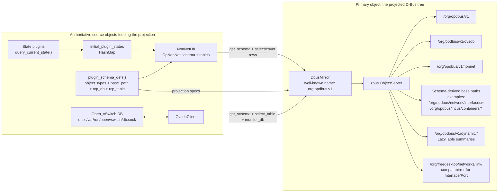
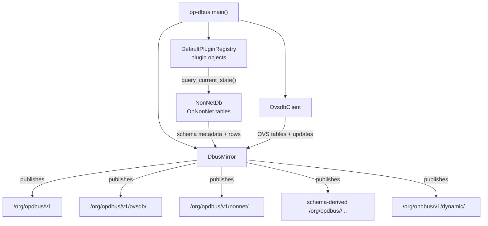
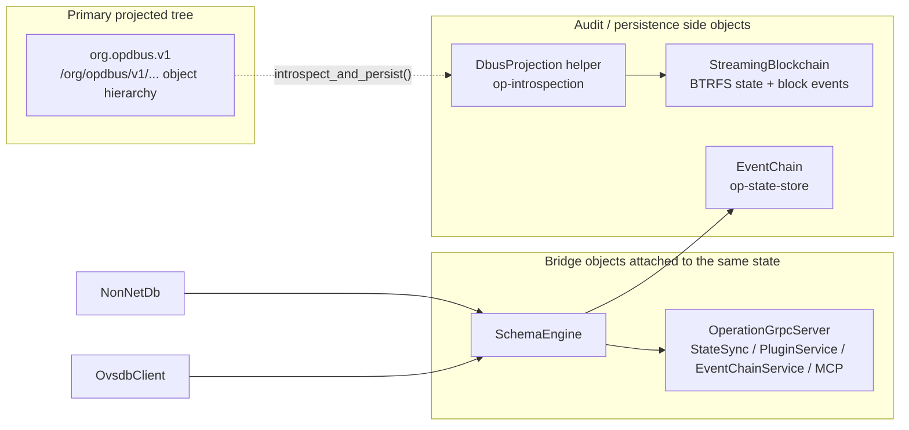
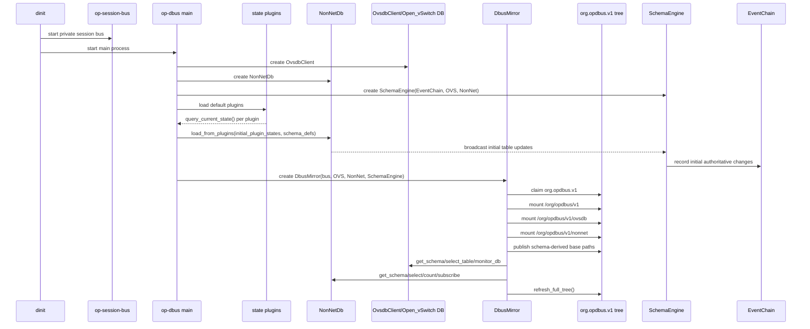
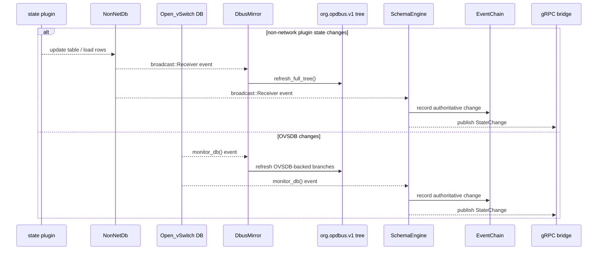
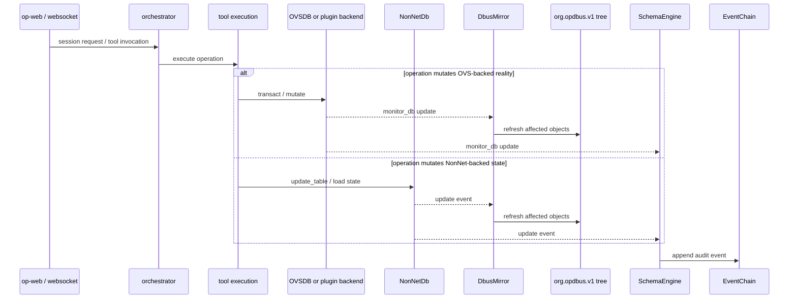
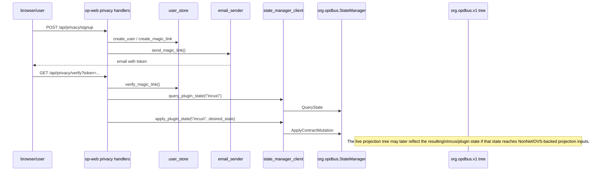

# D-Bus Projection Object Map

This map treats the projected D-Bus tree as the primary object in the system.

The main runtime object that owns the tree is `op_dbus_mirror::DbusMirror`, published as
`org.opdbus.v1`. Everything else in this map either feeds that tree, bridges out of it, or
records it.

`DbusProjection` is a separate helper in `op-introspection`; despite the name, it is not the
owner of the live `/org/opdbus/v1/...` tree.

## D-Bus As System Ontology

D-Bus is not just a transport in this architecture.

It is intended to be the system's:

- index
- namespace
- object directory
- switchboard
- operator
- retriever
- housekeeping layer

In practical terms, that means:

- important runtime things should have an address in the tree
- discoverability should come from the tree, not from side knowledge
- actions should have a stable object/interface home
- retrieval should be path/interface based, not guesswork
- the running system should organize itself through the bus

Short version:

`org.opdbus.v1` is supposed to be the live rolodex, phone book, operator desk, and
"where did I put that?" layer for the running system.

This is why projection-first consistency matters so much: if core state and control require
side channels that bypass the tree, then the system is no longer organized around its own
index.

## Primary Object Graph

## What Each Object Actually Owns

## Bridge And Audit Objects Around The Tree

## Timeline Layers

These timelines show when the projected tree exists, when it is refreshed, and where adjacent DB
or orchestration activity touches it.

### Boot Timeline

### Steady-State Runtime Timeline

### Orchestration / Spawned Activity Timeline

### Privacy Login / Verification Timeline

This is the login-adjacent path that currently overlaps the D-Bus side but does not go through
the `org.opdbus.v1` projection tree directly.

## Layer Relationship Summary

- Boot layer:
  creates the projection owner and mounts the tree.
- Runtime layer:
  keeps the tree fresh from `NonNetDb` and `Open_vSwitch`.
- Orchestration layer:
  causes mutations in backends; the tree updates after those backends change.
- Login/privacy layer:
  currently uses the older `StateManager` path and only intersects the projection tree
  indirectly.

## Runtime Reality In This Repo

- The live `/org/opdbus/v1/...` tree comes from `DbusMirror`, not from `DbusProjection`.
- `NonNetDb` is the in-process object table for non-network plugin state. It is seeded from live
  plugin state plus schema definitions.
- `OvsdbClient` talks directly to the native Open vSwitch database socket and projects rows into
  the same tree.
- `SchemaEngine` is the bridge/audit coordinator beside the tree. It records changes into
  `EventChain` and exposes them over gRPC.
- `StreamingBlockchain` is attached through `DbusProjection` for introspection persistence and
  BTRFS-backed state snapshots, not as the owner of the live projection tree.
- `op-web` privacy signup/verify currently still uses `state_manager_client` against
  `org.opdbus.StateManager`, which is adjacent to the main projection story rather than the owner
  of it.

## Intentionally Excluded From The Primary Map

- `org.opdbus.StateManager`:
  The crate code still exists, but it is not the primary owner of the current
  `/org/opdbus/v1/...` projection path in `op-dbus` startup.
- `MemoryStore` / `SqliteStore`:
  These are application storage objects, but they are not the direct source of the mirrored
  `org.opdbus.v1` object hierarchy.
