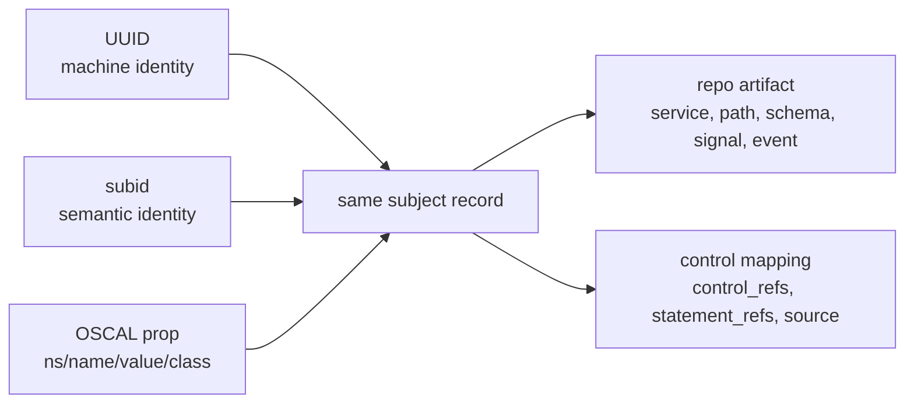
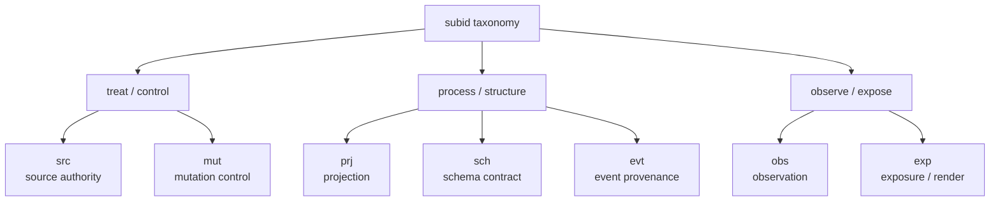
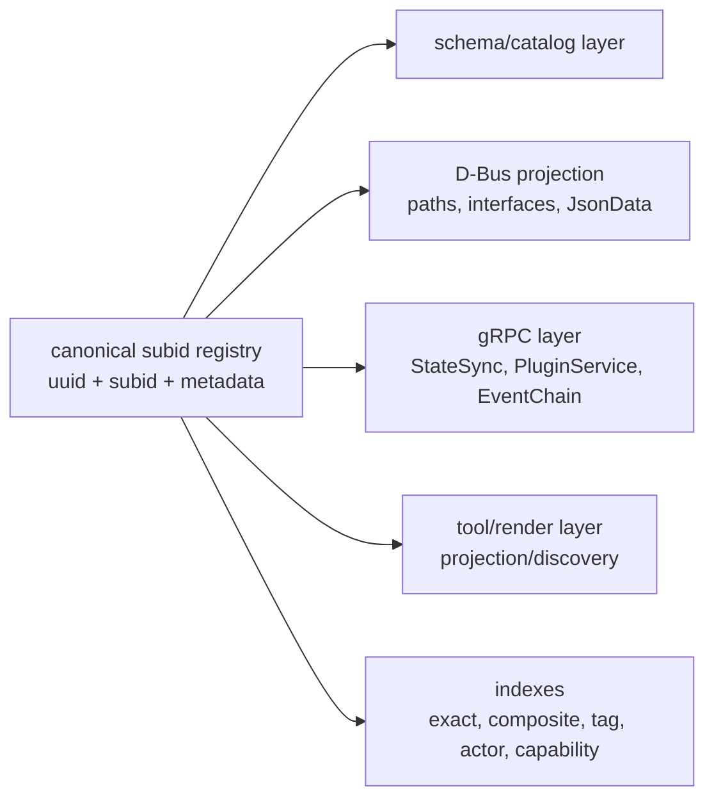

# Expanded subid taxonomy for operation-dbus-proto

## Executive summary

The strongest design is a **dual-identifier model**: keep an OSCAL-style `uuid` for machine identity, and add a separate internal `subid` for stable semantic classification. That is consistent with NIST’s distinction between machine-oriented UUIDs and human-oriented identifiers, and with NIST’s guidance that arbitrary extra classification data belongs in OSCAL `prop` objects rather than in free-form remarks. In practice, `subid` should be treated as an **organizational taxonomy key**, not as a replacement for UUID. citeturn9view0turn11view3turn13view0

For this repository, a useful `subid` is not just “rule” or “regulation.” The codebase exposes a concrete operational lifecycle: authoritative sources are mirrored into D-Bus objects, schemas are resolved and published, state is mutated through write paths, state is observed through read paths and discovery, changes are recorded in an event chain, and some of those artifacts are rendered as tools and higher-level views. That lifecycle is visible across the mirror, state, tool-discovery, and proto layers. fileciteturn11file2 fileciteturn11file1 fileciteturn21file0 fileciteturn22file0 fileciteturn22file1 fileciteturn22file2 fileciteturn23file0

The most workable proposal is therefore a **seven-category operational taxonomy**:

`src` source authority, `prj` projection, `sch` schema contract, `mut` mutation control, `obs` observation, `evt` event provenance, and `exp` exposure/render.

Each `subid` should follow:

`<category>.<component-type>.<subject>.<verb>[.<facet>][@vN]`

where `component-type` reuses NIST OSCAL component-type vocabulary when it fits (`software`, `service`, `process-procedure`, `standard`, `validation`, `network`, and so on), while the category captures **what the system is doing**. Regulatory mappings should live in metadata such as `control_source`, `control_refs[]`, and optional `statement_refs[]`, not inside the `subid` string itself. citeturn11view0turn11view4turn11view2

## Source scope

Enabled connector used: **GitHub** only. Source scope was constrained to NIST pages and the specified GitHub repository. No other GitHub repository or non-NIST web domain was used.

The explicit source base was:

- **NIST OSCAL and SP 800-53 pages**: *Identifier Use and UUIDs*; *Creating and Using Metadata in OSCAL*; *OSCAL Implementation Layer: Component Definition Model*; *Creating a Component Definition*; *OSCAL component-definition metaschema/reference pages*; and the *SP 800-53 Rev. 5* publication page. citeturn9view0turn13view0turn10view3turn11view4turn11view0turn11view2turn12view0
- **Repository files in `repr0bated/operation-dbus-proto`** explicitly inspected: `docs/architecture-flow.md`, `docs/operations/mirror-projection.md`, `crates/op-dbus-mirror/src/object.rs`, `crates/op-dbus-mirror/src/managed_objects.rs`, `crates/op-dbus-mirror/src/dbus_interface.rs`, `crates/op-state/src/dbus_server.rs`, `crates/op-tools/src/builtin/plugin_projection.rs`, `crates/op-tools/src/discovery/projection_engine.rs`, `crates/op-dbus-model/src/models.rs`, and `crates/op-grpc-bridge/proto/operation.proto`. fileciteturn11file0 fileciteturn11file2 fileciteturn11file1 fileciteturn21file0 fileciteturn21file1 fileciteturn22file2 fileciteturn22file0 fileciteturn22file1 fileciteturn21file2 fileciteturn23file0

## Design premises

NIST’s OSCAL guidance matters here in three specific ways. First, OSCAL supports both machine-oriented UUIDs and human-oriented identifiers, but it is explicit that UUIDs are best for exact reference while human-oriented identifiers must be managed organizationally and are more collision-prone. That means `subid` needs a registry and validation policy. Second, OSCAL `prop` is the correct extensibility point for arbitrary controlled values, with `ns`, `name`, `value`, and optional `class`; NIST explicitly says `remarks` should not be used to carry arbitrary extra data. Third, OSCAL already supplies a useful vocabulary of component-purpose types, including `software`, `service`, `policy`, `process-procedure`, `standard`, `validation`, and `network`, which can be reused instead of inventing a second noun taxonomy. citeturn9view0turn11view3turn13view0turn11view0

The repository reinforces that separation. It already distinguishes **authoritative sources**, **projection layers**, **schema catalogs**, **mutation paths**, **read/query paths**, **event-chain proofs**, and **rendered or discovered tools**. `MirrorV1` exposes publication and path listing; `ProjectedObjectV1` exposes `json_data`, `get_property`, and `data_updated`; the ObjectManager exposes managed object enumeration; `PluginCatalogDocument` persists `schema`, `dbus_path`, `service_name`, `storage_path`, and `source`; the state and gRPC layers expose mutation and schema operations; and the tool layer derives read-only tools from projected D-Bus objects. A path-only or UUID-only scheme would lose important semantics that the codebase already treats as distinct. fileciteturn21file1 fileciteturn11file1 fileciteturn21file0 fileciteturn21file2 fileciteturn22file2 fileciteturn22file0 fileciteturn22file1 fileciteturn23file0

A practical implication follows: **regulatory mapping is metadata, not category**. NIST’s component-definition model uses `control-implementation` with a `source`, `implemented-requirement` with `control-id`, and optional statement-level references for finer granularity. So the subid taxonomy should classify *operational meaning*, while explicit NIST mappings sit beside it as arrays or references. citeturn11view4turn11view2

## Proposed taxonomy

This is a **proposed internal overlay**, not a NIST-native taxonomy. NIST contributes the identifier rules, property model, statement/control mapping model, and component-type vocabulary; the repository contributes the lifecycle surfaces to classify. citeturn11view0turn11view3turn10view3 fileciteturn11file0 fileciteturn11file2

Recommended canonical pattern:

`<category>.<component-type>.<subject>.<verb>[.<facet>][@vN]`

Recommended base regex:

`^(?<cat>src|prj|sch|mut|obs|evt|exp)\.(?<ctype>this-system|system|interconnection|software|hardware|service|policy|physical|process-procedure|plan|guidance|standard|validation|network)\.(?<subject>[a-z0-9]+(?:-[a-z0-9]+)*)\.(?<verb>[a-z0-9]+(?:-[a-z0-9]+)*)(?:\.(?<facet>[a-z0-9]+(?:-[a-z0-9]+)*)){0,2}(?:@v(?<ver>[1-9][0-9]*))?$`

Recommended validation rules are straightforward: lowercase ASCII; hyphenated segments only; fixed category set; OSCAL component-type vocabulary when available; immutable per subject across revisions unless the subject meaning changes materially; and a mandatory paired UUID in the record. Those stability expectations are directly aligned with NIST’s per-subject consistency guidance. citeturn9view0turn11view1

| category | definition | example | regex | storage recommendation | priority |
|---|---|---|---|---|---|
| `src` | authoritative input, source-of-truth, or ingress channel | `src.network.ovsdb.monitor@v1` | `BASE where cat=src` | canonical registry row plus exact index on `(subid, source_system)` | P0 |
| `prj` | source-to-object publication or mirror/projection step | `prj.service.projected-object.publish@v1` | `BASE where cat=prj` | object registry plus index on `(dbus_path, service_name)` | P0 |
| `sch` | schema, contract, vocabulary, or control-mapping artifact | `sch.standard.plugin-schema.resolve@v1` | `BASE where cat=sch` | schema catalog plus unique index on `(schema_id or hash, version)` | P0 |
| `mut` | write-path operation that changes effective state | `mut.service.state-sync.apply-patch@v1` | `BASE where cat=mut` | append-only mutation log plus idempotency index | P0 |
| `obs` | enumeration, read, query, or discovery path | `obs.service.object-manager.enumerate@v1` | `BASE where cat=obs` | read model/discovery cache plus index on `(object_path, interface)` | P1 |
| `evt` | emitted signal, audit-chain event, proof, or tag provenance | `evt.validation.event-chain.verify@v1` | `BASE where cat=evt` | append-only event store plus indexes on `(event_hash, tag, capability_id)` | P1 |
| `exp` | consumer-facing rendering or materialized presentation surface | `exp.service.plugin-projection.render@v1` | `BASE where cat=exp` | presentation catalog plus index on `(consumer_surface, object_path)` | P2 |

## Category implementation matrix and mapping

The family alignments below are **design inferences**, not direct NIST-issued one-to-one mappings. The direct NIST-backed parts are the identifier model, `prop` extensibility model, component-type vocabulary, and the control/statement reference structure. The family labels are the practical compliance families most naturally associated with each operational category. citeturn12view0turn11view4turn11view2

| category | intended use cases | recommended metadata fields | implementation notes | repository mapping | NIST alignment |
|---|---|---|---|---|---|
| `src` | authoritative stores, sockets, subscriptions, and source snapshots | `uuid`, `subid`, `source_system`, `source_locator`, `dbus_root`, `authority_rank`, `storage_path`, `control_refs[]` | Store centrally; permit writes only to source owners; index exact source and locator; derived caches may mirror but not override authority | OVSDB, NonNet, and SQLite are explicit upstream sources in the mirror docs; `MirrorV1.publish_snapshot`, `reconcile`, `get_stats`, and `list_paths` make the source/projection boundary explicit. fileciteturn11file2 fileciteturn21file1 fileciteturn11file0 | Reuse OSCAL component types like `network`, `service`, and `software`; likely primary family alignment is SC/CM because the category governs source channels and authoritative system state. citeturn11view0turn12view0 |
| `prj` | turning authoritative state into D-Bus objects and managed-object inventories | `uuid`, `subid`, `dbus_path`, `service_name`, `interface`, `source_subid`, `projection_root`, `json_property_name`, `control_refs[]` | Index by `dbus_path` and interface; read widely, write only from projection services; preserve source linkage so projections can be rebuilt | `ProjectedObjectV1` exposes `json_data`, `get_property`, and `data_updated`; ObjectManager exposes `GetManagedObjects`; the mirror docs define the projection tree and registration surface. fileciteturn11file1 fileciteturn21file0 fileciteturn11file2 | Use OSCAL `prop` for classification and component types for purpose. Family alignment is mostly CM, with AU relevance once projection changes are signaled. citeturn11view3turn11view0turn12view0 |
| `sch` | schema publication, contract lookup, JSON-schema dialects, and control mappings | `uuid`, `subid`, `schema_id`, `schema_version`, `schema_hash`, `component_type`, `control_source`, `control_refs[]`, `statement_refs[]` | Make this the canonical registry; unique on schema identity and version; broad read access, narrow write access to schema owners; never duplicate schema authority in multiple mutable stores | `PluginCatalogDocument` persists `schema`, `dbus_path`, `service_name`, `storage_path`, and `source`; `PluginV1.get_schema` and `PluginService.GetSchema` expose schema retrieval. fileciteturn21file2 fileciteturn22file2 fileciteturn23file0 | NIST explicitly supports component types, property-based taxonomies, `control-implementation` sources, `implemented-requirement` control IDs, and optional statement-level references. citeturn11view0turn11view3turn11view4turn11view2 |
| `mut` | property sets, method calls, patch application, contract mutation, state writes | `uuid`, `subid`, `plugin_id`, `object_path`, `member_name`, `actor_id`, `capability_id`, `idempotency_key`, `control_refs[]`, `statement_refs[]` | Append-only write log; require capability checks; index `actor_id`, `capability_id`, and idempotency; deny-by-default for write surfaces | `StateSync.Mutate`, `BatchMutate`, `SetProperty`, `CallMethod`, and `MutateRequest` include `actor_id`, `capability_id`, and idempotency semantics; D-Bus state APIs expose `apply_openflow_state` and `apply_contract_mutation`. fileciteturn23file0 fileciteturn22file2 | Direct NIST backing comes from control implementation and statement granularity; family alignment is naturally AC, CM, and SI for authorization, controlled change, and integrity. citeturn11view4turn11view2turn12view0 |
| `obs` | read-path enumeration, snapshots, discovery, introspection, query, and subscription setup | `uuid`, `subid`, `query_scope`, `path_pattern`, `consumer_role`, `cache_ttl`, `projection_scope`, `control_refs[]` | Accept many readers but support field masking later if sensitivity metadata is added; index `object_path`, `service_name`, and `query_scope`; caches are acceptable because reads are not authority | `get_property` and `json_data` expose object reads; ObjectManager enumerates objects; `PluginProjectionTool` is read-only; `ProjectionEngine` auto-discovers D-Bus paths and registers tools. fileciteturn11file1 fileciteturn21file0 fileciteturn22file0 fileciteturn22file1 | NIST supports human-oriented lookup and property-based arrangement/filtering; family alignment is usually AC and AU because observation is read-path governance plus audit context. citeturn9view0turn11view3turn12view0 |
| `evt` | D-Bus signals, state-change records, event hashes, proofs, snapshots, tag immutability | `uuid`, `subid`, `event_id`, `event_hash`, `decision`, `tags_touched[]`, `proof_root`, `actor_id`, `capability_id`, `control_refs[]` | Append-only only; index tag, event hash, actor, capability, and decision; write restricted to event pipeline; audit and proof reads can be broader than mutation rights | `data_updated` is emitted by `ProjectedObjectV1`; the proto defines `EventChainService`, `ChainEvent`, `VerifyChain`, `GetProof`, `ProveTagImmutability`, and snapshots. fileciteturn11file1 fileciteturn23file0 | NIST’s UUID and cross-instance reference model fits event/proof references well; family alignment is mostly AU, with validation and integrity overlays. citeturn9view0turn11view2turn12view0 |
| `exp` | consumer-facing rendering of mirrored state as tools, typed bridge views, or UI/API surfaces | `uuid`, `subid`, `consumer_surface`, `render_format`, `tool_name`, `redaction_profile`, `path_template`, `control_refs[]` | Treat as read-only derived catalog; index by tool name and consumer surface; if sensitive fields are later introduced, enforce redaction policy here rather than in source records | `PluginProjectionTool` derives tool names from object paths and returns rendered data; `ProjectionEngine` assigns `plugin-projection` and `mirrored.v1` namespaces; the gRPC layer also exposes typed bridge-state views for consumers. fileciteturn22file0 fileciteturn22file1 fileciteturn23file0 | NIST property/class support is the right place to annotate exposure metadata; family alignment is usually AC and, when personal or regulated data applies, privacy overlays from SP 800-53 Rev. 5. citeturn11view3turn12view0 |

The practical storage pattern is:

Because target language, scale, and existing database technology are unspecified, the safest default is a **language-neutral registry file** plus a persisted relational or document store. A minimal baseline is one canonical table or collection keyed by `uuid`, with a unique constraint on `subid`, plus composite indexes on `(category, component_type, subject, verb)` and selective secondary indexes for `dbus_path`, `plugin_id`, `actor_id`, `capability_id`, `event_hash`, and `tags_touched`. If you later project into a graph, search, or vector layer, keep `subid` as an exact-match field and keep `control_refs[]` and `statement_refs[]` as separate filterable arrays rather than folding them into the identifier string.

## Adoption and migration recommendations

The adoption path should be short and strict.

1. **Create one canonical registry**. Add a repository-owned `subid` registry artifact, preferably JSON or YAML, with required fields: `uuid`, `subid`, `category`, `component_type`, `subject`, `verb`, `version`, `control_source`, `control_refs[]`, and optional `statement_refs[]`. Use an organization-controlled namespace or URN for the property system, because NIST explicitly expects controlled URI-based naming systems where a value space is organization-defined. citeturn11view3

2. **Store `subid` as an OSCAL-style property, not as a UUID substitute**. The clean model is: UUID stays native identity; `subid` is a `prop` value. If you serialize into OSCAL-adjacent structures, use `ns`, `name`, `value`, and optional `class`; do not bury this in `remarks`. citeturn13view0turn11view3

3. **Backfill from stable repo surfaces**. Derive provisional `subid`s from the existing stable nouns already present in the repository: service name, D-Bus root, object path, plugin ID, method/signal name, and schema identity. The repository already exposes those stable anchors in `PluginCatalogDocument`, `ProjectedObjectV1`, ObjectManager, the state D-Bus host, and the gRPC proto. fileciteturn21file2 fileciteturn11file1 fileciteturn21file0 fileciteturn22file2 fileciteturn23file0

4. **Wire the taxonomy into every lifecycle surface once, not ad hoc everywhere**. The best injection points are the canonical catalog document, mirror/publication registration, gRPC mutation/event payloads, and tool discovery/rendering. That matches the repository’s existing authority and projection boundaries. fileciteturn21file2 fileciteturn21file1 fileciteturn22file1 fileciteturn23file0

5. **Enforce two hard rules in CI**. First, `subid` uniqueness is organizational and must be mechanically checked. Second, `mut.*` records must carry `actor_id` and `capability_id`, while `evt.*` records must carry `event_id` or `event_hash` and tags/proof fields when applicable. The proto already makes those write-path and audit fields first-class. fileciteturn23file0

6. **Keep compliance mappings out of the identifier string**. The identifier should stay short and stable; the compliance detail belongs in `control_source`, `control_refs[]`, and optional `statement_refs[]`. That follows NIST’s actual component-definition structure and will scale better than encoding families or control IDs into the subid itself. citeturn11view4turn11view2

The concise recommendation is this: **adopt `subid` as a human-readable operational taxonomy key, reuse OSCAL component-type vocabulary for the noun layer, preserve UUIDs for exact identity, and keep compliance references in metadata arrays rather than inside the identifier**. That design fits both the NIST model and the repository’s actual architecture. citeturn9view0turn11view0turn11view3 fileciteturn11file0 fileciteturn21file2
