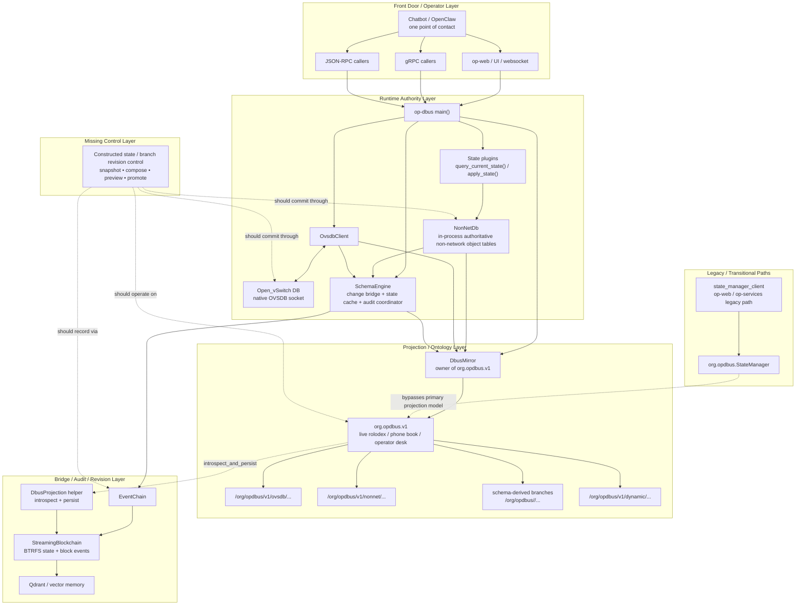

# Architecture Flow

End-to-end system architecture diagrams for operation-dbus-proto. Intended as the source of
truth for Lovable UI generation and onboarding.

---

## 1. Canonical State Mutation Path

```
External caller
  │
  ├── gRPC (op-dbus:50051)
  │     StateSyncServer (op_grpc_bridge)
  │     → mutate()
  │
  └── JSON-RPC (stdio/tcp/unix)
        → state.mutate request
        → handle_state_mutate_request()

            │
            ▼
    SchemaEngine (in-process singleton)
    schema materialization + validation
    (plugin IS the schema — schema drives everything)
            │
            ▼
    Plugin mutation/apply
            │
            ├── Network state     →  OVSDB (JSON-RPC socket)
            │                        authoritative RCP store
            │
            ├── Plugin state      →  NonNet DB (in-process JSON-RPC)
            │                        authoritative RCP store
            │
            ├── Persistent state  →  op-state-store (SQLite)
            │
            ├── Audit trail       →  BTRFS timing_subvol
            │                        (append-only, block chain)
            │
            └── DR state dump     →  BTRFS state_subvol
                                     current.json
                                     (only include_in_dr=true plugins)

    D-Bus projection (op-dbus-mirror):
      Pure 1:1 read from OVSDB + NonNet
      Projection index comes from RCP plugin schema metadata
      OVSDB row + native OVSDB schema + plugin projection metadata
      → /org/opdbus/network/bridges/{name}
      → /org/opdbus/network/ports/{name}
      → /org/opdbus/network/interfaces/{name}
      Large schema-derived tables only → /org/opdbus/v1/dynamic/{plugin}/{object_type}
      No catalog lookup, no sync, no intermediate stores
```

---

## 1.5 Projection-First Runtime Layers



Notes:

- `runtime layers` is accurate shorthand here.
- The primary live ontology is the `org.opdbus.v1` projection tree.
- `DbusMirror` is the owner of that tree.
- `SchemaEngine` is the adjacent change/audit bridge, not the owner of the tree.
- `org.opdbus.StateManager` is shown as transitional/legacy because it is not the primary
  projection-first authority model.
- The missing piece is branch-level constructed-state control over authoritative current state.

---

## 2. Blockchain & Vector Pipeline

```
Plugin mutation completes
        │
        ▼
OptimizedBlockchain::add_footprint()
  ├── Writes PluginFootprint → BTRFS timing_subvol (synchronous)
  │
  └── try_send(EmbedRequest) → mpsc channel (non-blocking, drop if full)
              │
              ▼
      Embedding Worker (tokio task, background)
        ├── EmbeddingProvider::embed(text, Document)
        │     └── OpenClaw agent routing
        │           model = OPENCLAW_EMBEDDING_MODEL
        │           (default: openclaw:embedder-voyage4lite)
        │           → POST /v1/embeddings → Voyage API
        │           fallback: op-ml local ONNX
        │
        └── Qdrant::upsert_points()
              collection: op_footprints  (or plugin-specific)
              point_id:   block_hash
              vector:     1024-dim (voyage-4-lite)
              payload:    plugin_id, operation, timestamp, session_id
              endpoint:   10.149.181.190:6334 (gRPC)


Qdrant roles:
  ├── AI analysis     — semantic search over footprints & reasoning episodes
  ├── Disaster recovery — vector snapshot = point-in-time AI memory state
  └── Offsite backup  — btrfs send of vector storage to remote replica
```

---

## 3. Control-Plane Chatbot Reasoning Vectorization

```
Chatbot enters reasoning state
  (trigger: goal received / tool result / interrupt / replan)
        │
        ▼
  Reasoning Episode opens
  ┌─────────────────────────────────────────────────────┐
  │  episode_id (UUID v7)                               │
  │  goal_text, trigger, tools_consulted                │
  │  reasoning_summary (model-generated at close)       │
  │  outcome_class, confidence, plugin_id               │
  │  pii_flagged → redacts summary from vector input    │
  └─────────────────────────────────────────────────────┘
        │
        ▼
  Reasoning state exits
  (tool_call / response_emitted / direction_change / goal_achieved)
        │
        ├── 1. Write record → blockchain / event log  (synchronous)
        │
        └── 2. Enqueue embedding  (non-blocking)
                    │
                    ▼
            Embedding Worker (high priority)
              embed: reasoning_summary + goal_text + outcome_class
                     + tools_consulted  (no raw payloads, no PII)
                    │
                    ▼
            Qdrant upsert
              collection: ctl_plane_reasoning_episodes
              vector: 1024-dim voyage-4-lite
              payload: episode_id, started_at, ended_at, outcome_class,
                       trigger, exit_reason, plugin_id, conversation_id,
                       reasoning_summary, decision_output
                    │
                    ▼
            trace span: reasoning_episode.vectorized
```

---

## 4. Chatbot Accountability View

```
Human operator query: "why did the chatbot reconfigure the firewall at 3am?"
        │
        ▼
ChatbotAccountabilityService (gRPC)
  SearchEpisodes(query, filters{outcome_class, plugin_id, time_range})
        │
        ├── EmbeddingProvider::embed(query, Query intent)
        │         → OpenClaw → Voyage API (query input_type)
        │
        └── Qdrant::search(ctl_plane_reasoning_episodes, vector, filters)
                    │
                    ▼
            Scored results ranked by semantic similarity
            Each result:
              ├── reasoning_summary
              ├── decision_output
              ├── outcome_class
              ├── started_at / duration_ms
              └── tools_consulted

        Lovable UI renders results from JSON schema
        (no special UI code — schema-driven renderjson)
```

---

## 5. BTRFS Subvolume & Snapshot Architecture

```
/                           (BTRFS root, /dev/sda + /dev/sdb RAID-1)
├── timing_subvol/          audit ledger — append-only blockchain blocks
│     └── snapshots/        .send-state.json  (per-remote send tracking)
│
├── state_subvol/           DR state — current.json per include_in_dr plugin
│
└── vectors/                Qdrant storage volume
      └── storage/          point data, segments, WAL


Incremental send (BTRFS):
  snapshot N-1  ←── parent (pinned until all remotes confirm receipt)
  snapshot N    ←── current

  btrfs send -p <N-1> <N> | ssh remote btrfs receive <path>

  SendState tracks per-remote last_sent_snapshot
  Pruning NEVER deletes a pinned snapshot
  Pin released only after successful incremental send to ALL remotes


DR recovery order:
  1. Boot baseline Debian
  2. Apply state_subvol/current.json  (plugin schema reinstalls dependencies)
  3. Restore Qdrant vectors from snapshot
  4. Replay timing_subvol blocks from last DR checkpoint forward
```

---

## 6. Agent Orchestration (Post-Refactor)

```
BEFORE (static structs):
  50+ per-agent .rs files
  each with hardcoded SystemMessage, ModelConfig, ToolSet
  registered manually in agent_catalog.rs

AFTER (dynamic personas):
  config/agents/personas.yaml
    └── persona definitions: name, system_prompt, model, tools, tags

  PersonaAgent (generic handler)
    ├── loads persona from YAML at startup
    ├── routes tool calls via MCP
    └── returns structured output per plugin schema

  AgentCatalog
    └── built from YAML — no code changes to add/remove agents

  OpenClaw agent routing:
    model string = agent selector
    e.g. "openclaw:embedder-voyage4lite"
         "openclaw:reasoner-claude-sonnet"
         "openclaw:coder-deepseek"
```

---

## 7. Service & Port Summary

| Service | Host | Port | Protocol | Notes |
|---|---|---|---|---|
| op-dbus | op-dbus (host) | 50051 | gRPC/TLS | Unified gRPC server (StateSync, MCP, Plugins) |
| op-dbus | op-dbus (host) | stdio/tcp/unix | JSON-RPC | MCP compact / CLI tooling |
| op-dbus-mirror | op-dbus (host) | D-Bus session (org.opdbus.v1) | D-Bus | 1:1 RCP projection (OVSDB + NonNet) |
| op-web | op-web | 8080 | HTTP | UI frontend |
| OpenClaw | services container (loopback:18789 → /run/services0/gateway.sock) | — | HTTP/WS | No IP; nginx proxies via Unix socket |
| Qdrant REST | qdrant container | 6333 | HTTP | Collection management |
| Qdrant gRPC | qdrant container | 6334 | gRPC | Vector ops (Rust client) |
| Xray | xray-server container | varies | proxy | Privacy ingress (not yet socket-only) |

### Network segments

**Socket-based service access (implemented):**
```
wg0 (10.0.0.1/24)            — WireGuard device identity/session
  └── nginx on 10.0.0.1:443  → /run/services0/gateway.sock → OpenClaw (127.0.0.1:18789 inside services)

services container            — loopback-only, no veth, no IP
  └── /run/services0/         — shared host ↔ container socket directory
      └── gateway.sock        — OpenClaw gateway socket (socat bridge)

user-<id> containers          — loopback-only, no veth, no IP
  └── /run/user-sockets/<id>/ — per-user socket directory
```

**OVS privacy fabric (separate dataplane, NOT used for OpenClaw):**
```
ovsbr0                        — OVS bridge (privacy routing only)
  ├── wgcf                     Cloudflare WARP tunnel (no IP on port)
  ├── priv_wg                  Privacy chain port (no IP)
  ├── priv_warp                Privacy chain port (no IP)
  ├── priv_xray                Privacy chain port (15.235.37.41/32)
  ├── ovsbr0-mgmt              Management internal port (10.200.0.1/24)
  ├── grpc-bridge              gRPC control plane (10.200.0.2/24)
  └── ovsbr0-sock              Socket-network anchor (no IP)
```

---

## 8. D-Bus Mirror — Pure 1:1 RCP Projection

The D-Bus mirror (`op-dbus-mirror`, bus name `org.opdbus.v1`) is a **pure 1:1 projection** of the two
authoritative RCP (Runtime Control Plane) databases. It introduces **no second source of truth** — it reads
directly from the databases and publishes what it finds as D-Bus objects.

### RCP Stores (read directly)

| Store | Protocol | Projection rule | What it holds |
|---|---|---|---|
| **OVSDB** | JSON-RPC (socket) | Read native `Open_vSwitch` schema, then project rows only when plugin RCP schema marks the object type `schema_derived=true` | Network state: bridges, ports, interfaces, flows |
| **NonNet** | JSON-RPC (in-process) | Read plugin RCP schema metadata and project only `schema_derived=true` object types | Non-network plugin state: dinit, hardware, privacy, DNS, etc. |

The native OVSDB schema is the data-shape authority for OVSDB mutations and reads. Every OVSDB transaction that inserts, updates, mutates, or deletes rows validates the target table and column names against that schema before the JSON-RPC `transact` request is sent.
The plugin/RCP schema supplies OP-DBUS ownership and projection metadata:

```json
{
  "schema_derived": true,
  "rcp_db": "ovsdb",
  "rcp_table": "Bridge",
  "id_field": "name",
  "base_path": "/org/opdbus/network/bridges",
  "interface": "org.opdbus.network.v1.Bridge"
}
```

Result:

```
OVSDB Bridge row name=ovsbr0
  + native OVSDB schema table Bridge
  + plugin projection metadata
  → /org/opdbus/network/bridges/ovsbr0
```

`/org/opdbus/v1/dynamic/{plugin}/{object_type}` is not a fallback. It is only a lazy-loading branch for large tables that already passed the same `schema_derived=true` selection rule.

### NOT projected (catalog only)

| Store | Purpose | Where it lives |
|---|---|---|
| Enterprise SQLite (namespace_schema) | Schema catalog/library — service definitions, LDAP schemas, migration rules | ComponentRegistry (gRPC) |

The Enterprise SQLite is a **catalog** used to create, store, and maintain a library of schemas.
It feeds the ComponentRegistry for gRPC discovery but is **never** part of the D-Bus projection flow.
ComponentRegistry is a pure gRPC in-memory service (`RegistryInner`).

### Refresh model

```
                ┌──────────────────────────────────┐
                │      op-dbus-mirror (org.opdbus.v1)       │
                │                                           │
                │  refresh_full_tree()                      │
                │    1. publish_nonnet_snapshot()            │
                │       └── NonNet get_schema → schema_derived│
                │           → select rows → base_path/{id}  │
                │    2. publish_ovsdb_snapshot()             │
                │       └── OVSDB get_schema + plugin RCP schema│
                │           → select schema-derived tables  │
                │    3. remove_stale_publications()          │
                │       └── prune D-Bus objects not in DB   │
                └──────────────────────────────────┘

Event-driven triggers:
  ├── OVSDB monitor_db("Open_vSwitch")  → channel rx → refresh
  ├── NonNet subscribe() broadcast      → channel rx → refresh
  └── Periodic fallback (300s)          → tick → refresh
```

### D-Bus interfaces

| Interface | Path | Methods / Properties |
|---|---|---|
| `org.opdbus.MirrorV1` | `/org/opdbus/v1` | `publish_snapshot`, `reconcile`, `get_stats`, `list_paths` |
| `org.opdbus.OvsdbV1` | `/org/opdbus/v1/ovsdb` | `transact`, `get_schema`, `list_dbs`, `create_bridge`, etc. |
| `org.opdbus.NonNetV1` | `/org/opdbus/v1/nonnet` | `transact`, `get_schema`, `list_dbs` |
| `org.opdbus.ProjectedObjectV1` | schema `base_path/{id}` | `json_data` property, `get_property(key)`, Signal: `data_updated` |
| `org.opdbus.LazyTableV1` | `/org/opdbus/v1/dynamic/{plugin}/{object_type}` | `count`, `table`, `database`, `list_ids(offset, limit)`, `get_row(id)` |

### NonNet seeding

NonNet starts with schema metadata, not catalog lookups. At boot,
`authoritative_nonnet.load_from_schema_defs(&schema_defs)` seeds plugin object metadata into the RCP schema.
The mirror reads that RCP schema directly. Runtime rows are still read from the authoritative RCP DB that owns them.

### D-Bus object path hierarchy

```
/org/opdbus/
├── state                              ← StateManager interface
└── v1/                                ← MirrorV1 management interface
    ├── ovsdb/                         ← OvsdbV1 JSON-RPC interface
    ├── nonnet/                        ← NonNetV1 JSON-RPC interface
    └── dynamic/                       ← LazyTableV1 for large schema-derived tables only
        └── {plugin}/{object_type}

/org/opdbus/network/
├── bridges/{name}                     ← OVSDB Bridge via network plugin schema
├── ports/{name}                       ← OVSDB Port via network plugin schema
└── interfaces/{name}                  ← OVSDB Interface via network plugin schema

/org/opdbus/{plugin}/...               ← NonNet rows at plugin schema base_path/{id}

/org/dbusmcp/Agent/
├── PythonPro                          ← Agent interface
├── RustPro                            ← Agent interface
└── ...per agent type

/org/opdbus/services                   ← services.v1.Manager interface
```

---

## 9. Data Stores at a Glance

| Store | Location | What lives there | Durability |
|---|---|---|---|
| OVSDB | JSON-RPC socket (host) | Network state (bridges, ports, interfaces, flows) | Persistent (OVS manages) |
| NonNet | In-process JSON-RPC | Non-network plugin state (seeded from state_manager at boot) | Runtime (re-seeded on restart) |
| op-state-store | SQLite (op-dbus host) | Plugin state, cognitive memory, user memory | Persistent |
| Enterprise SQLite | SQLite (namespace_schema) | Schema catalog: service definitions, LDAP schemas, migration rules | Persistent (catalog only) |
| BTRFS timing_subvol | /timing_subvol | Blockchain footprints (audit, immutable) | Persistent + replicated |
| BTRFS state_subvol | /state_subvol | DR current.json snapshots | Persistent + replicated |
| Qdrant | qdrant container | Vectors: footprints, reasoning episodes | Persistent + snapshotted |
| Embedding channel | in-process mpsc | In-flight embed requests | Best-effort (runtime only) |

---

## 9. Embedding Flow Detail

```
EmbedRequest {
  block_hash:      point ID in Qdrant
  embedding_text:  "plugin=firewall operation=set_rules ..."
  collection:      collection name
  payload:         JSON (plugin_id, op, ts, session_id, ...)
}

footprint_to_embedding_text():
  format: "plugin={plugin_id} operation={operation}
           actor={actor} outcome={outcome}
           summary={summary}"
  (no raw payloads — only metadata fields)

Channel: mpsc(1024) — try_send, silent drop on full
  rationale: embedding is runtime cognitive ability, not audit
  audit source of truth = BTRFS timing_subvol (never dropped)

Retry in worker: 5 attempts, 500ms base, exponential backoff
  worker logs warn on final failure, does not panic
```
