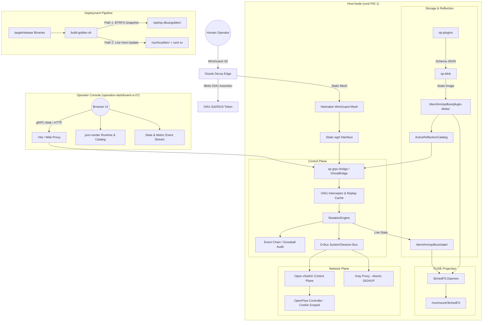

# OP-DBUS, 3tchedFS & Operator Console Master Architecture

This document provides a unified architectural blueprint and comprehensive record of Zen Review findings across the entire stack:
1. **OP-DBUS Core Backend** (`/srv/git/odbus`):
   - **The Blob System** (`crates/op-blob`)
   - **The Plugin Framework** (`crates/op-plugins` & `crates/op-state-store`)
   - **Authoritative Mutation Engine** (`crates/op-grpc-bridge`)
   - **Zero-Trust Identity & Sled ABI** (`crates/op-identity`)
   - **Network Plane & Ingress** (OVS, OpenFlow, Xray, EMQX, Netmaker)
2. **Golden Deployment & BTRFS Snapshot Pipeline** (`deploy/runit/build-golden.sh` & `deploy/btrfs-layout.sh`):
   - **Single-Build Dual-Target Publishing**: Staging deployable BTRFS subvolumes alongside atomic live host runtime updates.
   - **Network-Critical Hold-Back**: Deliberate exclusion of connectivity carriers from auto-restarting.
3. **3tchedFS FUSE Projection** (`/srv/3tchedFS`):
   - **Schema-Driven Virtual Filesystem**: Live typed projection over sealed blobs and present-state SHM.
   - **Sparse Copy-on-Write (COW) Workspaces**: Content-addressed view branching, schema validation on write, and D-Bus method dispatch.
4. **Operator Console Frontend** (`/srv/git/operation-dashboard-ui-07`): React/TypeScript UI, `json-render` declarative runtime, gRPC-web bridge client, and catalog stream pipelines.

---

## 1. System Topology & Global Transport

---

## 2. Golden Deployment Architecture & Zen Review (`deploy/`)

### 2.1 Dual-Publishing Pipeline (`deploy/runit/build-golden.sh`)
* **Single Source Build**: Builds are compiled once with `CXXFLAGS="-include cstdint" cargo build --workspace --release`.
* **Path 1: Golden Subvolume (`/opt/op-dbus/golden/`)**:
  - Enforces underlying BTRFS filesystem (`stat -f -c %T`).
  - Stages binaries (`bin/`), control scripts/systemd shims (`sbin/`), runit service definitions (`sv/`), and environment defaults (`etc/`).
  - Writes a cryptographic `MANIFEST` recording build timestamp, git commit, and SHA-256 hashes of every binary.
  - Snapshotting (`btrfs subvolume snapshot -r`) and streaming (`btrfs send / receive`) are executed at deployment release time.
* **Path 2: Live Runtime Installation (`/usr/local/bin` & `/etc/runit/sv`)**:
  - Installs binaries into `/usr/local/bin`, only updating modified files (`cmp -s`).
  - Installs runit `run` scripts, preserving host-modified versions to respect operator runtime tuning.
  - Automatically restarts only the supervised services whose binary changed.
* **Network-Critical Hold-Back List (`NEVER_AUTO_RESTART`)**:
  - Services: `ovs-vswitchd`, `ovsbr0-addr`, `ovsbr0-svc-addr`, `ovsbr0-uplink`, `uplink-dhcp`, `op-session-bus`, `opdbus-rundirs`, `dbus`.
  - These services carry host connectivity and core IPC; bouncing them automatically risks killing remote SSH or dropping session bus connections. They are reported to the console for deliberate manual restart.

### 2.2 Zen Review Findings: Golden Deployment
* 🟠 **Major (Predictable PID Temp File in Shell)**: `install_live()` uses `/tmp/golden-changed.$$` to collect changed binary names. In multi-tenant environments, PID-based temp files are vulnerable to symlink race conditions (mitigate with `mktemp`).
* 🟠 **Major (Orphaned Binary Retention)**: If a binary is deleted from the repo, `build_golden()` stages the current build but does not prune deleted artifacts from existing target subvolumes without a fresh subvolume recreation.
* 🟡 **Minor (Restart Health Probe Duration)**: Post-restart verification sleeps 3 seconds before querying `sv status`; flapping daemons may appear healthy momentarily before exiting.

---

## 3. 3tchedFS Architecture & Zen Review (`/srv/3tchedFS`)

### 3.1 Core Architectural Principles
* **Dual SHM Authority Model**:
  - **Schema Authority**: Sealed OPBLOB01 blobs (`/dev/shm/opdbus/plugin-blobs/`) define types, methods, fields, and immutability.
  - **Live Runtime Value Authority**: Live present-state JSON (`/dev/shm/opdbus/state/`) written by `MutationEngine`.
* **Zero-Copy & Live Snapshots**: Pinned view mounts serve leaf scalar files under `data/` live from SHM snapshot on `open()`.
* **Sparse Copy-On-Write (COW) Workspaces**: Staged edits validate against JSON Schema on write before committing.
* **Controlled D-Bus Method Dispatch (`threetched-fs call`)**: Validates argument schemas, enforces `--confirm-side-effects`, and dispatches over `/run/opdbus/session-bus.sock` via `org.opdbus.v1.PluginV1.Call`.

### 3.2 Zen Review Findings: 3tchedFS
* 🟠 **Major (SIGPIPE on Piped Tree Output)**: Piping `threetched-fs tree` to downstream tools that exit early (e.g. `head`) triggers an unhandled `BrokenPipe` panic.
* 🟠 **Major (FUSE Corpse Prevention)**: CLI mounts without `--auto-unmount` leave dangling `ENOTCONN` mount points on abnormal termination (enforced in runit service).
* 🟡 **Minor (Silent Fallback to Template)**: Falls back silently to `schema.template()` when a live state file fails schema validation during capture without diagnostic warnings.

---

## 4. Dedicated Zen Reviews: Core Backend Subsystems

### 4.1 The Blob System (`crates/op-blob`)
* **Pipeline**: *Roll → Seal → Freeze → Hot*
* **Zen Review Findings**:
  - 🟠 **Major (Panic in `BlobRef` Accessors - FIXED)**: Hardened `BlobRef::new` to validate `SECTION_MANIFEST_JSON` presence and verify UTF-8 encoding during construction.
  - 🟡 **Minor (Field Numbering Model)**: Protobuf descriptors in `descriptor.rs` use sequential field numbers `(i + 1)` sorted by property name.

---

### 4.2 The Plugin Framework (`crates/op-plugins` & `crates/op-state-store`)
* **Architecture**: *"The Plugin is the Schema"*. Auto-registration via `inventory::submit! { PluginReg::new(...) }`.
* **Zen Review Findings**:
  - 🟠 **Major (Mock Discovery Routine - FIXED)**: `SystemdAutoCreator::discover_units()` now inspects live host services from `/run/runit/service`.
  - 🟡 **Minor (Stale Netmaker Agent Logic)**: Dynamic `netclient` installation routines quarantined in favor of static WireGuard mesh.

---

### 4.3 Authoritative Mutation Engine (`crates/op-grpc-bridge`)
* **Architecture**: Central coordinator for all state changes. Appends linear `StateChange` records to `EventChain`, mirrors events to durable `StreamingSnowball` (`/var/lib/opdbus/snowball`), and broadcasts to subscribers.
* **Zen Review Findings**:
  - 🟠 **Major (Projection Drift on Filesystem Error)**: Errors in `write_projection` must trigger alarms to avoid in-memory vs on-disk divergence.
  - 🟠 **Major (Actor Resolution Security)**: Sled actor fallback uses validated `read_sled()` with strict 152-byte bounds.

---

## 5. Operator Console Architecture (`/srv/git/operation-dashboard-ui-07`)

### 5.1 Stack & Component Wiring
* **Core**: React 18, TypeScript, Vite, Tailwind CSS, `@radix-ui` / shadcn/ui primitives.
* **Declarative UI**: `json-render` library integration with typed catalog components (`catalog.ts`, `SpecRenderer.tsx`).
* **gRPC-Web Transport**: `@protobuf-ts/runtime-rpc` client, event streams (`useEventStream`), active abort-controller tracking.

---

### 5.2 Zen Review Findings: UI & Client Stack

| Severity | Component | Finding & Impact | Status |
|---|---|---|:---:|
| 🔴 **Critical** | `vite.config.ts` | Dev proxy omits gRPC prefixes (`/operation.`, `/op_chat.`, `/assistant.`, `/pair`). | Pending |
| 🟠 **Major** | `src/grpc/client.ts` | `subscribe()` dropped `includeSchema` flag when constructing requests. | **FIXED** |
| 🟠 **Major** | `src/grpc/client.ts` | Factory plugin methods lacked exported client bindings in `client.ts`. | **FIXED** |
| 🟠 **Major** | `src/grpc/client.ts` | `resetTransport()` leaked active in-flight controllers. | **FIXED** |
| 🟠 **Major** | `catalog/stream-plugins.ts` | `antigravity_chat` missing from `STREAM_PLUGIN_IDS` array. | **FIXED** |
| 🟠 **Major** | `src/json-render/catalog` | Components `navToggle`, `navSection`, `navItem` omit `events: [...]` in schema declarations. | Pending |
| 🟠 **Major** | `spec-builders.ts` | Element IDs formed from dotted object keys collide. | Pending |
| 🟡 **Minor** | `manifest.ts` | Several pages (`config`, `tools`, `skills`, `workflows`) have mock mutations without `wip` flags. | Pending |
