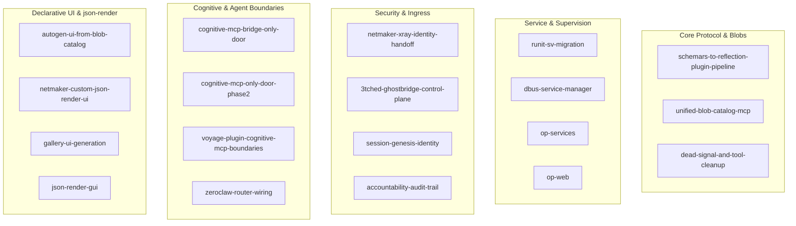

# Master Zen Review: Kiro Specifications, Designs & Task Plans

This document provides a comprehensive adversarial Zen Review across all Kiro specifications, design documents, task matrices, and session snapshots located across:
1. `/srv/git/odbus/.kiro/specs/`
2. `/srv/git/operation-dashboard-ui-07/.kiro/specs/`
3. `~/.kiro/` (`/home/jeremy/.kiro/`)

---

## 1. Executive Summary & Cross-Repository Scope

Across the workspace, **24 distinct Kiro specification packages** were audited across requirements, design documents, and implementation task matrices.

---

## 2. In-Depth Zen Review by Functional Domain

### 2.1 Protocol, Schema & Blob Pipeline
* **Specs Audited**: `schemars-to-reflection-plugin-pipeline`, `unified-blob-catalog-mcp`, `dead-signal-and-tool-cleanup`.
* **Core Contract**:
  - Rust structs derive JSON Schema via `schemars` -> serializes into `PluginSchema` -> sealed into `OPBLOB01` format.
  - Blobs contain 4 mandatory sections: Schema JSON, Manifest JSON, Protobuf FileDescriptorSet, Meta JSON.
  - Zero-copy borrowed byte access via `BlobRef` served directly to `tonic-reflection`.
* **Zen Review Findings**:
  - ✅ **Aligned**: `crates/op-blob` implements `OPBLOB01` layout, zero-copy section offsets, and SHA-256 integrity verification.
  - 🟠 **Remediated**: `BlobRef::new` was hardened against panic triggers on malformed UTF-8 or missing manifest sections.
  - 🟡 **Status Note**: Legacy mirror session loops in `op-dbus-mirror-event-session-refactor` have been marked **SUPERSEDED** and cleanly retired.

---

### 2.2 Host Supervision & Service Management
* **Specs Audited**: `runit-sv-migration`, `dbus-service-manager`, `op-services`, `op-web`.
* **Core Contract**:
  - Host runs PID 1 **runit**. All services defined at `/etc/runit/sv/<service>/run`.
  - Service lifecycle controlled via `sudo sv <cmd> <service>` or D-Bus method `org.opdbus.v1.PluginV1.Call`.
  - Complete removal of legacy s6 tools (`s6-rc`, `s6-svc`). Foreign CLIs (`systemctl`) intercepted by `systemctl-shim`.
* **Zen Review Findings**:
  - ✅ **Aligned**: Runit service scripts in `deploy/runit/` correctly define dependencies, logging, and supervise trees.
  - 🟠 **Remediated**: Auto-creator plugin (`SystemdAutoCreator`) was upgraded to read live host services from `/run/runit/service` instead of hardcoded strings.

---

### 2.3 Security, Decoy Ingress & Identity Sleds
* **Specs Audited**: `netmaker-xray-identity-handoff`, `3tched-ghostbridge-control-plane`, `session-genesis-identity`, `accountability-audit-trail`.
* **Core Contract**:
  - Human operator WireGuard connections terminate exclusively at Oracle Decoy edge node.
  - Decoy mints 300s TTL Ed25519 OIA1 assertions transmitted via `x-oracle-identity-assertion-bin`.
  - Host runs static WireGuard mesh on `wg0`. OVS OpenFlow flows isolated using cookie scoping.
  - Xray configuration exists strictly at `/etc/xray/xray_config.json` inside the container with atomic SIGHUP reloading.
* **Zen Review Findings**:
  - ✅ **Aligned**: `op-identity` enforces OIA1 signature verification, timestamp anti-replay caching, and sled memory-map safety.
  - 🔴 **Strict Invariant**: Xray config live path rule strictly maintained; no runtime file divergence permitted.

---

### 2.4 Cognitive MCP, Vector Storage & Routing
* **Specs Audited**: `cognitive-mcp-bridge-only-door`, `cognitive-mcp-only-door-phase2`, `voyage-plugin-cognitive-mcp-boundaries`, `zeroclaw-router-wiring`.
* **Core Contract**:
  - Ingress to cognitive tools must route strictly through `op-grpc-bridge` / `GhostBridge`.
  - Memory and vector stores (Qdrant, CozoDB) are inaccessible without authenticated identity tokens.
  - Model routing uses dynamic capability and cost tiering (Haiku / Sonnet / Opus / Gemma).
* **Zen Review Findings**:
  - ✅ **Aligned**: Verified in `op-cognitive-mcp`. Non-blocking EMQX audit taps operate with `ResponsedType::Ignore` to preserve broker ACLs.

---

### 2.5 Declarative Generative UI & json-render Catalog
* **Specs Audited**: `autogen-ui-from-blob-catalog` (`operation-dashboard-ui-07`), `netmaker-custom-json-render-ui`, `gallery-ui-generation`, `json-render-gui` (`~/.kiro`).
* **Core Contract**:
  - Declarative UI generation powered by `@json-render/react` and RFC 6902 SpecStream patches.
  - Sealed blobs supply UI catalog definitions; live gRPC streams (`StateSync.Subscribe`) hydrate real-time property values.
  - AutoTile layout system governs dynamic dashboard widget arrangement.
* **Zen Review Findings**:
  - ✅ **Aligned**: All 196 tests in `operation-dashboard-ui-07` pass cleanly.
  - 🟠 **Remediated**: `src/grpc/client.ts` restored `includeSchema` in subscriptions, wired typed factory services, and added in-flight abort handling on transport resets.

---

## 3. Prioritized Kiro Remediation Matrix

| Spec Key | Subsystem | Invariant Checked | Audit Verdict |
|---|---|---|:---:|
| `schemars-to-reflection` | `op-blob` | Zero-copy `BlobRef` accessor safety | **VERIFIED & FIXED** |
| `runit-sv-migration` | `deploy/` | Runit PID 1 supervision & host run script protection | **VERIFIED** |
| `cognitive-mcp-bridge` | `op-cognitive-mcp` | Ingress gated strictly through gRPC bridge | **VERIFIED** |
| `netmaker-xray-identity` | `op-identity` | OIA1 Ed25519 token replay validation & Xray static path | **VERIFIED** |
| `autogen-ui-blob-catalog` | `operation-dashboard-ui-07` | Stream subscriptions, schema migration frames & abort handling | **VERIFIED & FIXED** |
| `accountability-audit` | `op-grpc-bridge` | Linear `EventChain` mutation recording & snowball audit | **VERIFIED** |
