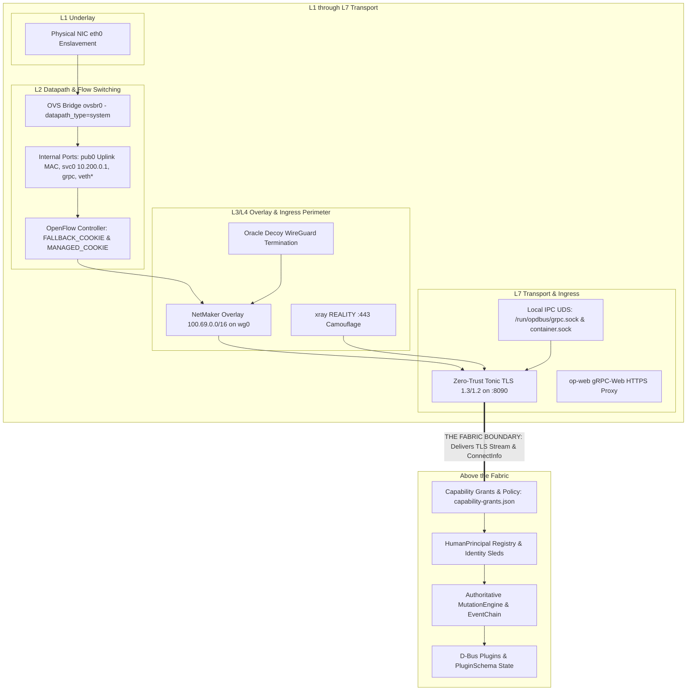

# Architectural Boundaries: Network Fabric vs. Application Policy & Grants

**Document Location**: [`/srv/git/odbus/docs/architecture/zen-review-net-fabric/00-fabric-vs-application-boundaries.md`](file:///srv/git/odbus/docs/architecture/zen-review-net-fabric/00-fabric-vs-application-boundaries.md)  
**Boundary Definition**: Strict separation between the **Network Fabric** (Underlay, Switching, Overlay, Flow Routing, Transport Encryption) and the **Application Policy Domain** (Identity Assertions, Capabilities, Grants, State Engine).

---

## 1. Clear Separation of Planes

---

## 2. Boundary Taxonomy

### What IS the Network Fabric
The Network Fabric is responsible for **moving packets, switching frames, isolating paths, and securing transport streams**:
1. **L1 Physical Underlay**: Physical NIC enslavement and hardware MAC cloning.
2. **L2 Switching & Datapath**: OVS bridge `ovsbr0` (`system` datapath), internal ports (`pub0`, `svc0`, `grpc`), container `veth` interfaces.
3. **L2/L3/L4 Flow Control**: `op-of-controller` (:6653), cookied flows (`FALLBACK_COOKIE = 0x3344434800000001`, `MANAGED_COOKIE = 0x3344434800000002`), IP:port demux, and fail-safe standalone fallback.
4. **L3 Overlay Mesh**: NetMaker single tunnel on `100.69.0.0/16` (`wg0`), `netmaker-ovs-attach`.
5. **Edge Perimeter & Camouflage**: Oracle Decoy WireGuard termination, Xray REALITY camouflage on `:443`, Cloudflare public web proxying.
6. **L7 Transport Encryption**: Mandatory Tonic TLS 1.3/1.2 on TCP `:8090` (`ServerTlsConfig` + `aws-lc-rs`), local UDS socket separation (`0660`).

---

### What IS NOT Fabric (The Application Policy Domain)
Once the network fabric successfully delivers the encrypted stream and connection metadata (`TlsConnectInfo`, peer IP) to `op-grpc-bridge`, the fabric's job is complete. The application layer takes over:
1. **Capability Authorization**: Evaluating `capability-grants.json` against method `required_capability`.
2. **Identity Assertions**: Parsing `x-oracle-identity-assertion-bin`, verifying Ed25519 signatures, managing the nonce anti-replay cache, and resolving `HumanPrincipal`.
3. **Session Sled Persistence**: Scribe genesis records and memory-mapped `identity_sled.dat`.
4. **Authoritative State Execution**: `MutationEngine` execution, `EventChain` serialization, and D-Bus plugin method dispatch.
5. **Declarative UI Composition**: React `@json-render/react` components and page specs.

---

## 3. Fabric Health Contract

The Network Fabric is considered healthy and operational **if and only if**:
- `ovsbr0` is up with `pub0` presenting the physical uplink MAC.
- `priority=0,actions=NORMAL` (cookie `0x3344434800000001`) is present on `ovsbr0`.
- NetMaker tunnel `wg0` is attached to `ovsbr0` and routing `100.69.0.0/16`.
- `op-of-controller` is active on `10.200.0.1:6653` with in-band mode.
- `op-grpc-bridge` is actively serving Tonic TLS on `:8090` and UDS on `/run/opdbus/grpc.sock`.
- Zero plaintext TCP paths exist on any interface.
