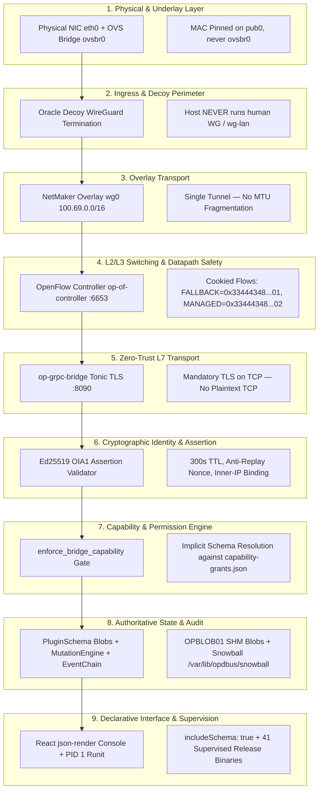

# Master Architecture: The Unified Interlocking System & Threat Surface

**Document Location**: [`/srv/git/odbus/docs/architecture/zen-review-net-fabric/00-master-unified-system-interlock.md`](file:///srv/git/odbus/docs/architecture/zen-review-net-fabric/00-master-unified-system-interlock.md)  
**System Scope**: Full Stack — Underlay NIC, OVS Datapath, NetMaker Mesh, Zero-Trust TLS, Oracle Decoy Assertions, Capability Grants, Schema Blobs, Mutation Engine, Snowball Audit, Runit Supervision, and Declarative UI.

---

## 1. The Unified 9-Layer Causal Chain

In OP-DBUS / 3tched, no component exists in isolation. A failure or drift in any single layer cascades through the entire fabric:

---

## 2. Cross-Layer Failure Cascade: What Happens If Any Link Breaks

| Layer | Invariant Guarantee | If This Single Invariant Fails (Cascading Consequence) |
|---|---|---|
| **1. Underlay / MAC** | Physical NIC MAC cloned to `pub0` only. | Upstream cloud hypervisors drop packets. Host is completely partitioned from the Internet. |
| **2. Decoy Perimeter** | Human WireGuard terminates exclusively on Oracle Decoy. | Host IP is exposed to port scanning and direct network reconnaissance; edge isolation collapses. |
| **3. Overlay Transport** | Single NetMaker tunnel (`100.69.0.0/16`). | Parallel tunnels cause 1420 vs 1500 MTU fragmentation and asymmetric routing loops. |
| **4. OpenFlow Safety** | `priority=0,actions=NORMAL` cookied fallback. | Connecting the OpenFlow controller causes OVS table wipe; host SSH is severed instantly. |
| **5. Zero-Trust TLS** | Mandatory TLS on all TCP listeners (`aws-lc-rs`). | Identity tokens can be sniffed across the mesh; `TlsConnectInfo` source-IP binding fails. |
| **6. Assertion Validator** | Ed25519 `OIA1` assertion validation with 30s leeway. | Attackers replay expired or forged identity tokens to impersonate operator sessions. |
| **7. Capability Gate** | Implicit capability resolution against footprint grants. | Authenticated operators receive `AccessDenied` because clients omit internal `capability_id` strings. |
| **8. Schema & Blobs** | `PluginSchema` sealed into atomic `OPBLOB01` SHM blobs. | gRPC reflection and D-Bus dispatch become desynchronized; generative UI renders stale forms. |
| **9. Supervision / UI** | PID 1 Runit (`sv`) + dynamic schema frames (`includeSchema: true`). | Daemons crash-loop on failure without restart; React UI fails to hydrate dynamic schema migration events. |

---

## 3. The Grand Invariants of the System

1. **Zero Plaintext on Wire**: Unencrypted IPC is restricted strictly to local Unix Domain Sockets (`/run/opdbus/grpc.sock`, `/run/ghostbridge/container.sock`) protected by filesystem DAC (`0660`). All TCP traffic is encrypted with TLS 1.3/1.2.
2. **The Plugin IS the Schema**: Protobuf descriptors, D-Bus interfaces (`/org/opdbus/v1/plugins/*`), and UI forms originate solely from Rust structs deriving `schemars::JsonSchema`.
3. **No Direct Control-Plane Ingress**: Cloudflare serves public web traffic; human WireGuard terminates at the Oracle Decoy; NetMaker acts purely as encrypted transit.
4. **Authoritative Mutation Engine**: No gRPC service or D-Bus method bypasses the `MutationEngine`. Every state mutation appends a linear `StateChange` record to `EventChain` and replicates to `/var/lib/opdbus/snowball`.
5. **Fail-Closed by Design**: If TLS certs are missing, if assertions are malformed, or if capabilities are undeclared, the system rejects the operation cleanly with structured diagnostics rather than degrading insecurely.
