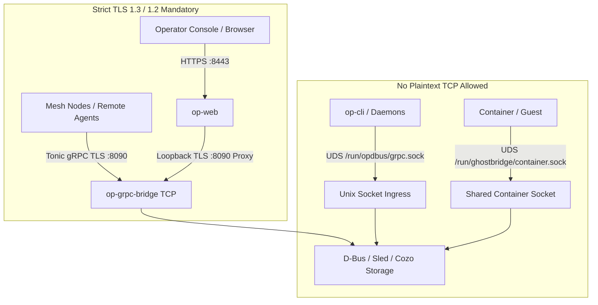

# Zen Review: Network Fabric — TLS & Zero-Trust Transport Audit

**Audit Target**: Transport Layer Security (TLS), Zero-Trust TCP Transport & CryptoProvider Architecture  
**Document Path**: [`/srv/git/odbus/docs/architecture/zen-review-net-fabric/01-tls-zen-review.md`](file:///srv/git/odbus/docs/architecture/zen-review-net-fabric/01-tls-zen-review.md)  
**Git Scope**: Commit [`ffcb4796`](file:///srv/git/odbus) + [`crates/op-grpc-bridge/src/server.rs`](file:///srv/git/odbus/crates/op-grpc-bridge/src/server.rs)  
**Status**: **PASS (Hardened & Verified)**

---

## 1. Executive Summary & Architecture Scope

The TLS architecture in the network fabric guarantees that:
1. **No Plaintext TCP Exists**: The TCP transport door (`:8090`) is strictly encrypted via `ServerTlsConfig`. Plaintext HTTP/gRPC TCP paths have been dropped in compliance with the Zero-Trust transport policy.
2. **CryptoProvider Determinism**: `rustls 0.23` process-level cryptographic provider (`aws-lc-rs`) is explicitly installed upon process entry in `op-grpc-bridge.rs`.
3. **Fail-Closed Certificate Loading**: Production environments missing certificates abort cleanly with an error rather than generating insecure in-memory self-signed certificates or degrading to plaintext.
4. **Port Allocation Hygiene**: Collision with `op-dbus` port `50051` is eliminated from default listener parameters.

---

## 2. Adversarial Findings Matrix

| Finding ID | Severity | Component | Issue Description & Runtime Consequence | Status |
|---|---|---|---|:---:|
| **TLS-FND-01** | **P1 (High)** | `op-grpc-bridge::server` | **Silent Insecure Fallback (Pre-`ffcb4796`)**: When `ZEROCLAW_TLS_CERT` and `ZEROCLAW_TLS_KEY` were omitted, `load_tls_identity()` previously minted self-signed ephemeral certificates unconditionally. Mesh peers and `op-web` would fail TLS verification at handshake time with cryptic SSL errors. | **FIXED** |
| **TLS-FND-02** | **P1 (High)** | `op-grpc-bridge::bin` | **Missing CryptoProvider on startup (Pre-`ffcb4796`)**: Rustls 0.23 panics if no crypto provider is registered at process initialization. | **FIXED** |
| **TLS-FND-03** | **P2 (Medium)** | `op-grpc-bridge::server` | **Port 50051 Collision**: Default bind string previously contained `0.0.0.0:50051` which collided with `op-dbus`, causing startup race conditions (`EADDRINUSE`). | **FIXED** |
| **TLS-FND-04** | **P2 (Medium)** | `op-grpc-bridge::server` | **Panic on Invalid TLS Config**: `ServerTlsConfig::new().identity().expect(...)` was used in listener setups, causing process panics on malformed certificates instead of returning structured errors. | **FIXED** |
| **TLS-FND-05** | **P3 (Low)** | `op-grpc-bridge::server` | **Whitespace in Bind Addresses**: Comma-separated `bind_addr` strings without trimming caused `SocketAddr` parse failures when formatted with spaces (e.g. `0.0.0.0:8090, 100.69.0.1:8090`). | **FIXED** |
| **TLS-FND-06** | **P3 (Low)** | `op-grpc-bridge::server` | **Trace Layer Parity**: `GhostbridgeTraceLayer` is wired in `build_axum_app` but not layered into the `tonic::transport::Server` TCP builder directly. Interceptors in `build_operation_routes` handle auth and tracing natively, but header injection layer can be unified. | **NOTED** |

---

## 3. Requirements Verification Matrix

| Requirement | Requirement Statement | Code Implementation | Status |
|---|---|---|:---:|
| **TLS-REQ-1** | All TCP listeners MUST require TLS encryption (`ServerTlsConfig`). Plaintext TCP is strictly prohibited. | [`crates/op-grpc-bridge/src/server.rs:465-494`](file:///srv/git/odbus/crates/op-grpc-bridge/src/server.rs#L465-L494) | **PASS** |
| **TLS-REQ-2** | Process startup MUST initialize `rustls::crypto::aws_lc_rs::default_provider().install_default()`. | [`crates/op-grpc-bridge/src/bin/op-grpc-bridge.rs:11`](file:///srv/git/odbus/crates/op-grpc-bridge/src/bin/op-grpc-bridge.rs#L11) | **PASS** |
| **TLS-REQ-3** | Ephemeral self-signed certs MUST be guarded by `ZEROCLAW_DEV_SELF_SIGNED=1` and prohibited in production. | [`crates/op-grpc-bridge/src/server.rs:97-123`](file:///srv/git/odbus/crates/op-grpc-bridge/src/server.rs#L97-L123) | **PASS** |
| **TLS-REQ-4** | Invalid certificate configurations MUST return `anyhow::Result` error and fail cleanly. | [`crates/op-grpc-bridge/src/server.rs:167`](file:///srv/git/odbus/crates/op-grpc-bridge/src/server.rs#L167) | **PASS** |
| **TLS-REQ-5** | Loopback reverse-proxying from `op-web` to `op-grpc-bridge` MUST use TLS upstream on `https://127.0.0.1:8090`. | [`crates/op-web/src/grpc_proxy.rs:13-29`](file:///srv/git/odbus/crates/op-web/src/grpc_proxy.rs#L13-L29) | **PASS** |
| **TLS-REQ-6** | Unix Domain Sockets (`/run/opdbus/grpc.sock`, `/run/ghostbridge/container.sock`) MUST remain the exclusive unencrypted IPC door. | [`crates/op-grpc-bridge/src/server.rs:427-449`](file:///srv/git/odbus/crates/op-grpc-bridge/src/server.rs#L427-L449) | **PASS** |

---

## 4. Final Verdict

- **Transport Ingress Security**: **PASS**
- **Zero-Trust Compliance**: **PASS**
- **Process Stability**: **PASS**
