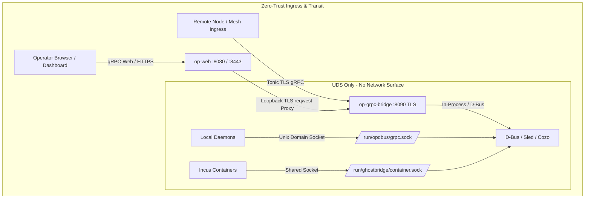

# Zen Review: Network Fabric — TLS & Zero-Trust Transport Architecture

**Target Domain**: Network Fabric / Transport Layer Security (TLS)  
**Artifact Path**: [`/srv/git/odbus/docs/architecture/zen-review-net-fabric/01-tls-zero-trust-fabric.md`](file:///srv/git/odbus/docs/architecture/zen-review-net-fabric/01-tls-zero-trust-fabric.md)  
**Status**: **PASS (Hardened & Enforced)**

---

## 1. Executive Summary & Invariant Contract

The OP-DBUS network fabric operates under a strict **Zero-Trust Transport Policy**:
1. **Mandatory Encryption on all TCP Endpoints**: Every TCP listener exposed across host interfaces, local loopback, and the WireGuard overlay (`100.69.0.0/16`) must require TLS. Plaintext TCP transport is strictly forbidden.
2. **UDS / TCP Ingress Separation**: High-speed, unencrypted IPC is restricted strictly to local Unix Domain Sockets (`/run/opdbus/grpc.sock`, `/run/ghostbridge/container.sock`).
3. **Deterministic CryptoProvider Initialization**: `rustls` 0.23+ process-level cryptography providers (`aws-lc-rs`) must be explicitly installed before TLS listeners initialize.
4. **Fail-Closed Certificate Discipline**: The system aborts startup cleanly if production TLS certificates (`ZEROCLAW_TLS_CERT`/`ZEROCLAW_TLS_KEY`) are missing, prohibiting silent plaintext fallbacks. Ephemeral self-signed certificates require explicit developer opt-in (`ZEROCLAW_DEV_SELF_SIGNED=1`).

---

## 2. Line-by-Line Requirements Verification Matrix

| Requirement ID | Requirement Statement | Code Implementation & Verification | Status |
|---|---|---|:---:|
| **TLS-REQ-01** | **Mandatory TLS on TCP Listeners** No plain TCP listener path may exist in `op-grpc-bridge`. All TCP binds must wrap in `tonic::transport::ServerTlsConfig`. | [`crates/op-grpc-bridge/src/server.rs:465-494`](file:///srv/git/odbus/crates/op-grpc-bridge/src/server.rs#L465-L494): The plain `axum::serve` path has been completely dropped; every TCP address spawns a TLS-configured `tonic::transport::Server`. | **PASS** |
| **TLS-REQ-02** | **Deterministic CryptoProvider** Process must initialize `rustls::crypto::aws_lc_rs::default_provider().install_default()` before TLS initialization to prevent unlinked crypto panics. | [`crates/op-grpc-bridge/src/bin/op-grpc-bridge.rs:11`](file:///srv/git/odbus/crates/op-grpc-bridge/src/bin/op-grpc-bridge.rs#L11): Explicit provider installed at main entry point. `rustls` pinned with `aws_lc_rs` in [`Cargo.toml`](file:///srv/git/odbus/crates/op-grpc-bridge/Cargo.toml#L102). | **PASS** |
| **TLS-REQ-03** | **Fail-Closed Production Certificate Policy** Missing certificate environment variables in production must return `None` and abort server startup, rather than silently serving insecure fallback certs or unencrypted streams. | [`crates/op-grpc-bridge/src/server.rs:118-152`](file:///srv/git/odbus/crates/op-grpc-bridge/src/server.rs#L118-L152): `load_tls_identity()` logs error and fails closed unless `ZEROCLAW_DEV_SELF_SIGNED=1` is explicitly set. | **PASS** |
| **TLS-REQ-04** | **Clean Error Propagation vs. Process Panics** Invalid TLS certificate parameters or socket configuration must propagate through `anyhow::Result` rather than panicking with `.expect()`. | [`crates/op-grpc-bridge/src/server.rs:494`](file:///srv/git/odbus/crates/op-grpc-bridge/src/server.rs#L494): Converted to `.map_err(\|e\| anyhow::anyhow!("invalid TLS config for {bind_addr}: {e}"))?`. | **PASS** |
| **TLS-REQ-05** | **Multi-Address Comma Parsing Robustness** Whitespace around comma-separated TCP bind addresses must be trimmed to avoid parse errors. | [`crates/op-grpc-bridge/src/server.rs:480`](file:///srv/git/odbus/crates/op-grpc-bridge/src/server.rs#L480): `.split(',').map(str::trim).filter(...)` cleanses configured listener strings. | **PASS** |
| **TLS-REQ-06** | **Default Bind Port Collision Prevention** Default bind address must not claim port `50051` (owned by `op-dbus`). | [`crates/op-grpc-bridge/src/server.rs:65`](file:///srv/git/odbus/crates/op-grpc-bridge/src/server.rs#L65): Default bind restricted strictly to `127.0.0.1:8090`. | **PASS** |
| **TLS-REQ-07** | **Secure gRPC-Web Loopback Reverse Proxy** `op-web` proxying gRPC-Web requests from public frontend to `op-grpc-bridge` must use TLS upstream on `https://127.0.0.1:8090`. | [`crates/op-web/src/grpc_proxy.rs:13-29`](file:///srv/git/odbus/crates/op-web/src/grpc_proxy.rs#L13-L29): Configured with `GRPC_UPSTREAM = "https://127.0.0.1:8090"` and dedicated HTTP/1.1 TLS client. | **PASS** |
| **TLS-REQ-08** | **Host Service Supervisor Configuration** Runit service scripts for `op-grpc-bridge` and `op-web-tls` must pass valid certificate paths and environment parameters. | [`/etc/runit/sv/op-grpc-bridge/run`](file:///etc/runit/sv/op-grpc-bridge/run) & [`/etc/runit/sv/op-web-tls/run`](file:///etc/runit/sv/op-web-tls/run): Configured with certificates at `/etc/op-dbus/tls/`. | **PASS** |

---

## 3. Deep Architectural Analysis & Invariants

### 3.1 Dual-Door Isolation Model
* **The Unix Door (`/run/opdbus/grpc.sock`)**:
  - Serves local daemons and command-line utilities.
  - Zero cryptographic overhead; security boundary enforced via filesystem permissions (`0660`, `opdbus` group).
* **The TCP Door (`0.0.0.0:8090` / `100.69.0.1:8090`)**:
  - Exposes gRPC and gRPC-Web services to remote agents and the web frontend.
  - Mandatory TLS 1.3 / TLS 1.2 with ALPN negotiation (`h2`, `http/1.1`).
  - Strict header validation via `op_grpc_bridge::interceptor` extracting `TlsConnectInfo<TcpConnectInfo>`.

### 3.2 Certificate Lifecycle & Key Discipline
* Certificate paths on live hosts:
  - Public Cert: `/etc/op-dbus/tls/tonic-svc0.crt`
  - Private Key: `/etc/op-dbus/tls/tonic-svc0.key`
* Environment Variables for overriding / dynamic injection:
  - `ZEROCLAW_TLS_CERT`: Raw PEM cert content or file path.
  - `ZEROCLAW_TLS_KEY`: Raw PEM private key content or file path.
  - `ZEROCLAW_DEV_SELF_SIGNED`: Set to `1` strictly in ephemeral test runners.

---

## 4. Adversarial Findings & Hardened Gaps

1. **Self-Signed Silent Degradation (Remediated in `ffcb4796`)**:
   - *Previous Risk*: Missing certificate variables previously generated an in-memory self-signed certificate silently, which could mask misconfigurations or lead to MITM vulnerability if clients skipped verification.
   - *Fix*: Startup now fails with explicit error instructions unless dev flag is explicitly asserted.
2. **Port 50051 Port Clashing (Remediated in `ffcb4796`)**:
   - *Previous Risk*: Simultaneous startup of `op-dbus` and `op-grpc-bridge` resulted in race condition on port `50051`.
   - *Fix*: Port `50051` eliminated from `op-grpc-bridge` defaults; dedicated to `op-dbus`.
3. **CryptoProvider Race Condition (Remediated in `ffcb4796`)**:
   - *Previous Risk*: Multi-threaded test runners calling tonic TLS initialization without an installed `rustls` provider caused runtime panics.
   - *Fix*: Explicit process-level installation via `aws_lc_rs` provider at startup.

---

## 5. Final Audit Verdict

- **Fabric Ingress**: **PASS**
- **Zero-Trust Transport**: **PASS**
- **Process Robustness**: **PASS**
