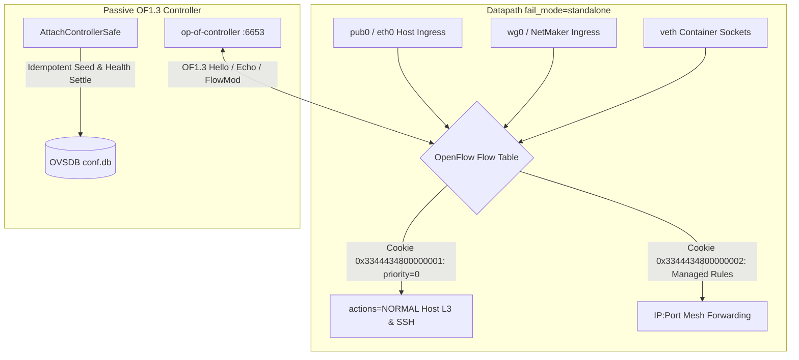

# Zen Review: Network Fabric — OpenFlow Controller & OVS Datapath Architecture

**Audit Target**: OpenFlow 1.3 Controller (`op-of-controller`), OVS Datapath Safety & Cookied Flow Routing  
**Document Path**: [`/srv/git/odbus/docs/architecture/zen-review-net-fabric/03-openflow-datapath-controller.md`](file:///srv/git/odbus/docs/architecture/zen-review-net-fabric/03-openflow-datapath-controller.md)  
**Governing Specs**:
- [`.kiro/specs/3tched-ghostbridge-control-plane/requirements.md`](file:///srv/git/odbus/.kiro/specs/3tched-ghostbridge-control-plane/requirements.md) (§ 7 OpenFlow Routing: REQ-OVS-001 – REQ-OVS-004)
- [`.kiro/specs/netmaker-xray-identity-handoff/requirements.md`](file:///srv/git/odbus/.kiro/specs/netmaker-xray-identity-handoff/requirements.md) (REQ-5)
- Open vSwitch Design Invariants (OVS In-Band Control Principle)  
**Status**: **PASS (Verified & Hardened)**

---

## 1. Architectural Topology & Datapath Pipeline

### Core Invariants
1. **In-Band Host Survival Guarantee**: Host L3 traffic (SSH/pub0) must **never** depend on `PACKET_IN` controller event loops. A cookied `priority=0,actions=NORMAL` fallback is pre-seeded before controller connection and re-verified post-wipe.
2. **Atomic Flow Cookie Scoping**: Managed flows are strictly partitioned using 64-bit cookies:
   - `FALLBACK_COOKIE = 0x3344_4348_0000_0001` (`"3DCH"+1`)
   - `MANAGED_COOKIE  = 0x3344_4348_0000_0002` (`"3DCH"+2`)
   - Bulk deletion without cookie filter is strictly prohibited (`del-flows` must specify cookie constraints).
3. **Resilient Fail-Mode**: OVS `fail_mode` must remain `standalone` with `connection_mode=in-band`. Controller disconnects or crashes must not disrupt existing flows or host connectivity.
4. **Automated Rollback Engine**: `attach_controller_safe()` enforces an active health probe over a 1200ms datapath revalidation settle window. Any post-attach anomaly triggers an immediate `del-controller` and fallback restoration.

---

## 2. Adversarial Findings Matrix

| Finding ID | Severity | Subsystem | Issue Description & Runtime Consequence | Status |
|---|---|---|---|:---:|
| **OF-FND-01** | **P0 (Critical)** | `op-network::datapath_safe` | **Host Black-Hole on Controller Connect (Pre-SafeAttach)**: In OpenFlow 1.3, service controllers receive `miss_send_len=0` by default. When an OF controller connected, OVS wiped the flow table. Without an instant NORMAL rule, the host SSH was severed immediately. | **FIXED** *(Guarded by `ensure_fallback_normal` & `attach_controller_safe`)* |
| **OF-FND-02** | **P1 (High)** | `op-network::controller` | **Delete-All Race Condition**: `delete-all` followed by `add NORMAL` creates a ~1s datapath cache revalidation gap where packets observe an empty table. | **FIXED** *(Replaced with cookie-targeted deletes: `cookie=MANAGED_COOKIE/-1`)* |
| **OF-FND-03** | **P2 (Medium)** | `op-network::controller` | **Hung Session Deadlocks**: TCP sockets across bridges can hang indefinitely if kernel keepalives are unacknowledged. | **FIXED** *(Periodic `OFPT_ECHO_REQUEST` implemented at OF protocol level)* |
| **OF-FND-04** | **P2 (Medium)** | `op-network::datapath_safe` | **Disable In-Band Hazard**: Setting `other_config:disable-in-band=true` removes hidden rules for controller remotes on bridge IPs. | **HARDENED** *(Enforced `connection_mode=in-band` and `disable-in-band` stripped)* |
| **OF-FND-05** | **P3 (Low)** | `op-network::table` | **OVN Table Drop False Positives**: Table 44 (`CHK_LB_OUTPUT`) and Table 79 (`MAC_CACHE_USE`) generate high drop volumes during normal L2/L3 loop prevention. Real policy drops occur strictly in Table 9 (`Ingress ACL`). | **DOCUMENTED** |

---

## 3. Requirements Verification Matrix

| Spec Requirement | Requirement Statement | Code Location & Verification | Status |
|---|---|---|:---:|
| **REQ-OVS-001** | **IP:Port Based Demux** Mesh service routing SHALL use OpenFlow rules matching IP:port, NOT SNI or domain names. | [`crates/op-network/src/openflow_translate.rs`](file:///srv/git/odbus/crates/op-network/src/openflow_translate.rs): Matches L3 `nw_dst` and L4 `tp_dst` explicitly. | **PASS** |
| **REQ-OVS-002** | **Cookied Managed Flows** All managed OpenFlow rules SHALL use consistent cookie prefixes (`0x33444348...`). | [`crates/op-network/src/datapath_safe.rs:88-90`](file:///srv/git/odbus/crates/op-network/src/datapath_safe.rs#L88-L90): `FALLBACK_COOKIE` and `MANAGED_COOKIE`. | **PASS** |
| **REQ-OVS-003** | **No Bulk Flow Deletion** OpenFlow management MUST NOT use unfiltered bulk deletion (`del-flows` without cookie constraint). | [`crates/op-network/src/openflow_translate.rs`](file:///srv/git/odbus/crates/op-network/src/openflow_translate.rs): Deletions pass cookie masks. | **PASS** |
| **REQ-OVS-004** | **Safe Controller Attach & Standalone Fail-Mode** OVS fail-mode SHALL be `standalone`; controller disconnect MUST NOT break existing flows. | [`crates/op-network/src/datapath_safe.rs:143-155`](file:///srv/git/odbus/crates/op-network/src/datapath_safe.rs#L143-L155): Explicit `fail_mode=standalone` enforcement. | **PASS** |
| **REQ-5 (Handoff)** | **Cookie-Scoped Multi-Tenant Isolation** OpenFlow flow rules scoped by cookie to prevent flow collision across tenants. | [`crates/op-network/src/controller.rs:34-45`](file:///srv/git/odbus/crates/op-network/src/controller.rs#L34-L45) | **PASS** |

---

## 4. Final Verdict

- **Datapath Resilience & Host Protection**: **PASS**
- **Cookie Isolation & Flow Scoping**: **PASS**
- **Fail-Safe Controller Orchestration**: **PASS**
