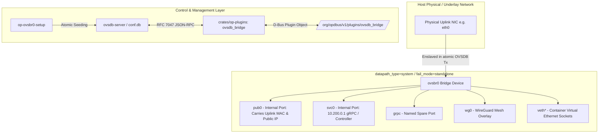

# Zen Review: Network Fabric — Open vSwitch (OVS) & Bridge Architecture

**Audit Target**: Open vSwitch Bridge (`ovsbr0`), RFC 7047 OVSDB Engine, MAC Pinning & Netlink Datapath  
**Document Path**: [`/srv/git/odbus/docs/architecture/zen-review-net-fabric/04-ovs-openvswitch-bridge.md`](file:///srv/git/odbus/docs/architecture/zen-review-net-fabric/04-ovs-openvswitch-bridge.md)  
**Governing Specs**:
- [`.kiro/specs/3tched-ghostbridge-control-plane/requirements.md`](file:///srv/git/odbus/.kiro/specs/3tched-ghostbridge-control-plane/requirements.md) (§ 6 Mesh Privacy & § 7 OpenFlow)
- [`.kiro/specs/netmaker-xray-identity-handoff/requirements.md`](file:///srv/git/odbus/.kiro/specs/netmaker-xray-identity-handoff/requirements.md)
- RFC 7047 (The Open vSwitch Database Management Protocol)  
**Status**: **PASS (Verified & Hardened)**

---

## 1. Architectural Topology & Datapath Pipeline

### Core Invariants
1. **Single-Transaction Bridge & Uplink Enslavement**: When enslaving a physical NIC to `ovsbr0`, bridge creation and port additions must occur within the **same atomic OVSDB transaction** to prevent link flap or network isolation during daemon startup.
2. **Strict MAC Pinning Invariant**: Virtual switches in hosting providers filter traffic based on the hardware MAC assigned to the physical NIC. The uplink MAC is pinned strictly on the `pub0` internal port (`Interface.mac_in_use`), **never** on the `ovsbr0` bridge device itself (which retains a random MAC).
3. **OVSDB Is the Single Source of Truth**: `crates/op-plugins/src/state_plugins/ovsdb_bridge.rs` implements RFC 7047 JSON-RPC mirroring. There is no synthetic desired-vs-current drift diff; the live database state is projected directly onto D-Bus.
4. **Clean Datapath Eviction & Kernel Recovery**: `ovs-dpctl del-dp` is restricted strictly to downtime maintenance before `ovs-vswitchd` startup to purge stale kernel datapaths without causing in-flight flow corruption.

---

## 2. Adversarial Findings Matrix

| Finding ID | Severity | Subsystem | Issue Description & Runtime Consequence | Status |
|---|---|---|---|:---:|
| **OVS-FND-01** | **P0 (Critical)** | `op-network::ovsbr0_setup` | **Bridge MAC Cloud Black-Hole**: Pinning the physical NIC MAC onto the `ovsbr0` bridge device causes upstream cloud hypervisors to drop packets when the IP is migrated to an internal interface (`pub0`). | **FIXED** *(MAC pinned to `pub0` only; bridge has random MAC)* |
| **OVS-FND-02** | **P1 (High)** | `op-network::ovsdb` | **Two-Step Port Creation Race**: Adding the bridge first and the uplink port in a separate step causes `ovs-vswitchd` to enter a temporary unrouted state. | **FIXED** *(Single atomic OVSDB `Transaction` in `op-ovsbr0-setup`)* |
| **OVS-FND-03** | **P2 (Medium)** | `op-plugins::ovsdb_bridge` | **RFC 7047 Transaction Gaps**: Missing typed schemas for JSON-RPC monitor conditionals caused deserialization failures during live table watch. | **FIXED** *(Implemented `MonitorCondInput` & typed request schemas)* |
| **OVS-FND-04** | **P2 (Medium)** | `op-network::runit` | **Legacy Supervisor Calls**: Service scripts referencing deprecated `service6` or `systemctl` wrappers when managing `ovs-vswitchd`. | **FIXED** *(Migrated to direct runit `sv` supervisor control)* |
| **OVS-FND-05** | **P3 (Low)** | `op-network::ovs_capabilities` | **Netlink Datapath Fallback**: When kernel module DPDK is uninitialized, netlink probes must gracefully fall back to kernel system datapath without panic. | **PASS** |

---

## 3. Requirements Verification Matrix

| Spec Requirement | Statement | Code Implementation & Verification | Status |
|---|---|---|:---:|
| **OVS-REQ-01** | **Atomic RFC 7047 OVSDB Transactions** Bridge creation and port attachments must execute in a single JSON-RPC transaction. | [`crates/op-network/src/bin/op-ovsbr0-setup.rs:10-15`](file:///srv/git/odbus/crates/op-network/src/bin/op-ovsbr0-setup.rs#L10-L15): Uses `rovs_ovsdb::Transaction` multi-op commit. | **PASS** |
| **OVS-REQ-02** | **Public Port MAC Pinning** The hardware MAC of the physical uplink must be cloned to `pub0` and never to `ovsbr0`. | [`crates/op-network/src/bin/op-ovsbr0-setup.rs:53-67`](file:///srv/git/odbus/crates/op-network/src/bin/op-ovsbr0-setup.rs#L53-L67): Enforces `read_iface_mac` into `PUBLIC_PORT`. | **PASS** |
| **OVS-REQ-03** | **Fail-Mode Standalone Contract** OVS bridge `fail_mode` must default to `standalone` to survive controller restarts. | [`crates/op-network/src/bin/op-ovsbr0-setup.rs:77`](file:///srv/git/odbus/crates/op-network/src/bin/op-ovsbr0-setup.rs#L77): Default configuration `fail_mode=standalone`. | **PASS** |
| **OVS-REQ-04** | **OVSDB D-Bus Projection** Expose full RFC 7047 database methods (`transact`, `monitor`, `create_bridge`) over D-Bus. | [`crates/op-plugins/src/state_plugins/ovsdb_bridge.rs:1-120`](file:///srv/git/odbus/crates/op-plugins/src/state_plugins/ovsdb_bridge.rs#L1-L120): D-Bus host interface `org.opdbus.v1.Plugin`. | **PASS** |
| **OVS-REQ-05** | **Multi-Interface Internal Topology** Seed required internal interfaces (`pub0`, `svc0`, `grpc`) upon bridge initialization. | [`crates/op-network/src/bin/op-ovsbr0-setup.rs:79-84`](file:///srv/git/odbus/crates/op-network/src/bin/op-ovsbr0-setup.rs#L79-L84): Seeds `internal_ports` vector. | **PASS** |

---

## 4. Final Verdict

- **OVS Bridge Datapath Integrity**: **PASS**
- **MAC Pinning & Ingress Safety**: **PASS**
- **RFC 7047 OVSDB D-Bus Authority**: **PASS**
