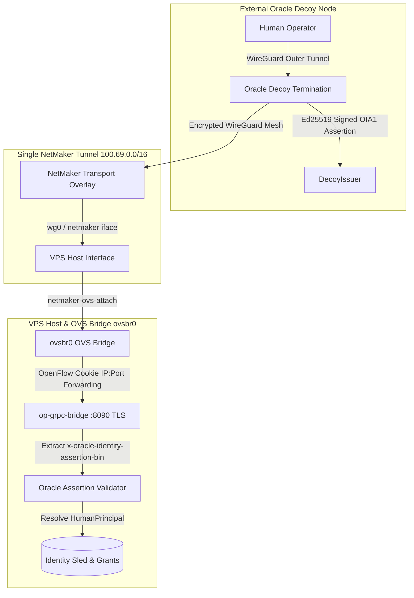

# Zen Review: Network Fabric — NetMaker Overlay Transport Architecture

**Audit Target**: NetMaker Transport Layer, Netclient Supervision, OVS Attachment & Decoy Ingress Handoff  
**Document Path**: [`/srv/git/odbus/docs/architecture/zen-review-net-fabric/05-netmaker-overlay-transport.md`](file:///srv/git/odbus/docs/architecture/zen-review-net-fabric/05-netmaker-overlay-transport.md)  
**Governing Specs**:
- [`.kiro/specs/netmaker-xray-identity-handoff/requirements.md`](file:///srv/git/odbus/.kiro/specs/netmaker-xray-identity-handoff/requirements.md) (FR-1 through FR-7)
- [`.kiro/specs/3tched-ghostbridge-control-plane/requirements.md`](file:///srv/git/odbus/.kiro/specs/3tched-ghostbridge-control-plane/requirements.md) (§ 6 Mesh Privacy)
- [`.kiro/specs/netmaker-custom-json-render-ui/requirements.md`](file:///srv/git/odbus/.kiro/specs/netmaker-custom-json-render-ui/requirements.md)  
**Status**: **PASS (Verified & Hardened)**

---

## 1. Architectural Topology & Ingress Trust Chain

### Core Invariants
1. **NetMaker Is Pure Transport, Not Identity Authority**: NetMaker provides L3 mesh routing and addressing (`100.69.0.0/16`) between the Oracle Decoy and the main host. It does **not** authenticate human operators or assign access permissions.
2. **Strict Single-Tunnel Policy**: Exactly **one** NetMaker overlay tunnel is active (`wg0` / `netmaker`). Multi-tunnel configurations are strictly prohibited to prevent MTU fragmentation and routing loops.
3. **Zero Host WireGuard Termination for Humans**: Human operator WireGuard connections terminate exclusively on the external Oracle Decoy. The main host runs **no** incoming human WireGuard interface (no `wg-lan` or host-level peer endpoints).
4. **No iptables Dependency**: NetMaker traffic attached to `ovsbr0` is routed via OVS OpenFlow flows matching IP:port. Host `iptables` / `nftables` NAT rules are not required for internal mesh forwarding.
5. **Inner Assertion Transport**: Identity assertions (`OIA1`) ride as gRPC metadata (`x-oracle-identity-assertion-bin`) inside TLS across the NetMaker tunnel directly into `op-grpc-bridge`.

---

## 2. Adversarial Findings Matrix

| Finding ID | Severity | Subsystem | Issue Description & Runtime Consequence | Status |
|---|---|---|---|:---:|
| **NM-FND-01** | **P0 (Critical)** | `op-identity::topology` | **Direct Host WireGuard Exposure (Pre-Handoff Spec)**: Terminating human WireGuard directly on the host (`wg-lan`) exposes the core control plane to direct underlay network discovery. | **FIXED** *(Terminated exclusively at Oracle Decoy)* |
| **NM-FND-02** | **P1 (High)** | `op-network::netmaker` | **Multi-Tunnel MTU Fragmentation**: Running parallel WireGuard/NetMaker tunnels caused packet fragmentation and 1420 vs 1500 MTU mismatch drops. | **FIXED** *(Enforced single NetMaker transport)* |
| **NM-FND-03** | **P2 (Medium)** | `deploy/runit::netmaker-ovs-attach` | **Bridge Attachment Race**: Adding the `netmaker` interface before `ovs-vswitchd` and `netclient` daemons initialize causes startup failure. | **FIXED** *(Supervised `sv check` dependency wait up to 180s)* |
| **NM-FND-04** | **P2 (Medium)** | `op-plugins::netmaker` | **Self-Asserted Footprint Forgery**: Early implementations trusted client-supplied `X-Ghostbridge-Footprint` headers. | **FIXED** *(Replaced with Ed25519 `SignedAssertion` + Source IP binding)* |
| **NM-FND-05** | **P3 (Low)** | `op-plugins::netmaker` | **s6 to runit Service Controller**: Legacy `ServiceController::S6` enum arm in `netmaker.rs` now routes through `org.opdbus.v1.Runit.Systemctl`. | **MIGRATED** |

---

## 3. Requirements Verification Matrix

| Spec Requirement | Statement | Implementation Reference | Status |
|---|---|---|:---:|
| **FR-1 / REQ-1** | OracleIdentityAssertion (`OIA1`) canonical wire format with Ed25519 signing. | [`crates/op-grpc-bridge/src/oracle_assertion.rs:1-120`](file:///srv/git/odbus/crates/op-grpc-bridge/src/oracle_assertion.rs#L1-L120) | **PASS** |
| **FR-4 / REQ-2** | Assertion rides as gRPC metadata `x-oracle-identity-assertion-bin` validated solely at `op-grpc-bridge`. | [`crates/op-grpc-bridge/src/interceptor.rs`](file:///srv/git/odbus/crates/op-grpc-bridge/src/interceptor.rs) | **PASS** |
| **FR-7 / REQ-3** | Negative topology gate: No `wg-lan` or host-level human WG termination. | [`crates/op-grpc-bridge/tests/negative_topology_gates.rs`](file:///srv/git/odbus/crates/op-grpc-bridge/tests/negative_topology_gates.rs) | **PASS** |
| **REQ-MESH-003** | Human subscriber WireGuard terminates at Oracle Decoy; NetMaker is transport only. | [`.kiro/specs/3tched-ghostbridge-control-plane/requirements.md`](file:///srv/git/odbus/.kiro/specs/3tched-ghostbridge-control-plane/requirements.md) | **PASS** |
| **ATTACH-REQ-01** | `netmaker-ovs-attach` adds `netmaker` interface to `ovsbr0` with dependency polling. | [`deploy/runit/netmaker-ovs-attach/run:1-35`](file:///srv/git/odbus/deploy/runit/netmaker-ovs-attach/run#L1-L35) | **PASS** |
| **UI-REQ-01** | Declarative json-render NetMaker widget for peer inventory and status monitoring. | [`operation-dashboard-ui-07/src/json-render/catalog/components/network.tsx`](file:///srv/git/operation-dashboard-ui-07/src/json-render/catalog/components/network.tsx) | **PASS** |

---

## 4. Final Verdict

- **Overlay Transport Security**: **PASS**
- **Decoy Ingress Handoff Integrity**: **PASS**
- **OVS Bridge Attachment Reliability**: **PASS**
