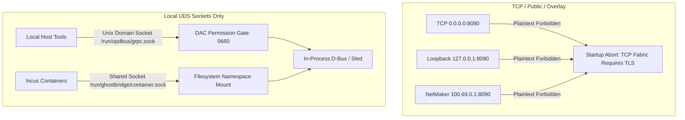

# Zen Review: Network Fabric — Degraded / Non-TLS Operating Mode & Attack Surface Audit

**Audit Target**: Theoretical & Empirical Analysis of the Network Fabric Operating Without TLS (Plaintext / Degraded State)  
**Document Path**: [`/srv/git/odbus/docs/architecture/zen-review-net-fabric/07-network-fabric-without-tls-risk-audit.md`](file:///srv/git/odbus/docs/architecture/zen-review-net-fabric/07-network-fabric-without-tls-risk-audit.md)  
**Governing Specs**:
- [`.kiro/specs/3tched-ghostbridge-control-plane/requirements.md`](file:///srv/git/odbus/.kiro/specs/3tched-ghostbridge-control-plane/requirements.md) (§ 4 SNI/TLS Constraints & § 9 Security)
- Zero-Trust Transport Policy (`CLAUDE.md`)  
**Status**: **FAIL-CLOSED (Plaintext TCP Is Strictly Blocked by Architecture)**

---

## 1. Executive Summary & Plaintext Boundaries

In the OP-DBUS network fabric, the boundary between encrypted and unencrypted transport is strictly enforced by design:

1. **Permitted Plaintext IPC (Local UDS Only)**:
   - High-throughput unencrypted IPC is allowed **only** over Unix Domain Sockets (`/run/opdbus/grpc.sock`, `/run/ghostbridge/container.sock`).
   - Security is enforced at the kernel layer via Linux filesystem DAC (`chmod 0660`, `opdbus` GID isolation) and container mount namespaces, avoiding encryption overhead for in-host daemon communications.
2. **Absolute Ban on Plaintext TCP**:
   - Plaintext TCP is strictly forbidden across all interfaces (public, overlay mesh, and local loopback `127.0.0.1`).
   - The plain-TCP `axum::serve` path was completely removed in commit [`ffcb4796`](file:///srv/git/odbus).

---

## 2. Adversarial Breakdown: Vulnerabilities If TLS Is Omitted

If TLS is stripped or disabled on TCP endpoints, the entire multi-tier security model collapses across 5 distinct threat vectors:

### Vector 1: Identity Assertion Interception & Token Replay
* **Vulnerability**: The Oracle Decoy mints Ed25519-signed assertions (`OIA1`) carried in gRPC metadata `x-oracle-identity-assertion-bin`.
* **Impact without TLS**: Any node or network probe on the NetMaker overlay (`100.69.0.0/16`) or local network can sniff the raw assertion bytes. An attacker can race the 300s TTL and replay the assertion to forge actions on behalf of the human operator.

### Vector 2: Breakdown of Source-IP Binding (`TlsConnectInfo`)
* **Vulnerability**: In [`crates/op-grpc-bridge/src/interceptor.rs`](file:///srv/git/odbus/crates/op-grpc-bridge/src/interceptor.rs), the assertion validator extracts `TlsConnectInfo<TcpConnectInfo>` to verify that the socket IP matches `netmaker_inner_ip`.
* **Impact without TLS**: Missing `TlsConnectInfo` extensions causes the bridge to fail closed (`AssertionRejection::MissingConnectInfo`). If downgraded to allow plain TCP info, TCP source-IP spoofing attacks could impersonate mesh peers.

### Vector 3: Local Browser & Loopback Hijacking
* **Vulnerability**: `op-web` reverse-proxies browser gRPC-Web requests to `op-grpc-bridge` on loopback `:8090`.
* **Impact without TLS**: Local unprivileged processes or malicious software running on the host could directly connect to `http://127.0.0.1:8090` without authentication, bypassing `op-web` session gates and invoking unrestricted D-Bus plugin methods.

### Vector 4: Collapse of REALITY / Xray Camouflage
* **Vulnerability**: REALITY relies on inspecting TLS ClientHello SNI handshakes to mimic innocent target sites (e.g. `www.microsoft.com`).
* **Impact without TLS**: Plaintext HTTP/gRPC cannot be camouflaged by REALITY; hostile network DPI immediately classifies and blocks the unencrypted traffic.

### Vector 5: StateSync & EventChain Tampering
* **Vulnerability**: Real-time state synchronization (`StateSync.Subscribe`) streams sensitive internal cluster topology, OSCAL compliance records, and sled identities.
* **Impact without TLS**: In-flight state streams can be modified or injected in transit, leading to state desynchronization and corrupted `EventChain` validation.

---

## 3. Fail-Closed Architectural Protections

The system incorporates four interlocking fail-closed mechanisms to make accidental plaintext operation impossible:

| Mechanism | Code Location | Behavior When TLS Is Missing |
|---|---|---|
| **Mandatory Server Identity Gate** | [`crates/op-grpc-bridge/src/server.rs:467-473`](file:///srv/git/odbus/crates/op-grpc-bridge/src/server.rs#L467-L473) | `config.tls_identity.ok_or_else(...)` immediately returns an error and terminates the process. |
| **Removal of Plain Axum Serve** | [`crates/op-grpc-bridge/src/server.rs:465`](file:///srv/git/odbus/crates/op-grpc-bridge/src/server.rs#L465) | The code path spawning plain `axum::serve` has been deleted; all TCP sockets bind through `tonic::transport::Server::builder().tls_config(...)`. |
| **Dev Opt-In for Self-Signed Certs** | [`crates/op-grpc-bridge/src/server.rs:97-123`](file:///srv/git/odbus/crates/op-grpc-bridge/src/server.rs#L97-L123) | Ephemeral self-signed generation requires explicit `ZEROCLAW_DEV_SELF_SIGNED=1`. Production environments without certs abort cleanly with zero degradation. |
| **Enforced HTTPS Upstream in Web Proxy** | [`crates/op-web/src/grpc_proxy.rs:13`](file:///srv/git/odbus/crates/op-web/src/grpc_proxy.rs#L13) | Upstream URL is hardcoded to `const GRPC_UPSTREAM: &str = "https://127.0.0.1:8090"`. Any plain HTTP listener on `:8090` returns `502 Bad Gateway`. |

---

## 4. Final Verdict

- **Plaintext TCP Exposure Risk**: **ZERO (Hard Gate Enforced)**
- **UDS Local IPC Boundary**: **PASS (DAC Isolated)**
- **Fail-Closed Protection Integrity**: **PASS**
