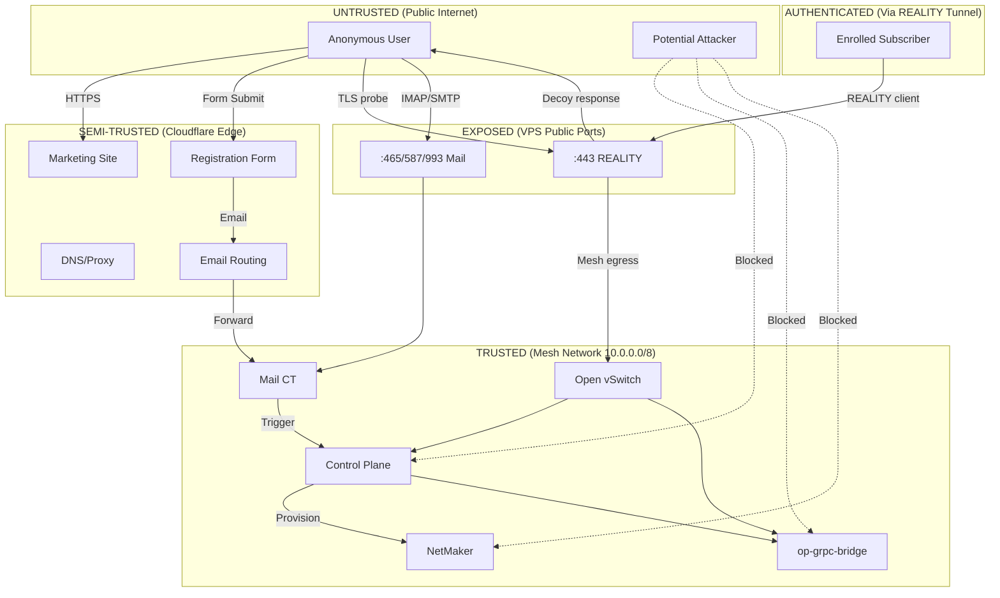
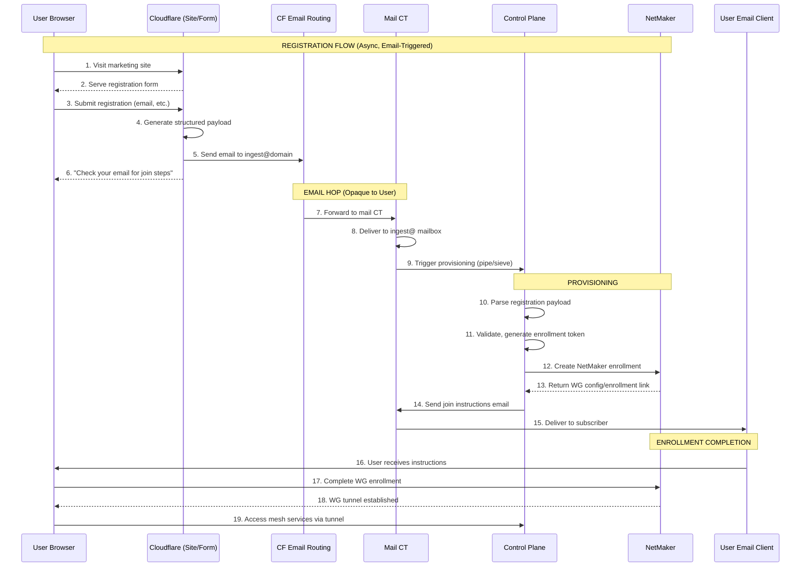
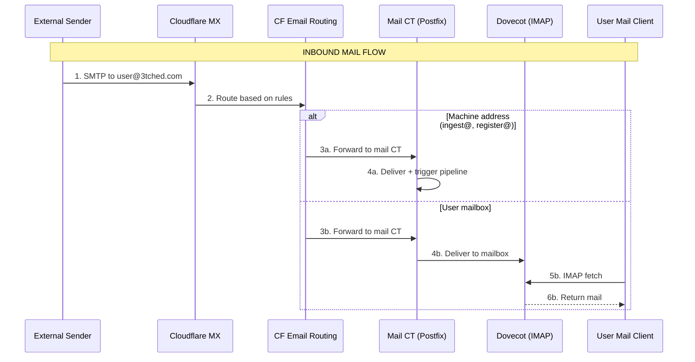
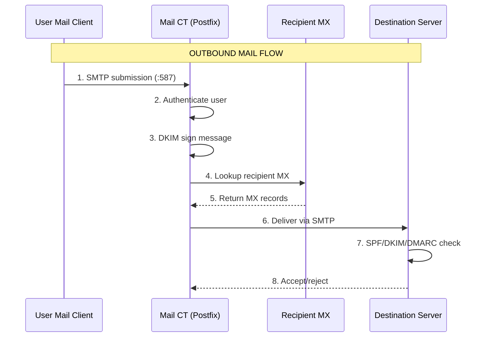
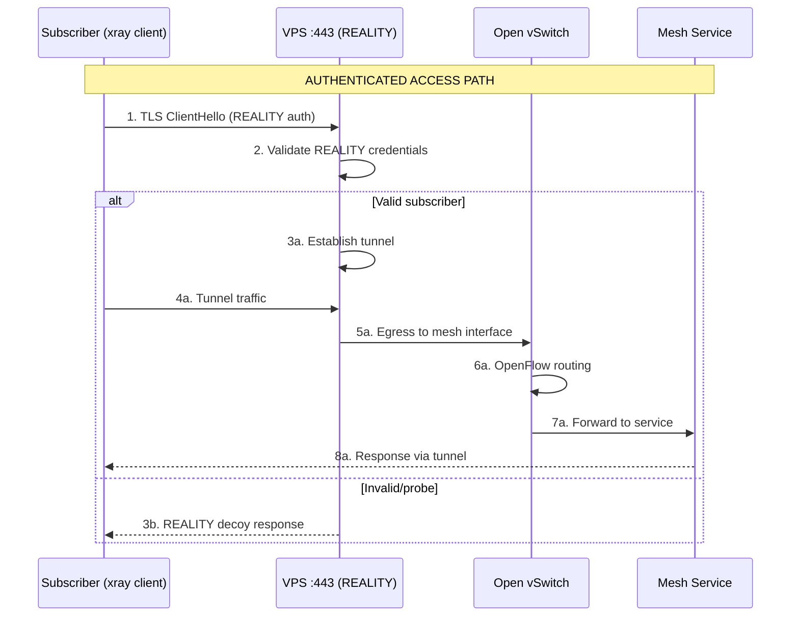
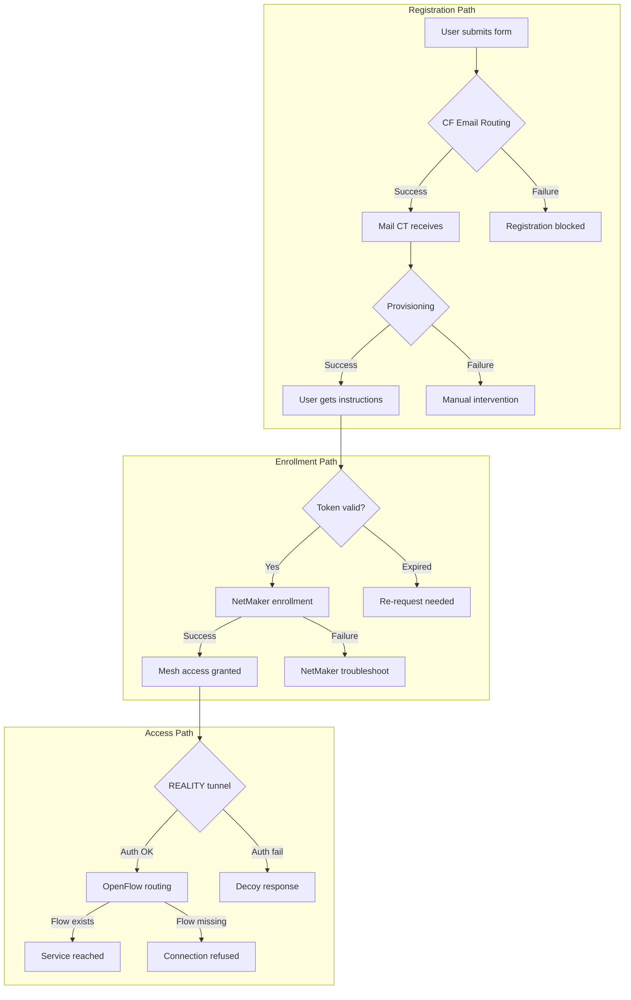

# 3tched Control Plane + ghostbridge Mesh Identity — Design

**Version:** 1.0  
**Status:** Draft  
**Implements:** requirements.md REQ-* specifications

---

## 1. Architecture Overview

### 1.1 System Components

| Component | Location | Purpose |
|-----------|----------|---------|
| **Cloudflare Edge** | CF Network | DNS, proxy, Email Routing, WAF |
| **Marketing Site** | CF Pages/Workers | Public website, registration form |
| **VPS (188.68.58.237)** | Public Internet | Host node, REALITY endpoint, mail ports |
| **REALITY/xray** | VPS :443 | Hostile-underlay camouflage tunnel |
| **Mail CT** | Incus container | Postfix/Dovecot, mail storage, outbound SMTP |
| **Control Plane** | Mesh-private | Provisioning, dashboard, API, gRPC |
| **NetMaker** | Mesh-private | WireGuard identity management |
| **op-grpc-bridge** | 10.0.0.2:8090 | gRPC services |
| **Open vSwitch** | VPS host | OpenFlow-based mesh traffic routing |

### 1.2 Network Topology

```
                    ┌─────────────────────────────────────────────────────────────┐
                    │                      PUBLIC INTERNET                         │
                    └─────────────────────────────────────────────────────────────┘
                                │                              │
                                ▼                              ▼
                    ┌───────────────────┐          ┌─────────────────────┐
                    │   CLOUDFLARE      │          │   VPS 188.68.58.237 │
                    │   ─────────────   │          │   ─────────────────  │
                    │ • DNS (orange)    │          │ • :443 REALITY only │
                    │ • Email Routing   │          │ • :465/587/993 mail │
                    │ • WAF/DDoS        │          │ • No other public   │
                    │ • Marketing site  │          │                     │
                    │ • Reg form        │          └──────────┬──────────┘
                    └────────┬──────────┘                     │
                             │                                │
              ┌──────────────┴──────────────┐                 │
              │ Email forward to mail CT    │                 │
              │ (registration triggers)     │                 │ REALITY tunnel
              └──────────────┬──────────────┘                 │ (authenticated)
                             │                                │
                             ▼                                ▼
    ┌─────────────────────────────────────────────────────────────────────────────┐
    │                            MESH NETWORK (10.0.0.0/8)                         │
    │  ┌─────────────┐  ┌─────────────┐  ┌─────────────┐  ┌─────────────────────┐ │
    │  │  Mail CT    │  │ Control     │  │  NetMaker   │  │   op-grpc-bridge    │ │
    │  │  ─────────  │  │ Plane       │  │  ─────────  │  │   ───────────────   │ │
    │  │ • Postfix   │  │ ─────────── │  │ • WG mgmt   │  │ • 10.0.0.2:8090     │ │
    │  │ • Dovecot   │  │ • Dashboard │  │ • Identity  │  │ • gRPC services     │ │
    │  │ • Ingest    │  │ • API       │  │ • Enroll    │  │ • gRPC-web UI       │ │
    │  │   pipeline  │  │ • Broker    │  │             │  │                     │ │
    │  └─────────────┘  │ • Qdrant    │  └─────────────┘  └─────────────────────┘ │
    │                   │ • Assistant │                                           │
    │                   └─────────────┘                                           │
    │                                                                             │
    │              ┌─────────────────────────────────────────┐                    │
    │              │         OPEN VSWITCH (OVS)              │                    │
    │              │  • Cookied OpenFlow rules               │                    │
    │              │  • IP:port based mesh service demux     │                    │
    │              │  • Safe controller attach               │                    │
    │              └─────────────────────────────────────────┘                    │
    └─────────────────────────────────────────────────────────────────────────────┘
```

---

## 2. Trust Boundaries

### 2.1 Trust Boundary Diagram



### 2.2 Trust Boundary Definitions

| Boundary | Entry Condition | Allowed Traffic |
|----------|-----------------|-----------------|
| **Public → CF Edge** | None (public) | HTTPS to marketing, form POST, DNS queries |
| **CF Edge → Mail CT** | CF Email Routing rules | Forwarded email only |
| **Public → VPS :443** | None (but decoy response) | TLS handshake → REALITY decoy |
| **Public → Mail Ports** | Valid mail credentials | SMTP submission, IMAP retrieval |
| **REALITY → Mesh** | Valid REALITY auth | Tunnel traffic to mesh interface |
| **Mesh → Services** | Source IP in mesh range | OpenFlow-routed service access |

### 2.3 What is Public vs Mesh vs Camouflage

| Category | Components | Accessible From | Purpose |
|----------|------------|-----------------|---------|
| **Public** | CF marketing site, registration form | Anyone | User acquisition |
| **Public (Mail)** | Mail ports :465/:587/:993 | Authenticated users | Email access |
| **Camouflage** | REALITY :443 | Anyone (decoy) / Subscribers (tunnel) | Hostile-underlay bypass |
| **Mesh-Private** | Dashboard, API, gRPC, broker, qdrant, assistant, NetMaker | Mesh only | Core services |

---

## 3. Sequence Flows

### 3.1 Subscribe Sequence: Browser → CF → Email → Mail CT → CP → NetMaker → Mesh Access



### 3.2 Mail Half-and-Half: Inbound Flow



### 3.3 Mail Half-and-Half: Outbound Flow



### 3.4 REALITY Tunnel Access Flow



---

## 4. OpenFlow Demux Design

### 4.1 Flow Architecture (Without SNI Front)

OpenFlow operates at L3/L4 (IP:port), not L7 (SNI). This avoids exposing private names on public interface.

```
                     ┌─────────────────────────────────────────┐
                     │           OVS Bridge (br-mesh)          │
                     │                                         │
  Mesh Interface ───►│  ┌─────────────────────────────────┐   │
  (from REALITY      │  │     OpenFlow Table (table=0)    │   │
   tunnel egress)    │  │                                 │   │
                     │  │  cookie=0x3tched, priority=100  │   │
                     │  │  ip,nw_dst=10.0.0.2,tp_dst=8090 │   │
                     │  │  → output:port_grpc             │   │
                     │  │                                 │   │
                     │  │  cookie=0x3tched, priority=100  │   │
                     │  │  ip,nw_dst=10.0.0.3,tp_dst=443  │   │
                     │  │  → output:port_dashboard        │   │
                     │  │                                 │   │
                     │  │  cookie=0x3tched, priority=100  │   │
                     │  │  ip,nw_dst=10.0.0.4,tp_dst=6333 │   │
                     │  │  → output:port_qdrant           │   │
                     │  │                                 │   │
                     │  │  priority=0 (default)           │   │
                     │  │  → NORMAL                       │   │
                     │  └─────────────────────────────────┘   │
                     └─────────────────────────────────────────┘
```

### 4.2 Cookie Convention

All managed flows use a consistent cookie prefix for safe operations:

- **Cookie prefix:** `0x3tched` (hex) or similar identifiable value
- **Add flows:** `ovs-ofctl add-flow br-mesh "cookie=0x3tched,priority=100,ip,nw_dst=10.0.0.2,tp_dst=8090,actions=output:2"`
- **Delete specific:** `ovs-ofctl del-flows br-mesh "cookie=0x3tched/-1,nw_dst=10.0.0.2"`
- **NEVER:** `ovs-ofctl del-flows br-mesh` (deletes ALL flows)

### 4.3 Safe Controller Attach

```bash
# Set fail-mode to standalone (flows persist if controller disconnects)
ovs-vsctl set-fail-mode br-mesh standalone

# Verify
ovs-vsctl get-fail-mode br-mesh
# Expected: standalone
```

---

## 5. Failure Modes

### 5.1 Mail Delay/Loss

| Scenario | Detection | Impact | Mitigation |
|----------|-----------|--------|------------|
| CF Email Routing delay | Monitor mail logs for arrival time | Registration delayed | Set user expectation ("within minutes"); retry logic |
| CF Email Routing failure | No mail arrives; CF dashboard alerts | Registration blocked | Direct MX fallback (requires DNS change) |
| Mail CT down | Mail queue on CF; postfix logs | Registration blocked | Incus container health check; auto-restart |
| Mail CT disk full | Postfix defer logs | Mail bounced | Disk monitoring; log rotation |

### 5.2 CF Forward Failure

| Scenario | Detection | Impact | Mitigation |
|----------|-----------|--------|------------|
| CF routing rule misconfigured | Test email doesn't arrive | All registrations fail | Pre-deployment test; CF rule validation |
| Destination unreachable | CF Email Routing logs (dashboard) | Registrations queue at CF | Ensure mail CT publicly reachable on forward port |
| SPF/DKIM failure on forward | Receiving server rejects | Machine mail rejected | Verify CF forward preserves headers; ARC signing |

### 5.3 Enrollment Token Expiry

| Scenario | Detection | Impact | Mitigation |
|----------|-----------|--------|------------|
| User delays enrollment | Token rejected on use | User cannot complete join | Clear expiry communication; re-request flow |
| Token leaked | Unexpected enrollment attempts | Unauthorized access attempt | Short expiry (24-72h); single-use tokens; audit log |
| Clock skew | Valid tokens rejected | Enrollment failures | NTP sync; grace period in validation |

### 5.4 REALITY Misuse

| Scenario | Detection | Impact | Mitigation |
|----------|-----------|--------|------------|
| Owned name in serverNames | Browser gets decoy for owned domain | User confusion; security exposure | Audit xray config; CI check for owned names |
| Decoy site blocks/changes | REALITY fingerprint mismatch | Detection risk | Monitor decoy availability; have backup decoy |
| Subscriber key compromise | Unauthorized tunnel access | Mesh breach | Key rotation; per-subscriber keys; audit logs |

### 5.5 OpenFlow Failures

| Scenario | Detection | Impact | Mitigation |
|----------|-----------|--------|------------|
| Accidental flow deletion | `ovs-ofctl dump-flows` shows missing rules | Service unreachable | Cookie-based ops only; flow backup script |
| Controller disconnect | OVS logs; `ovs-vsctl show` | New flows not installed | fail-standalone preserves existing flows |
| Flow table full | OVS logs; flow add failures | New services unreachable | Monitor table usage; prune stale flows |

### 5.6 Failure Mode Summary Diagram



---

## 6. DNS and Certificate Architecture

### 6.1 DNS Records

| Record | Type | Value | Proxy | Purpose |
|--------|------|-------|-------|---------|
| `3tched.com` | A | CF proxy IP | Orange | Marketing site |
| `www.3tched.com` | CNAME | 3tched.com | Orange | Marketing alias |
| `ghostbridge.tech` | A | CF proxy IP | Orange | Marketing site |
| `www.ghostbridge.tech` | CNAME | ghostbridge.tech | Orange | Marketing alias |
| `mail.3tched.com` | A | 188.68.58.237 | Grey | Mail CT direct |
| `mail.ghostbridge.tech` | A | 188.68.58.237 | Grey | Mail CT direct |
| `3tched.com` | MX | CF Email Routing | N/A | Inbound via CF |
| `ghostbridge.tech` | MX | CF Email Routing | N/A | Inbound via CF |
| `3tched.com` | TXT | SPF record | N/A | Mail auth |
| `ghostbridge.tech` | TXT | SPF record | N/A | Mail auth |
| `_dmarc.3tched.com` | TXT | DMARC policy | N/A | Mail auth |
| `_dmarc.ghostbridge.tech` | TXT | DMARC policy | N/A | Mail auth |
| `*._domainkey.3tched.com` | TXT | DKIM public key | N/A | Mail auth |
| `*._domainkey.ghostbridge.tech` | TXT | DKIM public key | N/A | Mail auth |

### 6.2 Certificate Strategy

| Service | Certificate | Provisioning | Notes |
|---------|-------------|--------------|-------|
| Marketing site | CF Universal SSL | Automatic | Orange-proxied |
| Mail CT (:465/:587/:993) | ACME (Let's Encrypt) | certbot/acme.sh | mail.3tched.com, mail.ghostbridge.tech |
| REALITY :443 | None (decoy) | N/A | Uses decoy site's cert |
| Mesh services | Internal CA or self-signed | Manual/automated | Mesh-only, not browser-trusted |

---

## 7. Rollback and Safety Notes

### 7.1 OVS Safety Rules

1. **NEVER** run `ovs-ofctl del-flows <bridge>` without cookie filter
2. **ALWAYS** use cookie prefix on all managed flows
3. **ALWAYS** test flow changes in staging first
4. **BACKUP** flow table before changes: `ovs-ofctl dump-flows br-mesh > flows.backup`
5. **RESTORE** if needed: `ovs-ofctl add-flows br-mesh flows.backup`

### 7.2 Rollback Procedures

| Change | Rollback Method |
|--------|-----------------|
| OpenFlow rule | Delete specific flow by cookie, re-add previous |
| Mail CT config | Restore from backup; `sv restart postfix dovecot` |
| xray/REALITY config | Restore config; `sv restart xray` |
| DNS record | Revert in CF dashboard (propagation delay) |
| NetMaker enrollment | Delete enrollment in NetMaker UI/API |
| CF Email Routing rule | Revert in CF dashboard |

### 7.3 Pre-Change Checklist

- [ ] Backup current config/state
- [ ] Test change in non-production if possible
- [ ] Have rollback command ready
- [ ] Verify monitoring is active
- [ ] Schedule during low-traffic window for critical changes

---

## 8. Security Considerations

### 8.1 Attack Surface Analysis

| Surface | Exposure | Mitigations |
|---------|----------|-------------|
| CF marketing site | Public | CF WAF, rate limiting |
| Registration form | Public | CAPTCHA, rate limiting, input validation |
| Mail ports | Public (authenticated) | fail2ban, TLS required, strong passwords |
| REALITY :443 | Public (decoy) | REALITY auth required for tunnel |
| Mesh services | Mesh only | Firewall blocks non-mesh; OVS rules |

### 8.2 Authentication Requirements

| Access Type | Authentication Method |
|-------------|----------------------|
| Mail submission | Username/password over TLS |
| Mail retrieval (IMAP) | Username/password over TLS |
| REALITY tunnel | xray REALITY credentials |
| Mesh services | Mesh IP + optional service-level auth |
| NetMaker enrollment | One-time token from provisioning |

### 8.3 Audit Points

- Registration attempts (form submissions)
- Enrollment completions/failures
- REALITY tunnel connections
- Mail delivery success/failure
- OpenFlow rule changes
- Service access from mesh

---

## 9. Component Configuration Summary

### 9.1 xray/REALITY Config (Relevant Sections)

```json
{
  "inbounds": [{
    "port": 443,
    "protocol": "vless",
    "settings": { "decryption": "none", "clients": [...] },
    "streamSettings": {
      "network": "tcp",
      "security": "reality",
      "realitySettings": {
        "dest": "www.microsoft.com:443",
        "serverNames": ["www.microsoft.com"],
        "privateKey": "...",
        "shortIds": ["..."]
      }
    }
  }]
}
```

**Critical:** `serverNames` contains ONLY decoy domain(s), never owned names.

### 9.2 Postfix Main Config Points

```
# Multi-domain
mydestination = 3tched.com, ghostbridge.tech, localhost
virtual_alias_maps = hash:/etc/postfix/virtual

# TLS
smtpd_tls_cert_file = /etc/letsencrypt/live/mail.3tched.com/fullchain.pem
smtpd_tls_key_file = /etc/letsencrypt/live/mail.3tched.com/privkey.pem
smtpd_tls_security_level = may
smtp_tls_security_level = may

# DKIM
milter_default_action = accept
milter_protocol = 6
smtpd_milters = inet:localhost:8891
non_smtpd_milters = inet:localhost:8891
```

### 9.3 SPF/DKIM/DMARC Records

```
# SPF (TXT at root)
v=spf1 ip4:188.68.58.237 -all

# DKIM (TXT at selector._domainkey)
v=DKIM1; k=rsa; p=<public_key>

# DMARC (TXT at _dmarc)
v=DMARC1; p=reject; rua=mailto:dmarc@3tched.com; adkim=s; aspf=s
```

---

## 10. Diagrams Index

| Diagram | Section | Description |
|---------|---------|-------------|
| Network Topology | 1.2 | High-level component layout |
| Trust Boundary (Mermaid) | 2.1 | Security zones and allowed flows |
| Subscribe Sequence | 3.1 | Full registration flow |
| Inbound Mail Flow | 3.2 | CF → Mail CT path |
| Outbound Mail Flow | 3.3 | Mail CT → External |
| REALITY Access Flow | 3.4 | Subscriber tunnel path |
| OpenFlow Table | 4.1 | Flow rule structure |
| Failure Modes | 5.6 | Failure decision tree |

---

*Design document for Kiro spec workflow. References requirements.md REQ-* IDs.*
