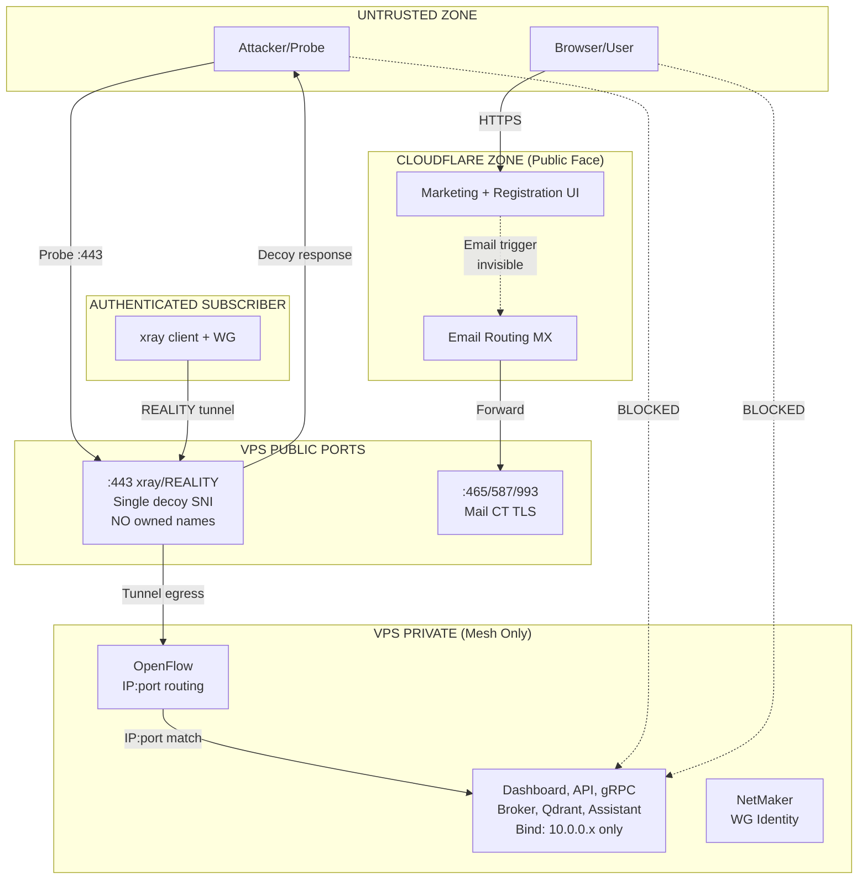

# 3tched Control Plane + ghostbridge Mesh Identity — Design

**Version:** 1.0  
**Status:** Draft  
**Implements:** requirements.md

---

## 1. Architecture: The Separation

```
┌─────────────────────────────────────────────────────────────────────────────┐
│                           PUBLIC INTERNET                                   │
│                                                                             │
│   Users see:                                                                │
│   • Cloudflare-served websites (3tched.com, ghostbridge.tech)              │
│   • Normal web experience                                                   │
│   • No knowledge of VPS                                                     │
└─────────────────────────────────────────────────────────────────────────────┘
                │                                    │
                │ HTTPS (orange-proxied)             │ Probe/Attack
                ▼                                    ▼
┌───────────────────────────┐          ┌─────────────────────────────────────┐
│      CLOUDFLARE           │          │         VPS 188.68.58.237           │
│                           │          │                                     │
│  • DNS (orange-proxied)   │          │  :443 ─► xray/REALITY               │
│  • Marketing site         │          │          • Single decoy SNI         │
│  • Registration UI        │          │          • NO owned domain names    │
│  • Email Routing (MX)     │          │          • Camouflage only          │
│  • WAF/DDoS               │          │          • Authorized → tunnel      │
│                           │          │                                     │
│  NO tunnels to VPS ──X    │          │  :465/587/993 ─► Mail CT            │
│  NO live API to VPS ─X    │          │          • ACME certs (mail.*)      │
│                           │          │          • Inbound via CF forward   │
│                           │          │          • Outbound direct          │
└───────────────────────────┘          │                                     │
         │                             │  ALL OTHER PORTS ─► CLOSED          │
         │ Email forward               └─────────────────────────────────────┘
         │ (invisible infra)                              │
         ▼                                                │
┌─────────────────────────────────────────────────────────┼─────────────────┐
│                              VPS INTERNAL               │                 │
│                                                         │                 │
│  ┌─────────────┐      ┌─────────────────────────────────┼───────────────┐ │
│  │  Mail CT    │      │            MESH (10.0.0.0/8)    │               │ │
│  │             │      │                                 │               │ │
│  │ • Postfix   │      │  REALITY tunnel ────────────────┘               │ │
│  │ • Dovecot   │      │  egress here                                    │ │
│  │ • Ingest    │      │                                                 │ │
│  │   triggers  │      │  ┌──────────┐ ┌──────────┐ ┌──────────────────┐ │ │
│  │             │      │  │Dashboard │ │ API      │ │ op-grpc-bridge   │ │ │
│  │ Outbound:   │      │  │10.0.0.x  │ │10.0.0.x  │ │ 10.0.0.2:8090    │ │ │
│  │ SPF/DKIM    │      │  └──────────┘ └──────────┘ └──────────────────┘ │ │
│  │ direct send │      │                                                 │ │
│  └─────────────┘      │  ┌──────────┐ ┌──────────┐ ┌──────────────────┐ │ │
│                       │  │ Broker   │ │ Qdrant   │ │ Assistant        │ │ │
│                       │  │10.0.0.x  │ │10.0.0.x  │ │ 10.0.0.x         │ │ │
│                       │  └──────────┘ └──────────┘ └──────────────────┘ │ │
│                       │                                                 │ │
│                       │         ┌─────────────────────────┐             │ │
│                       │         │   Open vSwitch (OVS)    │             │ │
│                       │         │   • Cookied OpenFlow    │             │ │
│                       │         │   • IP:port routing     │             │ │
│                       │         │   • No SNI, no L7       │             │ │
│                       │         └─────────────────────────┘             │ │
│                       │                                                 │ │
│                       │  ┌──────────────────────────────────┐           │ │
│                       │  │         NetMaker                 │           │ │
│                       │  │   • WireGuard identity mgmt      │           │ │
│                       │  │   • Subscriber enrollment        │           │ │
│                       │  └──────────────────────────────────┘           │ │
│                       └─────────────────────────────────────────────────┘ │
└─────────────────────────────────────────────────────────────────────────────┘
```

---

## 2. Trust Boundaries



### Trust Boundary Definitions

| Boundary | What Crosses | What's Blocked |
|----------|--------------|----------------|
| Public Internet → CF | HTTPS to marketing/registration | Everything else |
| Public Internet → VPS :443 | TLS probe (gets decoy) | Owned domain access |
| Public Internet → VPS mail | Authenticated SMTP/IMAP | Unauthenticated |
| CF → VPS backend | Email only (async) | Tunnels, APIs, streams |
| REALITY tunnel → Mesh | Authenticated subscriber traffic | Unauthenticated |
| Mesh → Services | OpenFlow-routed by IP:port | Non-mesh source IPs |

---

## 3. xray/REALITY Configuration

### What REALITY Does
- Listens on VPS :443
- Presents TLS that mimics a decoy site (e.g., www.microsoft.com)
- Unauthorized probes see decoy response
- Authorized clients (with REALITY credentials) establish tunnel
- Tunnel traffic exits onto mesh interface

### Critical Configuration Rules

```
┌─────────────────────────────────────────────────────────────┐
│                    xray_config.json                         │
├─────────────────────────────────────────────────────────────┤
│  serverNames: ["www.microsoft.com"]     ◄── SINGLE DECOY   │
│                                                             │
│  NOT: ["www.microsoft.com", "3tched.com"]    ◄── WRONG     │
│  NOT: ["dashboard.3tched.com"]               ◄── WRONG     │
│  NOT: ["ghostbridge.tech"]                   ◄── WRONG     │
│                                                             │
│  dest: "www.microsoft.com:443"          ◄── DECOY ONLY     │
└─────────────────────────────────────────────────────────────┘
```

### Why No Owned Names
- SNI probe reveals what domains the server handles
- Owned names in serverNames = "this VPS is related to 3tched"
- Defeats camouflage purpose
- Attacker gains intel

---

## 4. SNI Isolation

### The Problem We're Avoiding

```
WRONG APPROACH (SNI demux on public :443):
┌─────────────────────────────────────────────────────────┐
│  Browser sends SNI: dashboard.3tched.com                │
│                         │                               │
│                         ▼                               │
│  nginx/haproxy on :443 sees SNI                         │
│        │                     │                          │
│        ▼                     ▼                          │
│  SNI=dashboard.*        SNI=other                       │
│  → route to dashboard   → route to REALITY              │
│                                                         │
│  PROBLEM: Exposes that VPS serves dashboard.3tched.com │
└─────────────────────────────────────────────────────────┘
```

### The Correct Approach

```
CORRECT APPROACH (no SNI demux on public :443):
┌─────────────────────────────────────────────────────────┐
│  ANY connection to VPS :443                             │
│                         │                               │
│                         ▼                               │
│  xray/REALITY (only thing on :443)                      │
│        │                     │                          │
│        ▼                     ▼                          │
│  REALITY auth OK        REALITY auth FAIL               │
│  → tunnel to mesh       → decoy response                │
│                                                         │
│  SNI value IGNORED for routing                          │
│  No owned domains exposed                               │
└─────────────────────────────────────────────────────────┘
```

### Rules
1. No nginx on public :443
2. No haproxy on public :443
3. Only xray/REALITY on public :443
4. SNI does not affect routing
5. Owned domain TLS certs do not exist on VPS public edge

---

## 5. OpenFlow Mesh Routing

### Why IP:Port, Not SNI

| Approach | Layer | Visibility | Works with encrypted? |
|----------|-------|------------|----------------------|
| SNI demux | L7 | Exposes domain names | Only at TLS handshake |
| IP:port demux | L3/L4 | IPs only (mesh-internal) | Yes, post-tunnel |

### Flow Structure

```
┌─────────────────────────────────────────────────────────────┐
│                 OVS Bridge (br-mesh)                        │
│                                                             │
│  Tunnel egress ───►  OpenFlow Table                         │
│  (from REALITY)      ┌─────────────────────────────────┐    │
│                      │ cookie=0x3tched, priority=100   │    │
│                      │ ip,nw_dst=10.0.0.2,tp_dst=8090  │    │
│                      │ actions=output:grpc_port        │    │
│                      ├─────────────────────────────────┤    │
│                      │ cookie=0x3tched, priority=100   │    │
│                      │ ip,nw_dst=10.0.0.3,tp_dst=443   │    │
│                      │ actions=output:dashboard_port   │    │
│                      ├─────────────────────────────────┤    │
│                      │ priority=0                      │    │
│                      │ actions=NORMAL                  │    │
│                      └─────────────────────────────────┘    │
└─────────────────────────────────────────────────────────────┘
```

### Safety Rules

| Rule | Command Example | Why |
|------|-----------------|-----|
| Always use cookie | `cookie=0x3tched` | Identify managed flows |
| Never bulk delete | ~~`ovs-ofctl del-flows br-mesh`~~ | Destroys all flows |
| Filter deletions | `del-flows cookie=0x3tched/-1,...` | Safe removal |
| Fail-mode standalone | `ovs-vsctl set-fail-mode br-mesh standalone` | Survives controller disconnect |

---

## 6. Mail Architecture (Half-and-Half)

```
┌─────────────────────────────────────────────────────────────┐
│                     INBOUND MAIL                            │
│                                                             │
│  External sender                                            │
│        │                                                    │
│        ▼                                                    │
│  MX lookup: 3tched.com                                      │
│        │                                                    │
│        ▼                                                    │
│  Cloudflare Email Routing (owns MX)                         │
│        │                                                    │
│        ▼                                                    │
│  Forward to mail CT (VPS :25 or configured port)            │
│        │                                                    │
│        ▼                                                    │
│  Mail CT receives, stores in mailbox                        │
│                                                             │
│  User retrieves via IMAP :993 (direct to VPS mail CT)       │
└─────────────────────────────────────────────────────────────┘

┌─────────────────────────────────────────────────────────────┐
│                     OUTBOUND MAIL                           │
│                                                             │
│  User/system composes mail                                  │
│        │                                                    │
│        ▼                                                    │
│  Mail CT (postfix) :587 submission                          │
│        │                                                    │
│        ▼                                                    │
│  DKIM sign with mail CT key                                 │
│        │                                                    │
│        ▼                                                    │
│  Direct SMTP to recipient MX                                │
│  (NOT through Gmail, NOT through CF)                        │
│        │                                                    │
│        ▼                                                    │
│  Recipient checks SPF: VPS IP authorized ✓                  │
│  Recipient checks DKIM: mail CT signature ✓                 │
│  Recipient checks DMARC: aligned ✓                          │
└─────────────────────────────────────────────────────────────┘
```

### DNS Records

| Record | Type | Value | Purpose |
|--------|------|-------|---------|
| 3tched.com | MX | CF Email Routing | Inbound via CF |
| ghostbridge.tech | MX | CF Email Routing | Inbound via CF |
| mail.3tched.com | A | 188.68.58.237 (grey) | Direct mail access |
| mail.ghostbridge.tech | A | 188.68.58.237 (grey) | Direct mail access |
| 3tched.com | TXT | `v=spf1 ip4:188.68.58.237 -all` | Authorize VPS only |
| ghostbridge.tech | TXT | `v=spf1 ip4:188.68.58.237 -all` | Authorize VPS only |
| *._domainkey.* | TXT | DKIM public key | Signature verification |
| _dmarc.* | TXT | `v=DMARC1; p=reject; ...` | Policy |

### What's NOT in SPF
- No `include:_spf.google.com`
- No Gmail servers
- No CF sending IPs (CF only forwards inbound)

---

## 7. What Is Public vs Mesh vs Camouflage

| Category | Components | Access Method | Who Can Reach |
|----------|------------|---------------|---------------|
| **Public (CF)** | Marketing site, registration UI | Browser → CF edge | Anyone |
| **Public (VPS mail)** | IMAP, SMTP submission | Direct to VPS :465/587/993 | Authenticated users |
| **Camouflage** | REALITY :443 | Probe → decoy response | Anyone (but useless) |
| **Mesh-private** | Dashboard, API, gRPC, broker, qdrant, assistant | Tunnel → mesh → OpenFlow | Enrolled subscribers only |

---

## 8. Failure Modes

### REALITY Misconfiguration

| Failure | Detection | Impact | Fix |
|---------|-----------|--------|-----|
| Owned name in serverNames | SNI probe reveals | Camouflage defeated | Remove from config, restart xray |
| Multiple serverNames | Config audit | Fingerprint anomaly | Reduce to single decoy |
| Decoy site down | REALITY handshake fails | Tunnel may fail | Choose reliable decoy |

### OpenFlow Failures

| Failure | Detection | Impact | Fix |
|---------|-----------|--------|-----|
| Bulk del-flows | Flows disappear | Network down | Restore from backup, re-add flows |
| Missing cookie | dump-flows shows no cookie | Can't safely manage | Re-add with cookie |
| Controller disconnect | OVS logs | No new flows | fail-standalone preserves existing |

### Mail Failures

| Failure | Detection | Impact | Fix |
|---------|-----------|--------|-----|
| CF forward fails | No mail arrives | Inbound broken | Check CF routing rules |
| SPF mismatch | Bounces, DMARC reports | Outbound rejected | Fix SPF record |
| Gmail in SPF | DMARC reports Gmail sends | Policy violation | Remove Gmail from SPF |

---

## 9. Verification Checklist

### REALITY/SNI Isolation
- [ ] `grep -i "3tched\|ghostbridge" /etc/xray/xray_config.json` returns nothing
- [ ] SNI probe to VPS:443 with owned domain returns decoy cert
- [ ] Only xray listens on :443 (`ss -tlnp | grep :443`)
- [ ] No nginx/haproxy on :443

### Public Port Surface
- [ ] External nmap shows only :443 and mail ports
- [ ] HTTP to VPS IP returns nothing useful
- [ ] Owned domains resolve to CF, not VPS (except mail.*)

### Mesh Isolation
- [ ] Services bind to 10.x.x.x (`ss -tlnp` shows mesh IPs)
- [ ] Connection from public IP to mesh services fails
- [ ] Connection through REALITY tunnel succeeds

### Mail
- [ ] MX records point to CF
- [ ] SPF contains only VPS IP, no Gmail
- [ ] DKIM test passes
- [ ] Outbound mail delivers with aligned SPF/DKIM/DMARC

### OpenFlow
- [ ] Flows have consistent cookie
- [ ] No scripts with unfiltered del-flows
- [ ] fail-mode is standalone

---

*Design focused on technical separation: REALITY/xray, SNI isolation, OpenFlow routing, mail architecture.*
