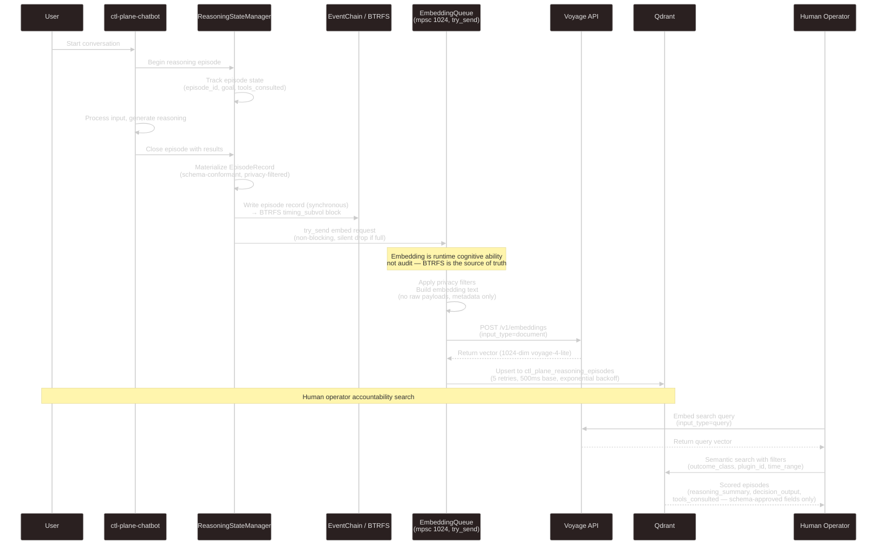

# Chatbot Reasoning Vectorization

## Key facts for models

- **No D-Bus watcher** in this path — reasoning episodes write directly to EventChain/BTRFS then enqueue to embedding worker
- **No SQLite** — episode records go to BTRFS timing_subvol (audit) and Qdrant (vector search)
- **EmbeddingQueue is lossy by design** — `try_send`, drop on full; BTRFS is the durable audit trail
- **Embedding text** is metadata only: `plugin=X operation=Y actor=Z outcome=W summary=...` — no raw payloads
- **PII flag** → redacts summary from vector input before enqueueing
- **Qdrant collection**: `ctl_plane_reasoning_episodes`, 1024-dim, voyage-4-lite
- **Retry**: 5 attempts, 500ms base, exponential backoff in worker; logs warn on final failure, does not panic
