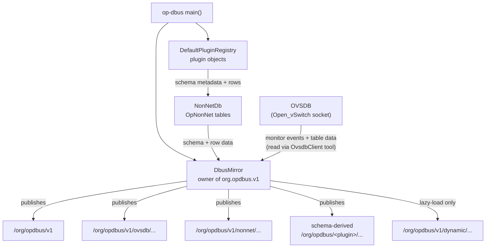

# D-Bus Projection — op-dbus-mirror

**Key relationships:**

- `OvsdbClient` is an internal tool inside `DbusMirror` — not a separate actor in the data path
- `NonNetDb` is seeded from plugin schema at boot; mirror reads it directly
- `OVSDB` monitor events drive refresh; mirror never writes to OVSDB
- `/org/opdbus/v1/dynamic/...` is lazy-load only for large schema-derived tables that passed the same `schema_derived=true` filter — not a fallback
