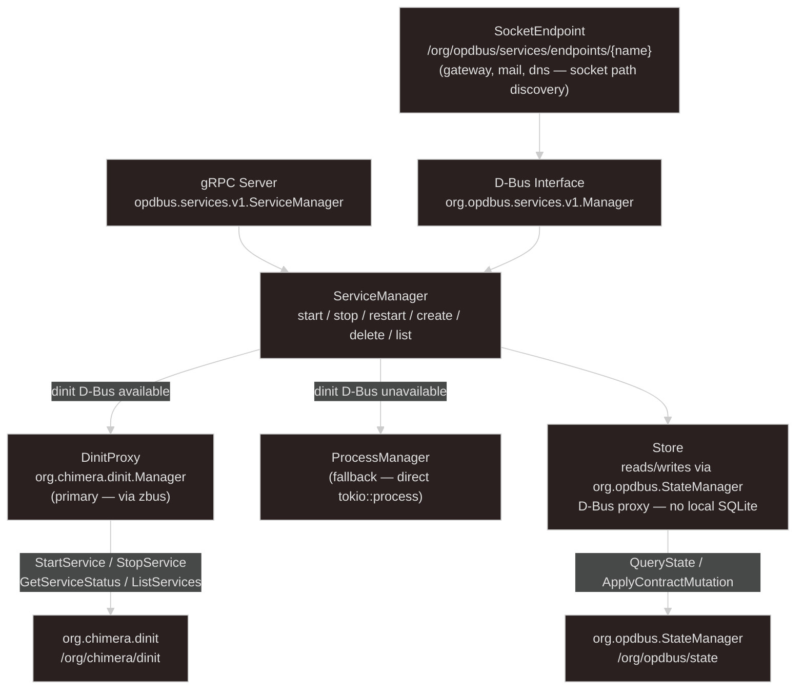

# Service Manager Architecture

No trait hierarchy. Single `ServiceManager` struct. `DinitProxy` is primary; `ProcessManager` is
fallback when dinit D-Bus is unavailable. Store reads/writes via `org.opdbus.StateManager` D-Bus —
no local SQLite.

## Key facts for models

- **No systemd backend** — dinit only, via `org.chimera.dinit` D-Bus interface
- **No StubBackend / trait hierarchy** — `DinitProxy` and `ProcessManager` are concrete structs, not trait impls
- **No SQLite** — `Store` is a D-Bus client for `org.opdbus.StateManager`; service definitions live in the op-dbus state tree
- **`ProcessManager`** — fallback only; spawns processes directly via `tokio::process::Command` when dinit D-Bus is not reachable
- **`SocketEndpoint`** — publishes socket paths on D-Bus so consumers (op-web etc.) don't hardcode paths
- **State change events** — `ServiceManager` broadcasts `ServiceEvent` via `tokio::sync::broadcast` channel; gRPC `WatchStatus` streams from this
