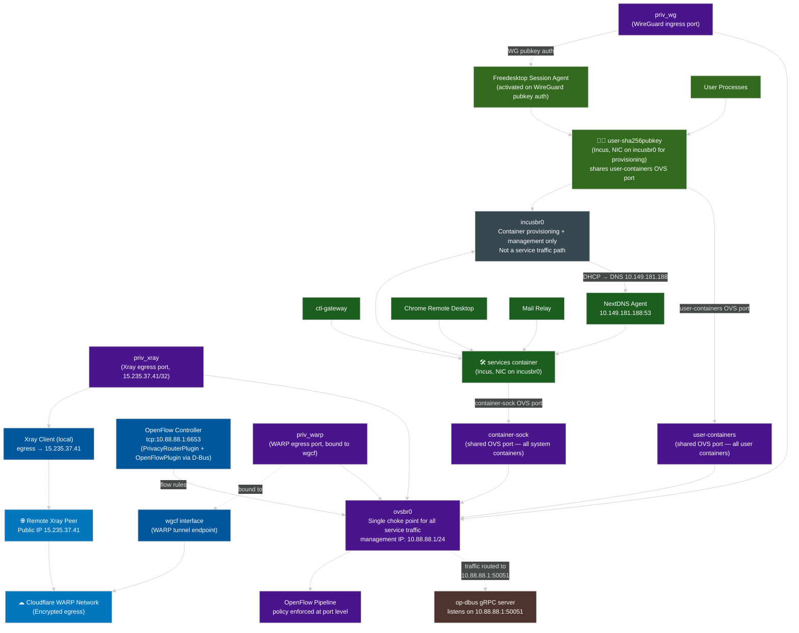

# Network Topology — operation-dbus-proto

OVS bridge fabric, container isolation, egress chain, and control plane.

```mermaid
---
config:
  theme: neo-dark
---
graph TB
    XRAY_REMOTE["🌐 Remote Xray Peer<br/>Public IP 15.235.37.41"]
    REMOTE_WARP["☁ Cloudflare WARP Network<br/>(Encrypted egress)"]
    WGCF_IFACE["wgcf interface<br/>(WARP tunnel endpoint)"]

    XRAY_REMOTE --> REMOTE_WARP

    XRAY_CLIENT["Xray Client (local)<br/>egress → 15.235.37.41"]
    OF_CTRL["OpenFlow Controller<br/>tcp:10.88.88.1:6653<br/>(PrivacyRouterPlugin + OpenFlowPlugin via D-Bus)"]
    OPDBUS["op-dbus gRPC server<br/>listens on 10.88.88.1:50051"]

    OVS["ovsbr0<br/>Single choke point for all service traffic<br/>management IP: 10.88.88.1/24"]
    PRIV_WG["priv_wg<br/>(WireGuard ingress port)"]
    PRIV_WARP["priv_warp<br/>(WARP egress port, bound to wgcf)"]
    PRIV_XRAY["priv_xray<br/>(Xray egress port, 15.235.37.41/32)"]
    CONT_SOCK["container-sock<br/>(shared OVS port — all system containers)"]
    USER_PORT["user-containers<br/>(shared OVS port — all user containers)"]
    OPENFLOW["OpenFlow Pipeline<br/>policy enforced at port level"]

    OF_CTRL -->|flow rules| OVS
    OVS -.->|"traffic routed to<br/>10.88.88.1:50051"| OPDBUS

    PRIV_WG --> OVS
    PRIV_WARP --> OVS
    PRIV_XRAY --> OVS
    CONT_SOCK --> OVS
    USER_PORT --> OVS
    OVS --> OPENFLOW

    PRIV_WARP -.->|bound to| WGCF_IFACE
    WGCF_IFACE --> REMOTE_WARP
    PRIV_XRAY --> XRAY_CLIENT --> XRAY_REMOTE

    INCUSBR0["incusbr0<br/>Container provisioning + management only<br/>Not a service traffic path"]

    SERV_CONTAINER["🛠 services container<br/>(Incus, NIC on incusbr0)"]
    CTLGW["ctl-gateway"]
    NXDNS["NextDNS Agent<br/>10.149.181.188:53"]
    CHROME["Chrome Remote Desktop"]
    MAIL["Mail Relay"]

    SERV_CONTAINER -->|container-sock OVS port| CONT_SOCK
    SERV_CONTAINER --> INCUSBR0
    CTLGW --> SERV_CONTAINER
    NXDNS --> SERV_CONTAINER
    CHROME --> SERV_CONTAINER
    MAIL --> SERV_CONTAINER

    USER_AUTH["Freedesktop Session Agent<br/>(activated on WireGuard pubkey auth)"]
    USER_CTNR["🧑‍💻 user-sha256pubkey<br/>(Incus, NIC on incusbr0 for provisioning)<br/>shares user-containers OVS port"]
    USER_APP["User Processes"]

    PRIV_WG -->|WG pubkey auth| USER_AUTH --> USER_CTNR
    USER_CTNR -->|user-containers OVS port| USER_PORT
    USER_APP --> USER_CTNR
    USER_CTNR --> INCUSBR0

    INCUSBR0 -->|"DHCP → DNS 10.149.181.188"| NXDNS

    classDef remoteStyle fill:#0277bd,stroke:#cccccc,stroke-width:1,color:#ffffff;
    classDef ingressStyle fill:#01579B,stroke:#cccccc,stroke-width:1,color:#ffffff;
    classDef fabricStyle fill:#4a148c,stroke:#cccccc,stroke-width:1,color:#ffffff;
    classDef systemStyle fill:#1B5E20,stroke:#cccccc,stroke-width:1,color:#ffffff;
    classDef userStyle fill:#33691e,stroke:#cccccc,stroke-width:1,color:#ffffff;
    classDef provisionStyle fill:#37474f,stroke:#cccccc,stroke-width:1,color:#ffffff;
    classDef serviceStyle fill:#4e342e,stroke:#cccccc,stroke-width:1,color:#ffffff;

    class XRAY_REMOTE,REMOTE_WARP remoteStyle;
    class WGCF_IFACE,XRAY_CLIENT,OF_CTRL ingressStyle;
    class OVS,PRIV_WG,PRIV_WARP,PRIV_XRAY,CONT_SOCK,USER_PORT,OPENFLOW fabricStyle;
    class SERV_CONTAINER,CTLGW,NXDNS,CHROME,MAIL systemStyle;
    class USER_CTNR,USER_AUTH,USER_APP userStyle;
    class INCUSBR0 provisionStyle;
    class OPDBUS serviceStyle;
```
