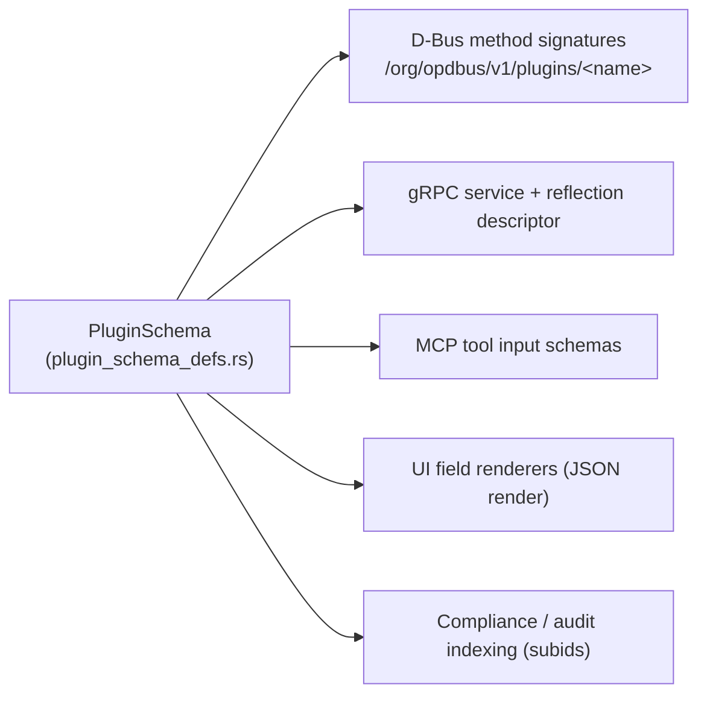
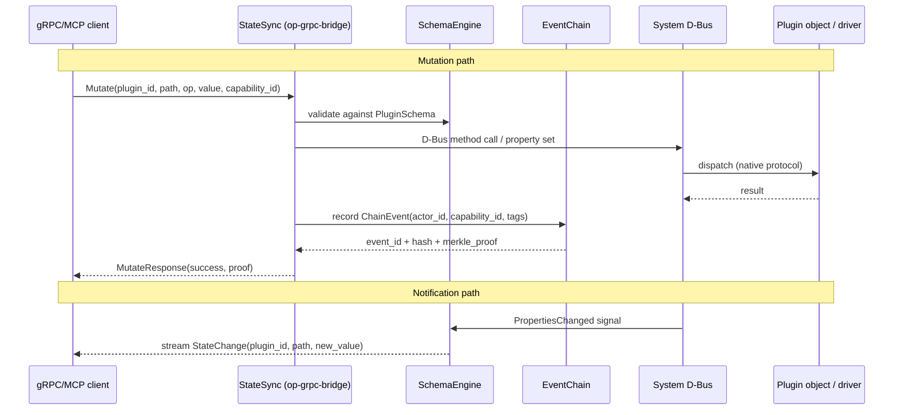

# Architecture Overview — operation-dbus-proto (3tched Control Plane)

> Generated 2026-07-02 from workspace source and current (June/July 2026) design
> notes. This is a whole-workspace overview; deep contracts live in
> [`docs/reference/api-reference.md`](../reference/api-reference.md) and
> operational how-tos in [`docs/guides/user-guide.md`](../guides/user-guide.md).

## 1. What this system is

`operation-dbus-proto` is a native, deterministic control plane for Artix Linux
infrastructure. It manages networking, containers, services, storage, identity,
and an AI/agent layer through a single control plane: **D-Bus**.

Foundational choices:

- **Host:** Artix Linux with **s6** service supervision (not systemd).
- **Network:** Open vSwitch fabric via native **OVSDB JSON-RPC** and pure-Rust
  **OpenFlow** — no `ovs-vsctl`/`ip` subprocesses in the control plane.
- **Containers:** Incus; privacy services (Xray, mail) run inside containers over
  Unix sockets with OpenFlow routing.
- **Storage:** CozoDB (graph-relational-vector) + Btrfs vectorized footprint
  transport for the blockchain ledger.
- **AI:** LLM backend with per-container memory (CozoDB + Qdrant semantic search).

## 2. Core principles

1. **D-Bus is the only control plane.** Every read, write, and tool call flows
   through a D-Bus object under `org.opdbus.v1`. gRPC and HTTP are transports on
   top; they still resolve to D-Bus objects.
2. **Schema is the single source of truth.** `PluginSchema` defines every plugin's
   state, methods, signals, and capabilities. D-Bus method signatures, gRPC
   shapes, MCP tool inputs, and UI field renderers are all derived from it. If a
   valid schema cannot be produced, the entity does not exist on the system.
3. **Native protocols only.** OVSDB JSON-RPC instead of `ovs-vsctl`; netlink
   instead of `ip`; programmatic APIs instead of shell subprocesses.
4. **Zero-copy / 1:1 direct read.** Live state is read directly from the schema
   engine's shared memory (`/dev/shm`), not from polling loops or SQL snapshots.
5. **Accountability.** Every mutation is recorded in an append-only event chain
   with actor and capability attribution, and can be proven via Merkle proof.
6. **OSCAL subid taxonomy.** Every object, method, and event carries a stable
   `subid` operational key alongside its immutable `uuid`.

## 3. Layered architecture

```mermaid
flowchart TB
    subgraph clients["External clients"]
        UI["Web UI (op-web)"]
        LLMC["LLM / MCP clients<br/>NotebookLM, Droid, Cursor, Codex"]
        REMOTE["Remote agents / gRPC"]
    end

    subgraph gateway["Gateway + MCP layer"]
        COGMCP["op-cognitive-mcp :3003<br/>universal external MCP gateway"]
        MCP["op-mcp<br/>multi-transport MCP server"]
        GW["op-gateway<br/>WireGuard-auth MCP router"]
        COMPACT["compact-mcp 127.0.0.1:11436<br/>loopback / chatbot only"]
    end

    subgraph agents["Agent + chat layer"]
        CHAT["op-chat<br/>ChatActor, tool loader"]
        CACHE["op-cache<br/>agent registry, orchestrator, workstack cache"]
        AGENTS["op-agents<br/>D-Bus agent implementations"]
        WORKFLOWS["op-workflows<br/>workflow engine"]
    end

    subgraph bridge["Bridge layer (D-Bus <-> gRPC)"]
        GRPCBRIDGE["op-grpc-bridge<br/>StateSync, PluginService,<br/>EventChain, SchemaEngine"]
        ADAPTERS["op-grpc-adapters<br/>mail/netmaker/MQTT gRPC facade"]
        MIRROR["op-dbus-mirror<br/>1:1 projection of OVSDB / NonNet"]
    end

    subgraph core["Schema + plugin core"]
        PLUGINS["op-plugins<br/>state plugins (70+)"]
        STATE["op-state<br/>StatePlugin trait, StateManager"]
        STATESTORE["op-state-store<br/>PluginSchema contract"]
        PROJECTION["op-projection<br/>schema-validated transforms"]
    end

    subgraph data["Data + system layer"]
        NETWORK["op-network<br/>OVSDB / OpenFlow / rtnetlink"]
        SERVICES["op-services / op-s6-systemctl<br/>dinit + s6 lifecycle"]
        COZO["op-cozo-store<br/>CozoDB graph-vector"]
        BLOCKCHAIN["op-blockchain<br/>Btrfs footprint ledger"]
        IDENTITY["op-identity<br/>WireGuard identity, magic link"]
        XRAY["op-xray-daemon / op-gemma<br/>privacy routing"]
    end

    clients --> gateway
    gateway --> agents
    agents --> bridge
    bridge --> core
    core --> data
```



The layers, top to bottom:

| Layer | Purpose | Key crates |
|---|---|---|
| Clients | Human and machine consumers | `op-web` (UI) |
| Gateway / MCP | Auth, transport, tool exposure to external clients | `op-cognitive-mcp`, `op-mcp`, `op-gateway`, `op-mcp-aggregator`, `op-mcp-shim` |
| Agent / chat | Reasoning, orchestration, tool execution | `op-chat`, `op-cache`, `op-agents`, `op-workflows`, `op-llm` |
| Bridge | Bidirectional D-Bus ↔ gRPC, schema engine, projection | `op-grpc-bridge`, `op-grpc-adapters`, `op-dbus-mirror`, `op-assistant-grpc` |
| Schema / plugin core | Source of truth, plugin trait, validation | `op-plugins`, `op-state`, `op-state-store`, `op-projection`, `op-dbus-model` |
| Data / system | Native protocol drivers and stores | `op-network`, `op-services`, `op-s6-systemctl`, `op-cozo-store`, `op-blockchain`, `op-identity`, `op-xray-daemon`, `op-gemma`, `op-cache` |
| Support | Cross-cutting utilities | `op-core`, `op-http`, `op-jsonrpc`, `op-tools`, `op-introspection`, `op-inspector`, `op-execution-tracker`, `op-dynamic-loader`, `op-deployment`, `op-compliance` |

## 4. Crate map

Descriptions are taken from each crate's `Cargo.toml` and current source.

### Schema and plugin core
- **op-state-store** — Canonical `PluginSchema` contract (fields, methods,
  signals, capabilities, subids) plus the execution state store / job ledger.
- **op-state** — `StatePlugin` trait, `StateManager`, diff/apply/checkpoint, and
  schema validation.
- **op-plugins** — The plugin system: 70+ state plugins, blockchain footprints,
  and the D-Bus host export. Plugins self-register via `inventory::submit!`.
- **op-projection** — Schema-validated state transformation engine.
- **op-dbus-model** — Plugin catalog document model (schema + D-Bus path +
  service name + storage path).

### Bridge
- **op-grpc-bridge** — Bidirectional D-Bus ↔ gRPC bridge with the central
  `SchemaEngine`, `StateSync`, `PluginService`, and `EventChainService`.
- **op-grpc-adapters** — Wraps mail, Netmaker, MQTT and other backends behind a
  uniform Tonic gRPC interface with Ghostbridge identity headers and reflection.
- **op-dbus-mirror** — 1:1 D-Bus projection of internal databases (OVSDB,
  NonNet) as `ProjectedObjectV1` objects.
- **op-assistant-grpc** — gRPC gateway for assistant integration (D-Bus-first
  transport with RPC fallback).

### Gateway / MCP
- **op-cognitive-mcp** — Universal external MCP gateway (`:3003`): CozoDB memory
  store, Qdrant semantic shuttle, code RAG, memory tools.
- **op-mcp** — Unified MCP protocol server with multiple transports (stdio,
  HTTP/SSE, WebSocket, gRPC) and modes (compact / agents / full).
- **op-gateway** — MCP gateway with WireGuard authentication and smart routing.
- **op-mcp-aggregator** — Proxies and aggregates multiple MCP servers behind one
  endpoint.
- **op-mcp-shim** — MCP stdio shim exposing a reflection-enabled gRPC service as
  MCP tools.

### Agent / chat
- **op-chat** — Chat actor with memory loop and forced tool pipeline.
- **op-cache** — Btrfs-based caching with NUMA awareness, agent registry,
  orchestrator, and hash-based workstack cache; gRPC services.
- **op-agents** — Secure agent registry and D-Bus agent implementations.
- **op-workflows** — Workflow engine with plugin/service nodes.
- **op-llm** — LLM provider integration with dynamic model discovery.

### Data / system
- **op-network** — Native networking: OpenFlow (all versions, pure Rust), OVSDB
  JSON-RPC, rtnetlink, Proxmox API, container networking.
- **op-services** — System-wide service manager (systemd replacement, dinit
  backend).
- **op-s6-systemctl** — D-Bus service mapping `systemctl` calls to s6 on Artix.
- **op-openvswitch-daemon** — D-Bus daemon for OVS management via native `rovs`
  primitives.
- **op-xray-daemon** — D-Bus service managing the Xray proxy daemon lifecycle.
- **op-gemma** — Gemma routing brain: maps `subid → tag → xray + OpenFlow` rules.
- **op-cozo-store** — Embedded CozoDB graph-relational-vector database.
- **op-blockchain** — Streaming blockchain over Btrfs subvolumes (footprint
  transport).
- **op-identity** — WireGuard identity + magic-link registration.

### Support / cross-cutting
- **op-core** — Core types and utilities.
- **op-http** — Central HTTP/TLS server.
- **op-web** — Unified web server and chat UI (consolidates HTTP services).
- **op-jsonrpc** — JSON-RPC server with OVSDB and NonNet database support.
- **op-tools** — Tool registry and execution.
- **op-introspection** — D-Bus introspection.
- **op-inspector** — Universal object inspector with AI gap-filling and Proxmox
  introspection.
- **op-execution-tracker** — Lightweight execution monitoring.
- **op-dynamic-loader** — Dynamic tool loading with caching and execution
  tracking.
- **op-deployment** — Container and image deployment management.
- **op-compliance** — OSCAL compliance engine ("Law Firm").

> `op-ml` exists but is currently disabled in the workspace (ort API
> compatibility). `op-gemma` and `op-openvswitch-daemon` are present in source but
> not all are listed as active workspace members — check `Cargo.toml` before
> building.

## 5. The schema-as-contract model

`PluginSchema` (in `op-state-store`) is the frozen contract from which all
interfaces are generated:



- **Schemars seeds the contract.** Each plugin's state struct and every method
  input/output struct derives `schemars::JsonSchema`.
  `schemars_adapter::plugin_schema_from_json` translates the derived JSON Schema
  2020-12 document into a `PluginSchema`. Schemars is the derivation tool;
  `PluginSchema` is the published contract. No consumer reads schemars output
  directly.
- Each plugin owns its own `<plugin>_schema()` function co-located in its file
  and self-registers via `inventory::submit!`.
  `crates/op-plugins/src/state_plugins/plugin_schema_defs.rs` is a re-export
  aggregator plus shared helpers — the AGENTS.md rule "never define a schema
  inline" means never define *another plugin's* schema inline.
- At the bridge, each active plugin schema is frozen into a **plugin object
  blob** that couples four identities that must not drift: the schema identity,
  the D-Bus object identity, the generated gRPC service identity, and the gRPC
  reflection descriptor identity (see the
  [schema-blob whitepaper](../schema-coupled-plugin-blob-reflection-whitepaper.md)).
- gRPC reflection advertises only **active** plugin blobs — no phantom
  descriptors.

### The schemars → reflection pipeline

The end-to-end pipeline (defined in the `.kiro/specs/schemars-to-reflection-plugin-pipeline`
Kiro spec) runs from typed Rust structs to gRPC reflection:

```
State struct (#[derive(schemars::JsonSchema)])
  → schemars::schema_for!() → JSON Schema 2020-12
  → schemars_adapter::plugin_schema_from_json()
  → PluginSchema { fields, methods, subids, ... }   ← SINGLE SOURCE OF TRUTH
      ├── plugin.schema() (StatePlugin trait) + PluginRegistry::register()
      │     → SchemaCatalog + D-Bus object /org/opdbus/v1/plugins/<name>
      ├── SchemaEngine → /dev/shm/live-schema.json (runtime canonical read)
      ├── build.rs (op-grpc-bridge): plugin_methods.proto + route dispatch
      └── freeze_plugin_method_reflection() → PerMethodGrpcServices
            → FileDescriptorSet → tonic-reflection (grpcurl / MCP / Postman)
```

Two complementary gRPC descriptor layers exist and must not be merged:
build-time `google.protobuf.Struct`-typed routes (`operation_descriptor.bin`,
Rust-level dispatch) and runtime field-typed descriptors derived from
`MethodDecl.args/returns` (reflection fidelity for clients). Canonical reference
plugin: `crates/op-plugins/src/state_plugins/unix_socket.rs`.

## 6. State flow (mutation + notification)



The complete traffic diagrams (gRPC, D-Bus, combined overlay, and port table)
are in [`docs/architecture-flow.md`](../architecture-flow.md).

## 7. OSCAL subid taxonomy

Every artifact carries two identifiers: an immutable `uuid` (machine identity)
and a stable `subid` (operational taxonomy key).

```
<category>.<component-type>.<subject>.<verb>[.<facet>][@vN]
```

Seven categories: `src`, `prj`, `sch`, `mut`, `obs`, `evt`, `exp`. Rules:
`mut.*` records must carry `actor_id` + `capability_id`; `evt.*` records must
carry `event_id`/`event_hash`; compliance mappings live in metadata arrays,
never in the subid string. Full definition:
[`docs/subid-taxonomy.md`](../subid-taxonomy.md).

## 8. MCP gateway topology (settled)

- **cognitive-mcp** (`:3003`, Netmaker WireGuard IP `100.90.37.254`) is the
  universal gateway for **all** external clients (NotebookLM, Droid, Cursor,
  Codex, Junie, Gemini CLI).
- **compact-mcp** (`127.0.0.1:11436`) is loopback / chatbot only — never exposed
  externally.
- Do not add new shim services, point external clients at `op-assistant-grpc`
  directly, or expose compact-mcp beyond loopback.

## 9. Kiro specs (authoritative design records)

Recent design work is captured as Kiro spec folders under `.kiro/specs/`
(requirements / design / tasks / spec). These are the most current, verified
design records in the repository:

- **`schemars-to-reflection-plugin-pipeline`** — the complete plugin-owned
  pipeline from typed Rust structs → `PluginSchema` → D-Bus /
  `/dev/shm/live-schema.json` → `build.rs` proto generation → tonic-reflection.
  Establishes schemars as the derivation seed and `PluginSchema` as the
  published contract, defines migration tiers A/B/C, and the canonical plugin
  pattern.
- **`voyage-plugin-cognitive-mcp-boundaries`** — enforces the boundary between
  `op-plugins` (schema/config authority) and `op-cognitive-mcp` (HTTP executor /
  MCP tool surface). `embedding_model` is the single Voyage config authority;
  `op-cognitive-mcp` reads its runtime config from the D-Bus projection its
  plugin owns (`/dev/shm/opdbus/projections/<plugin>`) rather than from env vars.

## 10. Where to go next

- API and contract details → [`docs/reference/api-reference.md`](../reference/api-reference.md)
- Build, run, call a plugin, add a plugin → [`docs/guides/user-guide.md`](../guides/user-guide.md)
- Plugin object blobs & reflection → [`../schema-coupled-plugin-blob-reflection-whitepaper.md`](../schema-coupled-plugin-blob-reflection-whitepaper.md)
- Traffic flow diagrams → [`../architecture-flow.md`](../architecture-flow.md)
- Kiro specs → `.kiro/specs/schemars-to-reflection-plugin-pipeline/`, `.kiro/specs/voyage-plugin-cognitive-mcp-boundaries/`
